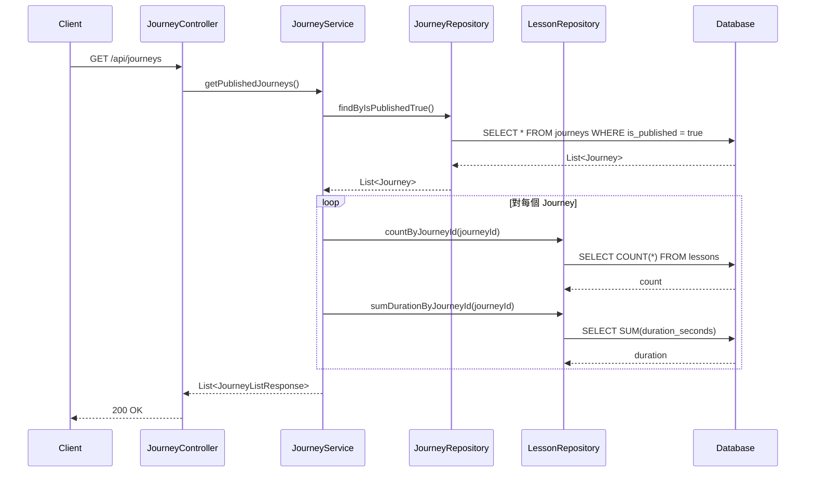
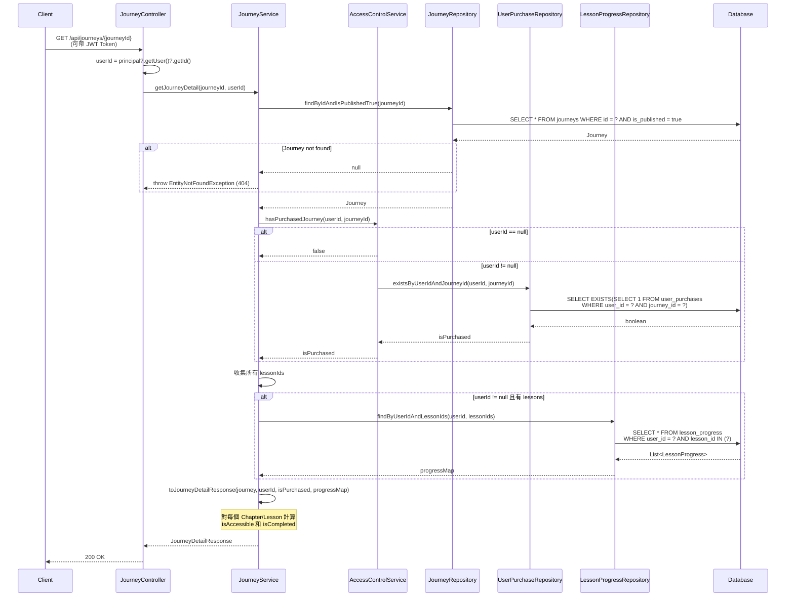
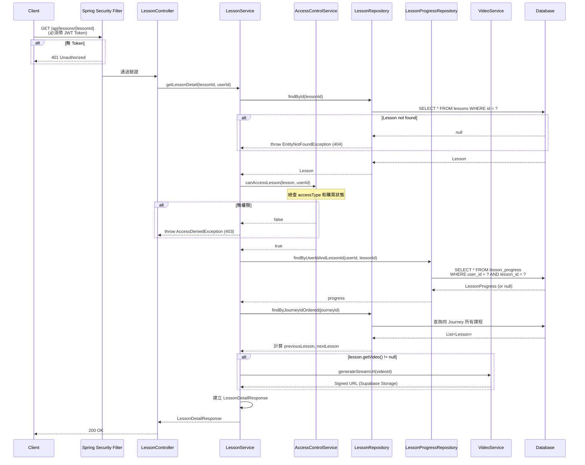
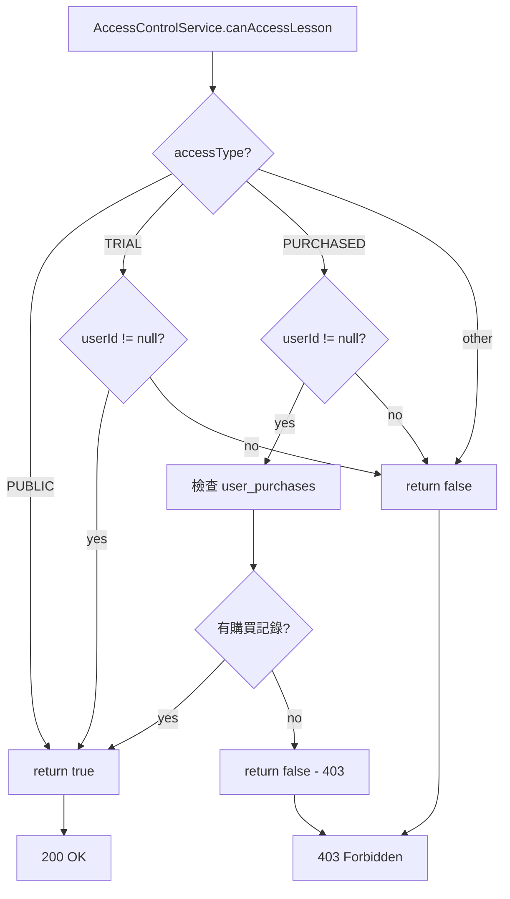
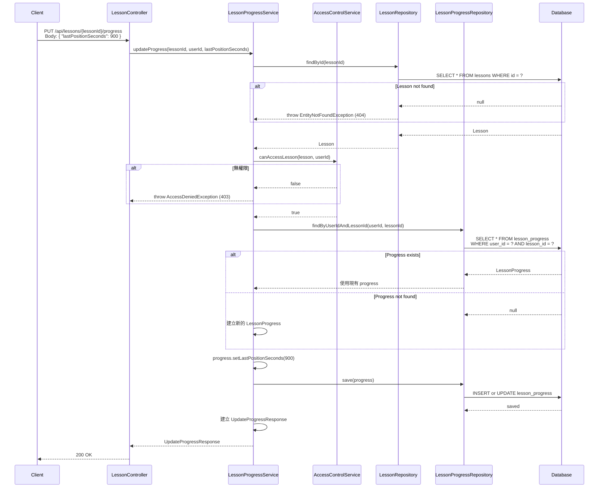
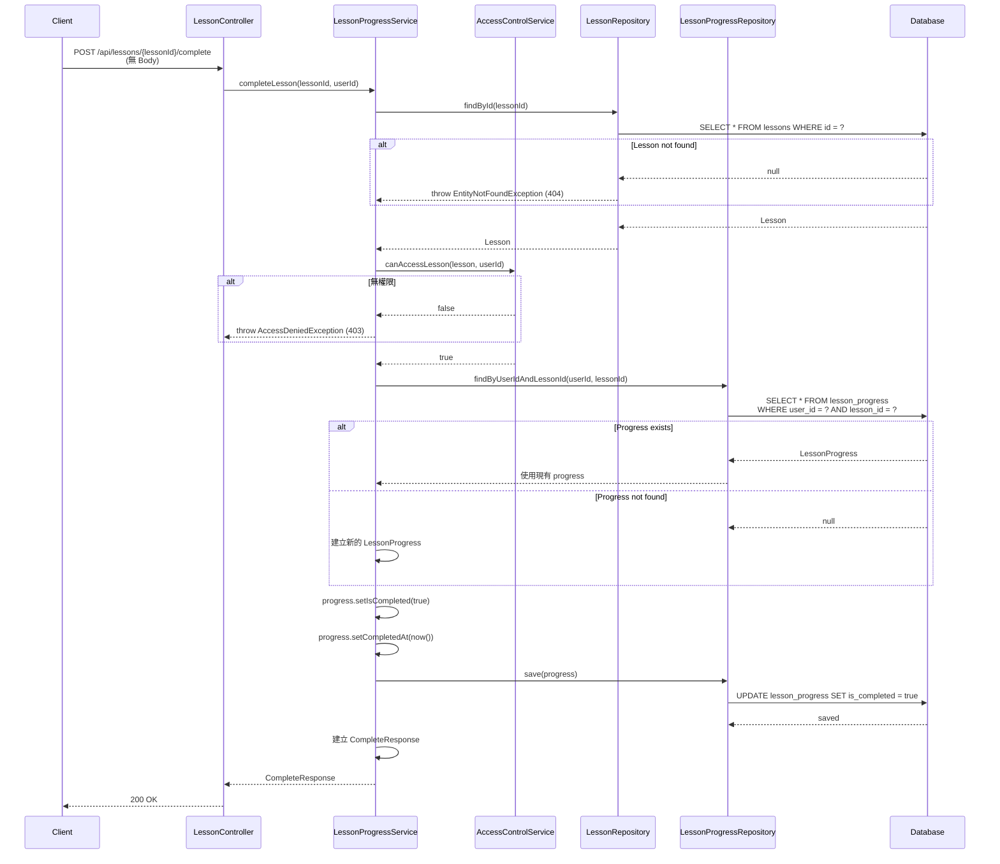
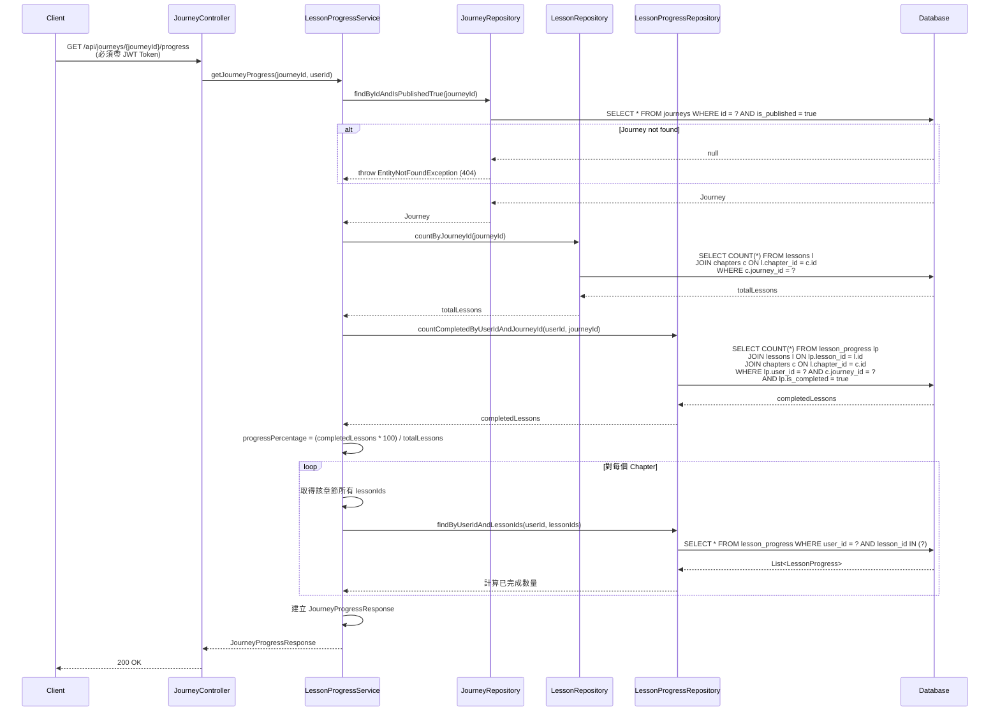
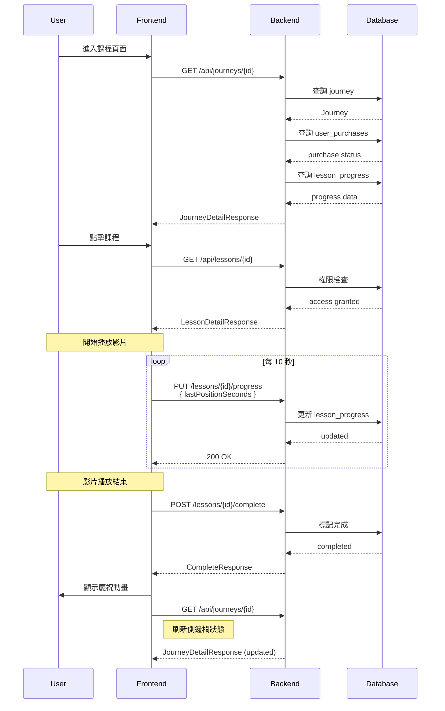

# Backend Specification: Course Lesson System

## Overview

實作課程管理系統，支援 Journey -> Chapter -> Lesson 三層架構，包含權限控制、多種課程類型、學習進度追蹤。

**MVP 範圍**: 專注於學生端 API，Admin 功能透過 SQL Script 處理。

## Technical Stack

- Spring Boot 3.2
- Spring Security 6
- PostgreSQL + Flyway
- JPA / Hibernate
- Supabase Storage (影片/檔案儲存)

## Database Schema

### journeys table (課程旅程)

```sql
CREATE TABLE journeys (
    id UUID PRIMARY KEY DEFAULT gen_random_uuid(),
    title VARCHAR(255) NOT NULL,
    description TEXT,
    thumbnail_url VARCHAR(500),
    is_published BOOLEAN DEFAULT FALSE,
    created_at TIMESTAMP DEFAULT CURRENT_TIMESTAMP,
    updated_at TIMESTAMP DEFAULT CURRENT_TIMESTAMP
);

CREATE INDEX idx_journeys_is_published ON journeys(is_published);
```

### chapters table (章節)

```sql
CREATE TABLE chapters (
    id UUID PRIMARY KEY DEFAULT gen_random_uuid(),
    journey_id UUID NOT NULL REFERENCES journeys(id) ON DELETE CASCADE,
    title VARCHAR(255) NOT NULL,
    description TEXT,
    sort_order INT NOT NULL DEFAULT 0,
    access_type VARCHAR(50) NOT NULL DEFAULT 'PURCHASED',  -- 'PUBLIC', 'PURCHASED'
    created_at TIMESTAMP DEFAULT CURRENT_TIMESTAMP,
    updated_at TIMESTAMP DEFAULT CURRENT_TIMESTAMP
);

CREATE INDEX idx_chapters_journey_id ON chapters(journey_id);
CREATE INDEX idx_chapters_sort_order ON chapters(journey_id, sort_order);
```

### lessons table (課程)

```sql
CREATE TABLE lessons (
    id UUID PRIMARY KEY DEFAULT gen_random_uuid(),
    chapter_id UUID NOT NULL REFERENCES chapters(id) ON DELETE CASCADE,
    title VARCHAR(255) NOT NULL,
    description TEXT,
    lesson_type VARCHAR(50) NOT NULL,  -- 'VIDEO', 'GOOGLE_FORM', 'ARTICLE'
    content_url VARCHAR(500),          -- 影片URL、Google Form URL 等
    video_id UUID REFERENCES videos(id),
    duration_seconds INT,
    sort_order INT NOT NULL DEFAULT 0,
    access_type VARCHAR(50) NOT NULL DEFAULT 'PURCHASED',  -- 'PUBLIC', 'TRIAL', 'PURCHASED'
    instructor_id UUID REFERENCES users(id),
    created_at TIMESTAMP DEFAULT CURRENT_TIMESTAMP,
    updated_at TIMESTAMP DEFAULT CURRENT_TIMESTAMP
);

CREATE INDEX idx_lessons_chapter_id ON lessons(chapter_id);
CREATE INDEX idx_lessons_sort_order ON lessons(chapter_id, sort_order);
```

### videos table (影片儲存)

```sql
CREATE TABLE videos (
    id UUID PRIMARY KEY DEFAULT gen_random_uuid(),
    original_filename VARCHAR(255) NOT NULL,
    storage_path VARCHAR(500) NOT NULL,
    storage_provider VARCHAR(50) NOT NULL DEFAULT 'SUPABASE',
    file_size_bytes BIGINT NOT NULL,
    mime_type VARCHAR(100) NOT NULL,
    duration_seconds INT,
    status VARCHAR(50) NOT NULL DEFAULT 'READY',
    created_at TIMESTAMP DEFAULT CURRENT_TIMESTAMP,
    updated_at TIMESTAMP DEFAULT CURRENT_TIMESTAMP
);
```

### lesson_progress table (學習進度)

```sql
CREATE TABLE lesson_progress (
    id UUID PRIMARY KEY DEFAULT gen_random_uuid(),
    user_id UUID NOT NULL REFERENCES users(id) ON DELETE CASCADE,
    lesson_id UUID NOT NULL REFERENCES lessons(id) ON DELETE CASCADE,
    is_completed BOOLEAN DEFAULT FALSE,
    last_position_seconds INT DEFAULT 0,
    completed_at TIMESTAMP,
    created_at TIMESTAMP DEFAULT CURRENT_TIMESTAMP,
    updated_at TIMESTAMP DEFAULT CURRENT_TIMESTAMP,
    UNIQUE(user_id, lesson_id)
);

CREATE INDEX idx_lesson_progress_user_id ON lesson_progress(user_id);
CREATE INDEX idx_lesson_progress_lesson_id ON lesson_progress(lesson_id);
```

### user_purchases table (購買記錄)

```sql
CREATE TABLE user_purchases (
    id UUID PRIMARY KEY DEFAULT gen_random_uuid(),
    user_id UUID NOT NULL REFERENCES users(id) ON DELETE CASCADE,
    journey_id UUID NOT NULL REFERENCES journeys(id) ON DELETE CASCADE,
    purchased_at TIMESTAMP DEFAULT CURRENT_TIMESTAMP,
    UNIQUE(user_id, journey_id)
);

CREATE INDEX idx_user_purchases_user_id ON user_purchases(user_id);
CREATE INDEX idx_user_purchases_journey_id ON user_purchases(journey_id);
```

---

## Common Definitions

### Authentication

需登入的 API 在 Header 帶入 JWT Token：

```
Authorization: Bearer <access_token>
```

### Standard Error Response

```json
{
  "timestamp": "2024-01-01T00:00:00Z",
  "status": 400,
  "error": "Bad Request",
  "message": "Validation failed",
  "path": "/api/journeys"
}
```

### HTTP Status Codes

| Code | Description |
|------|-------------|
| 200 | OK - 請求成功 |
| 201 | Created - 資源建立成功 |
| 400 | Bad Request - 請求參數錯誤 |
| 401 | Unauthorized - 未登入或 Token 過期 |
| 403 | Forbidden - 無權限存取 |
| 404 | Not Found - 資源不存在 |

### Common Types

| Field | Format | Example |
|-------|--------|---------|
| id | UUID | `"550e8400-e29b-41d4-a716-446655440000"` |
| timestamp | ISO 8601 | `"2024-01-01T00:00:00Z"` |
| duration | seconds (integer) | `1800` |

### Enums

**LessonType:**
- `VIDEO` - 影片
- `GOOGLE_FORM` - Google 表單
- `ARTICLE` - 文章

**AccessType:**
- `PUBLIC` - 公開，所有人可看
- `TRIAL` - 試讀，登入後可看
- `PURCHASED` - 需購買才能觀看

---

## API Endpoints

### Public API (未登入可存取)

---

#### GET /api/journeys

取得已發布的課程列表

**Authentication:** 不需要

**Response (200 OK):**

| Field | Type | Nullable | Description |
|-------|------|----------|-------------|
| id | UUID | No | 課程 ID |
| title | string | No | 課程標題 |
| description | string | Yes | 課程描述 |
| thumbnailUrl | string | Yes | 縮圖網址 |
| chapterCount | integer | No | 章節數量 |
| lessonCount | integer | No | 課程數量 |
| totalDurationSeconds | integer | No | 總時長 (秒) |

```json
[
  {
    "id": "550e8400-e29b-41d4-a716-446655440000",
    "title": "軟體設計之旅",
    "description": "從零開始學習軟體設計",
    "thumbnailUrl": "https://example.com/thumbnail.jpg",
    "chapterCount": 5,
    "lessonCount": 25,
    "totalDurationSeconds": 36000
  }
]
```

---

#### GET /api/journeys/{journeyId}

取得課程詳情 (含章節與課程列表)

**Authentication:** 選填 (登入時會回傳個人進度與購買狀態)

**Path Parameters:**

| Parameter | Type | Description |
|-----------|------|-------------|
| journeyId | UUID | 課程 ID |

**Response (200 OK):**

| Field | Type | Nullable | Description |
|-------|------|----------|-------------|
| id | UUID | No | 課程 ID |
| title | string | No | 課程標題 |
| description | string | Yes | 課程描述 |
| thumbnailUrl | string | Yes | 縮圖網址 |
| chapters | Chapter[] | No | 章節列表 |
| isPurchased | boolean | No | 是否已購買 (未登入為 false) |

**Chapter Object:**

| Field | Type | Nullable | Description |
|-------|------|----------|-------------|
| id | UUID | No | 章節 ID |
| title | string | No | 章節標題 |
| description | string | Yes | 章節描述 |
| sortOrder | integer | No | 排序順序 |
| accessType | AccessType | No | 存取權限 |
| lessons | LessonSummary[] | No | 課程列表 |

**LessonSummary Object:**

| Field | Type | Nullable | Description |
|-------|------|----------|-------------|
| id | UUID | No | 課程 ID |
| title | string | No | 課程標題 |
| lessonType | LessonType | No | 課程類型 |
| durationSeconds | integer | Yes | 時長 (秒) |
| accessType | AccessType | No | 存取權限 |
| isAccessible | boolean | No | 是否可存取 |
| isCompleted | boolean | No | 是否已完成 (未登入為 false) |
| instructor | Instructor | Yes | 講師資訊 |

**Instructor Object:**

| Field | Type | Nullable | Description |
|-------|------|----------|-------------|
| id | UUID | No | 講師 ID |
| name | string | No | 講師名稱 |
| pictureUrl | string | Yes | 講師頭像 |

```json
{
  "id": "550e8400-e29b-41d4-a716-446655440000",
  "title": "軟體設計之旅",
  "description": "從零開始學習軟體設計",
  "thumbnailUrl": "https://example.com/thumbnail.jpg",
  "chapters": [
    {
      "id": "660e8400-e29b-41d4-a716-446655440000",
      "title": "第一章：基礎概念",
      "description": "學習軟體設計的基本概念",
      "sortOrder": 1,
      "accessType": "PUBLIC",
      "lessons": [
        {
          "id": "770e8400-e29b-41d4-a716-446655440000",
          "title": "1-1 什麼是軟體設計",
          "lessonType": "VIDEO",
          "durationSeconds": 1800,
          "accessType": "PUBLIC",
          "isAccessible": true,
          "isCompleted": false,
          "instructor": {
            "id": "880e8400-e29b-41d4-a716-446655440000",
            "name": "水球老師",
            "pictureUrl": "https://example.com/avatar.jpg"
          }
        },
        {
          "id": "770e8400-e29b-41d4-a716-446655440001",
          "title": "1-2 軟體設計原則",
          "lessonType": "VIDEO",
          "durationSeconds": 2400,
          "accessType": "PURCHASED",
          "isAccessible": false,
          "isCompleted": false,
          "instructor": null
        }
      ]
    }
  ],
  "isPurchased": false
}
```

**Error Responses:**

| Status | Condition |
|--------|-----------|
| 404 | 課程不存在或未發布 |

---

### Student API (需登入)

---

#### GET /api/lessons/{lessonId}

取得課程詳情 (含內容)

**Authentication:** 必要

**Path Parameters:**

| Parameter | Type | Description |
|-----------|------|-------------|
| lessonId | UUID | 課程 ID |

**Response (200 OK):**

| Field | Type | Nullable | Description |
|-------|------|----------|-------------|
| id | UUID | No | 課程 ID |
| title | string | No | 課程標題 |
| description | string | Yes | 課程描述 |
| lessonType | LessonType | No | 課程類型 |
| contentUrl | string | Yes | 內容網址 (YouTube/Google Form 等) |
| videoStreamUrl | string | Yes | 影片串流網址 (自託管影片) |
| durationSeconds | integer | Yes | 時長 (秒) |
| instructor | Instructor | Yes | 講師資訊 |
| progress | Progress | No | 學習進度 |
| previousLesson | LessonNav | Yes | 上一課 |
| nextLesson | LessonNav | Yes | 下一課 |
| journeyId | UUID | No | 所屬課程 ID |
| journeyTitle | string | No | 所屬課程標題 |

**Progress Object:**

| Field | Type | Nullable | Description |
|-------|------|----------|-------------|
| isCompleted | boolean | No | 是否已完成 |
| lastPositionSeconds | integer | No | 上次觀看位置 (秒) |
| completedAt | timestamp | Yes | 完成時間 |

**LessonNav Object:**

| Field | Type | Nullable | Description |
|-------|------|----------|-------------|
| id | UUID | No | 課程 ID |
| title | string | No | 課程標題 |

```json
{
  "id": "770e8400-e29b-41d4-a716-446655440000",
  "title": "1-1 什麼是軟體設計",
  "description": "介紹軟體設計的定義與重要性",
  "lessonType": "VIDEO",
  "contentUrl": "https://www.youtube.com/watch?v=xxx",
  "videoStreamUrl": null,
  "durationSeconds": 1800,
  "instructor": {
    "id": "880e8400-e29b-41d4-a716-446655440000",
    "name": "水球老師",
    "pictureUrl": "https://example.com/avatar.jpg"
  },
  "progress": {
    "isCompleted": false,
    "lastPositionSeconds": 450,
    "completedAt": null
  },
  "previousLesson": null,
  "nextLesson": {
    "id": "770e8400-e29b-41d4-a716-446655440001",
    "title": "1-2 軟體設計原則"
  },
  "journeyId": "550e8400-e29b-41d4-a716-446655440000",
  "journeyTitle": "軟體設計之旅"
}
```

**Error Responses:**

| Status | Condition |
|--------|-----------|
| 401 | 未登入 |
| 403 | 無權限存取此課程 (需購買) |
| 404 | 課程不存在 |

**403 Response Body:**

```json
{
  "timestamp": "2024-01-01T00:00:00Z",
  "status": 403,
  "error": "Forbidden",
  "message": "請購買此課程以解鎖完整內容",
  "path": "/api/lessons/770e8400-e29b-41d4-a716-446655440000"
}
```

---

#### PUT /api/lessons/{lessonId}/progress

更新學習進度

**Authentication:** 必要

**Path Parameters:**

| Parameter | Type | Description |
|-----------|------|-------------|
| lessonId | UUID | 課程 ID |

**Request Body:**

| Field | Type | Required | Validation | Description |
|-------|------|----------|------------|-------------|
| lastPositionSeconds | integer | Yes | >= 0 | 觀看位置 (秒) |

```json
{
  "lastPositionSeconds": 900
}
```

**Response (200 OK):**

| Field | Type | Description |
|-------|------|-------------|
| lessonId | UUID | 課程 ID |
| isCompleted | boolean | 是否已完成 |
| lastPositionSeconds | integer | 觀看位置 (秒) |
| updatedAt | timestamp | 更新時間 |

```json
{
  "lessonId": "770e8400-e29b-41d4-a716-446655440000",
  "isCompleted": false,
  "lastPositionSeconds": 900,
  "updatedAt": "2024-01-01T00:00:00Z"
}
```

**Error Responses:**

| Status | Condition |
|--------|-----------|
| 400 | lastPositionSeconds 為負數 |
| 401 | 未登入 |
| 403 | 無權限存取此課程 |
| 404 | 課程不存在 |

---

#### POST /api/lessons/{lessonId}/complete

標記課程完成

**Authentication:** 必要

**Path Parameters:**

| Parameter | Type | Description |
|-----------|------|-------------|
| lessonId | UUID | 課程 ID |

**Request Body:** 無

**Response (200 OK):**

| Field | Type | Description |
|-------|------|-------------|
| lessonId | UUID | 課程 ID |
| isCompleted | boolean | 是否已完成 (true) |
| completedAt | timestamp | 完成時間 |

```json
{
  "lessonId": "770e8400-e29b-41d4-a716-446655440000",
  "isCompleted": true,
  "completedAt": "2024-01-01T00:00:00Z"
}
```

**Error Responses:**

| Status | Condition |
|--------|-----------|
| 401 | 未登入 |
| 403 | 無權限存取此課程 |
| 404 | 課程不存在 |

---

#### GET /api/journeys/{journeyId}/progress

取得課程學習進度總覽

**Authentication:** 必要

**Path Parameters:**

| Parameter | Type | Description |
|-----------|------|-------------|
| journeyId | UUID | 課程 ID |

**Response (200 OK):**

| Field | Type | Description |
|-------|------|-------------|
| journeyId | UUID | 課程 ID |
| totalLessons | integer | 總課程數 |
| completedLessons | integer | 已完成課程數 |
| progressPercentage | integer | 進度百分比 (0-100) |
| chapters | ChapterProgress[] | 各章節進度 |

**ChapterProgress Object:**

| Field | Type | Description |
|-------|------|-------------|
| chapterId | UUID | 章節 ID |
| title | string | 章節標題 |
| totalLessons | integer | 總課程數 |
| completedLessons | integer | 已完成課程數 |
| isCompleted | boolean | 是否全部完成 |

```json
{
  "journeyId": "550e8400-e29b-41d4-a716-446655440000",
  "totalLessons": 25,
  "completedLessons": 10,
  "progressPercentage": 40,
  "chapters": [
    {
      "chapterId": "660e8400-e29b-41d4-a716-446655440000",
      "title": "第一章：基礎概念",
      "totalLessons": 5,
      "completedLessons": 5,
      "isCompleted": true
    },
    {
      "chapterId": "660e8400-e29b-41d4-a716-446655440001",
      "title": "第二章：進階技巧",
      "totalLessons": 5,
      "completedLessons": 3,
      "isCompleted": false
    }
  ]
}
```

**Error Responses:**

| Status | Condition |
|--------|-----------|
| 401 | 未登入 |
| 404 | 課程不存在 |

---

#### GET /api/videos/{videoId}/stream

取得影片串流 URL (Signed URL)

**Authentication:** 必要

**Path Parameters:**

| Parameter | Type | Description |
|-----------|------|-------------|
| videoId | UUID | 影片 ID |

**Response (200 OK):**

| Field | Type | Description |
|-------|------|-------------|
| streamUrl | string | 串流網址 (Signed URL) |
| expiresAt | timestamp | 過期時間 |
| durationSeconds | integer | 影片時長 (秒) |

```json
{
  "streamUrl": "https://xxx.supabase.co/storage/v1/object/sign/videos/xxx.mp4?token=...",
  "expiresAt": "2024-01-01T01:00:00Z",
  "durationSeconds": 1800
}
```

**Error Responses:**

| Status | Condition |
|--------|-----------|
| 401 | 未登入 |
| 403 | 無權限存取此影片 |
| 404 | 影片不存在 |

---

## Access Control Logic

### isAccessible 判斷邏輯

```
1. accessType = PUBLIC → true (所有人可看)
2. accessType = TRIAL → 登入後可看
3. accessType = PURCHASED → 需檢查購買狀態
```

### Lesson 權限檢查流程

```
GET /api/lessons/{lessonId}

1. 檢查 lesson 是否存在
2. 檢查 lesson.accessType:
   - PUBLIC: 允許存取
   - TRIAL: 需登入，登入後允許存取
   - PURCHASED: 需登入 + 檢查 user_purchases
3. 無權限時回傳 403
```

---

## API 實作流程詳解

本節詳細說明每個 API 的內部處理流程，幫助交接工程師理解系統運作方式。

### 1. GET /api/journeys - 課程列表

| 項目 | 說明 |
|------|------|
| Controller | `JourneyController.getJourneys()` |
| Service | `JourneyService.getPublishedJourneys()` |
| Repository | `JourneyRepository.findByIsPublishedTrue()` |

**處理流程：**



**Response 欄位對應：**

| 欄位 | 來源 |
|------|------|
| id | `journey.getId()` |
| title | `journey.getTitle()` |
| description | `journey.getDescription()` |
| thumbnailUrl | `journey.getThumbnailUrl()` |
| chapterCount | `journey.getChapters().size()` |
| lessonCount | Repository 查詢 |
| totalDurationSeconds | Repository 查詢 |
| price | `journey.getPrice() ?? 1990` |
| currency | `"TWD"` |

**不需要認證**，任何人都可以呼叫。

---

### 2. GET /api/journeys/{journeyId} - 課程詳情

| 項目 | 說明 |
|------|------|
| Controller | `JourneyController.getJourneyDetail()` |
| Service | `JourneyService.getJourneyDetail()` |
| Dependencies | `AccessControlService`, `LessonProgressRepository` |

**處理流程：**



**關鍵邏輯：**

- 未登入時 `userId = null`，所有 `isCompleted = false`，`isPurchased = false`
- 登入後會查詢用戶的學習進度和購買狀態
- `isAccessible` 決定前端是否顯示鎖頭圖示

---

### 3. GET /api/lessons/{lessonId} - 課程內容

| 項目 | 說明 |
|------|------|
| Controller | `LessonController.getLessonDetail()` |
| Service | `LessonService.getLessonDetail()` |
| Dependencies | `AccessControlService`, `VideoService` |

**處理流程：**



**權限檢查流程圖：**



---

### 4. PUT /api/lessons/{lessonId}/progress - 更新觀看進度

| 項目 | 說明 |
|------|------|
| Controller | `LessonController.updateProgress()` |
| Service | `LessonProgressService.updateProgress()` |
| 前端呼叫時機 | 影片播放中每 10 秒、離開頁面時 |

**處理流程：**



**資料庫操作：**

```sql
-- 若記錄存在 (UPDATE)
UPDATE lesson_progress 
SET last_position_seconds = 900, 
    updated_at = CURRENT_TIMESTAMP
WHERE user_id = 'xxx' AND lesson_id = 'xxx';

-- 若記錄不存在 (INSERT)
INSERT INTO lesson_progress (id, user_id, lesson_id, last_position_seconds, is_completed, created_at, updated_at)
VALUES (gen_random_uuid(), 'xxx', 'xxx', 900, false, CURRENT_TIMESTAMP, CURRENT_TIMESTAMP);
```

---

### 5. POST /api/lessons/{lessonId}/complete - 標記完成

| 項目 | 說明 |
|------|------|
| Controller | `LessonController.completeLesson()` |
| Service | `LessonProgressService.completeLesson()` |
| 前端呼叫時機 | 影片播放結束 (onEnded)、非影片課程點擊「下一課」 |

**處理流程：**



**冪等性說明：**

- 多次呼叫 complete 不會產生錯誤
- `completedAt` 會更新為最新的完成時間
- 前端可以安全地重複呼叫

---

### 6. GET /api/journeys/{journeyId}/progress - 課程進度總覽

| 項目 | 說明 |
|------|------|
| Controller | `JourneyController.getJourneyProgress()` |
| Service | `LessonProgressService.getJourneyProgress()` |

**處理流程：**



---

## 前後端互動時序圖

### 學習流程完整時序



---

## Entity Definitions

### LessonType Enum

```java
public enum LessonType {
    VIDEO,
    GOOGLE_FORM,
    ARTICLE
}
```

### AccessType Enum

```java
public enum AccessType {
    PUBLIC,
    TRIAL,
    PURCHASED
}
```

---

## Components Structure

### Entity Layer

```
entity/
├── Journey.java
├── Chapter.java
├── Lesson.java
├── LessonType.java
├── AccessType.java
├── LessonProgress.java
├── UserPurchase.java
└── Video.java
```

### Repository Layer

```
repository/
├── JourneyRepository.java
├── ChapterRepository.java
├── LessonRepository.java
├── LessonProgressRepository.java
├── UserPurchaseRepository.java
└── VideoRepository.java
```

### Service Layer

```
service/
├── course/
│   ├── JourneyService.java
│   ├── LessonService.java
│   ├── LessonProgressService.java
│   └── AccessControlService.java
└── video/
    └── VideoService.java
```

### Controller Layer

```
controller/
├── JourneyController.java      # Public + Student APIs
├── LessonController.java       # Student APIs
└── VideoController.java        # Video streaming
```

### DTO

```
dto/
├── request/
│   └── UpdateProgressRequest.java
└── response/
    ├── JourneyListResponse.java
    ├── JourneyDetailResponse.java
    ├── ChapterResponse.java
    ├── LessonSummaryResponse.java
    ├── LessonDetailResponse.java
    ├── ProgressResponse.java
    ├── JourneyProgressResponse.java
    └── VideoStreamResponse.java
```

---

## Admin Data Management (Script)

MVP 階段使用 SQL Script 管理資料：

```sql
-- 建立課程
INSERT INTO journeys (id, title, description, thumbnail_url, is_published)
VALUES ('uuid', '軟體設計之旅', '描述', 'https://...', true);

-- 建立章節
INSERT INTO chapters (id, journey_id, title, sort_order, access_type)
VALUES ('uuid', 'journey-uuid', '第一章', 1, 'PUBLIC');

-- 建立課程
INSERT INTO lessons (id, chapter_id, title, lesson_type, content_url, duration_seconds, sort_order, access_type)
VALUES ('uuid', 'chapter-uuid', '1-1 介紹', 'VIDEO', 'https://youtube.com/...', 1800, 1, 'PUBLIC');

-- 授權購買
INSERT INTO user_purchases (user_id, journey_id)
VALUES ('user-uuid', 'journey-uuid');
```

---

## Implementation Tasks

### Phase 1: Database & Entity

1. [ ] 建立 Flyway migration: `V3__create_course_tables.sql`
2. [ ] 建立 Enums (LessonType, AccessType)
3. [ ] 建立 Entities (Journey, Chapter, Lesson, LessonProgress, UserPurchase, Video)
4. [ ] 建立 Repositories

### Phase 2: Service Layer

5. [ ] 建立 JourneyService
6. [ ] 建立 LessonService
7. [ ] 建立 LessonProgressService
8. [ ] 建立 AccessControlService
9. [ ] 建立 VideoService

### Phase 3: Controllers & DTOs

10. [ ] 建立 Response DTOs
11. [ ] 建立 Request DTOs
12. [ ] 建立 JourneyController (GET /api/journeys, GET /api/journeys/{id})
13. [ ] 建立 LessonController (GET, PUT progress, POST complete)
14. [ ] 建立 VideoController (GET stream)
15. [ ] 更新 SecurityConfig

### Phase 4: Integration Tests

16. [ ] 建立 JourneyControllerTest
17. [ ] 建立 LessonControllerTest
18. [ ] 建立 VideoControllerTest
19. [ ] 建立 AccessControlServiceTest

### Phase 5: E2E Tests

20. [ ] 建立 CourseE2ETest - 完整課程存取流程測試
21. [ ] 測試未登入用戶瀏覽課程列表
22. [ ] 測試未登入用戶瀏覽課程詳情
23. [ ] 測試登入用戶存取 PUBLIC 課程
24. [ ] 測試登入用戶存取 TRIAL 課程
25. [ ] 測試登入用戶存取 PURCHASED 課程（未購買 -> 403）
26. [ ] 測試已購買用戶存取 PURCHASED 課程
27. [ ] 測試學習進度更新與查詢
28. [ ] 測試課程完成標記

---

## Success Criteria

### 功能驗收
- [ ] 未登入可瀏覽課程列表與詳情
- [ ] 登入後可看到個人進度
- [ ] PUBLIC 課程所有人可看
- [ ] TRIAL 課程登入後可看
- [ ] PURCHASED 課程需購買授權
- [ ] 影片觀看進度正確記錄
- [ ] 課程完成狀態正確追蹤

### 測試驗收
- [ ] 所有 Integration Tests 通過
- [ ] 所有 E2E Tests 通過
- [ ] 測試覆蓋率達到 80% 以上
- [ ] E2E 測試涵蓋所有權限控制場景
