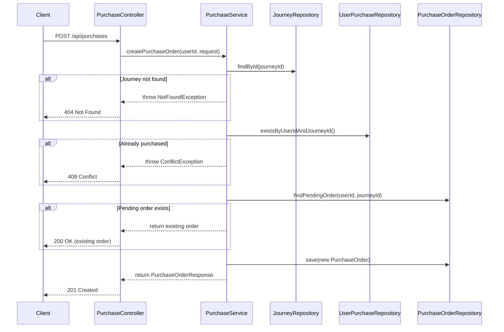
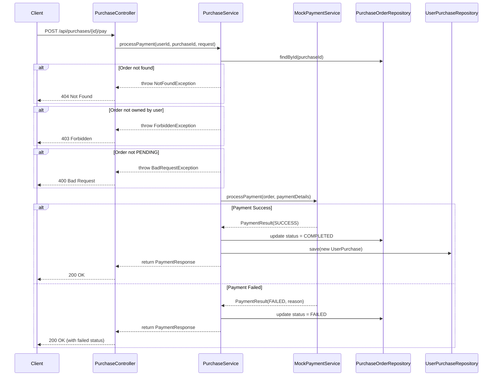
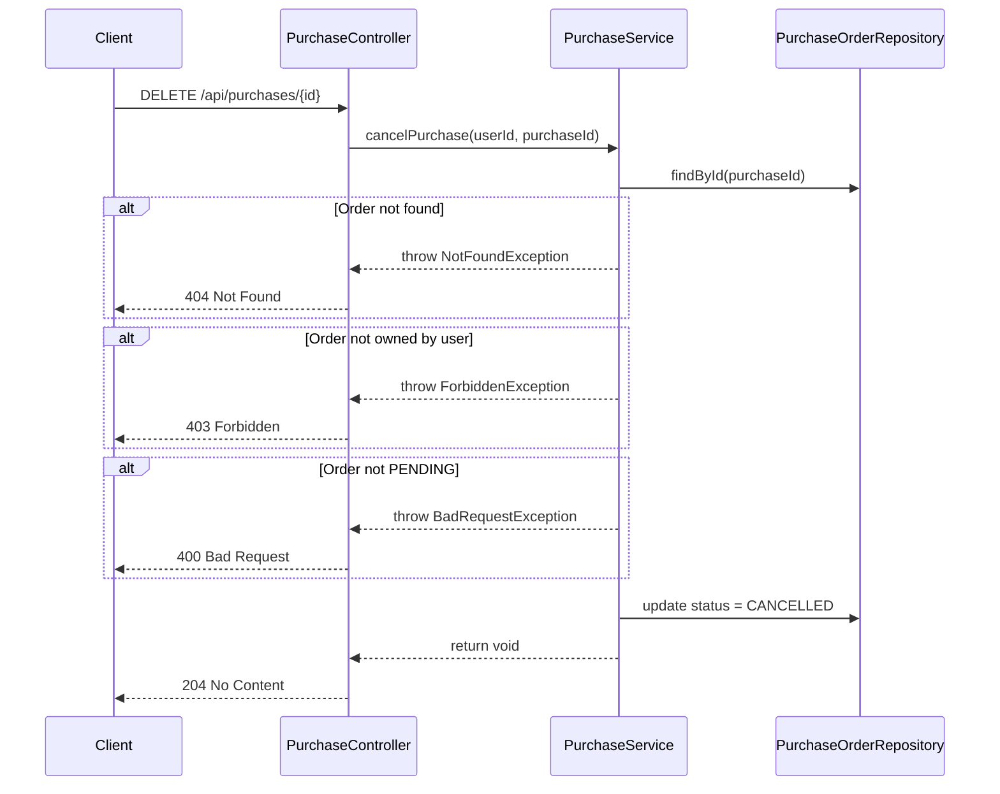

# Backend Specification: Course Purchase Flow

## Overview

實作課程購買流程，允許學生購買課程 (Journey)，支援信用卡、銀行轉帳付款方式（Mock 實作），追蹤訂單狀態，處理未完成購買，成功付款後授權課程存取。

**MVP 範圍**: 使用 Mock Payment Service，不串接實際金流。

## Technical Stack

- Spring Boot 3.2
- Spring Security 6
- PostgreSQL + Flyway
- JPA / Hibernate

## Database Schema

### purchase_orders table (購買訂單)

```sql
CREATE TABLE purchase_orders (
    id UUID PRIMARY KEY DEFAULT gen_random_uuid(),
    user_id UUID NOT NULL REFERENCES users(id) ON DELETE CASCADE,
    journey_id UUID NOT NULL REFERENCES journeys(id) ON DELETE CASCADE,
    amount DECIMAL(10, 2) NOT NULL,
    payment_method VARCHAR(50) NOT NULL,
    status VARCHAR(50) NOT NULL DEFAULT 'PENDING',
    failure_reason VARCHAR(500),
    created_at TIMESTAMP DEFAULT CURRENT_TIMESTAMP,
    updated_at TIMESTAMP DEFAULT CURRENT_TIMESTAMP,
    completed_at TIMESTAMP
);

CREATE INDEX idx_purchase_orders_user_id ON purchase_orders(user_id);
CREATE INDEX idx_purchase_orders_journey_id ON purchase_orders(journey_id);
CREATE INDEX idx_purchase_orders_status ON purchase_orders(status);
CREATE INDEX idx_purchase_orders_user_status ON purchase_orders(user_id, status);
```

### journeys table extension (課程價格)

```sql
ALTER TABLE journeys ADD COLUMN price DECIMAL(10, 2) NOT NULL DEFAULT 0.00;
```

---

## Sequence Diagrams

### Purchase Flow - Create Order



### Purchase Flow - Process Payment



### Purchase Flow - Cancel Order



---

## Common Definitions

### Authentication

需登入的 API 在 Header 帶入 JWT Token：

```
Authorization: Bearer <access_token>
```

### Standard Error Response

```json
{
  "timestamp": "2024-01-01T00:00:00Z",
  "status": 400,
  "error": "Bad Request",
  "message": "Validation failed",
  "path": "/api/purchases"
}
```

### HTTP Status Codes

| Code | Description |
|------|-------------|
| 200 | OK - 請求成功 |
| 201 | Created - 資源建立成功 |
| 204 | No Content - 刪除成功 |
| 400 | Bad Request - 請求參數錯誤或狀態不允許操作 |
| 401 | Unauthorized - 未登入或 Token 過期 |
| 403 | Forbidden - 無權限存取 |
| 404 | Not Found - 資源不存在 |
| 409 | Conflict - 資源衝突（已購買） |

### Common Types

| Field | Format | Example |
|-------|--------|---------|
| id | UUID | `"550e8400-e29b-41d4-a716-446655440000"` |
| timestamp | ISO 8601 | `"2024-01-01T00:00:00Z"` |
| amount | decimal (10, 2) | `1999.00` |

### Enums

**PurchaseStatus:**

- `PENDING` - 待付款
- `COMPLETED` - 已完成
- `FAILED` - 付款失敗
- `CANCELLED` - 已取消

**PaymentMethod:**

- `CREDIT_CARD` - 信用卡
- `BANK_TRANSFER` - 銀行轉帳

---

## Journey API Enhancement

### GET /api/journeys

取得所有已發布的課程列表，包含定價資訊。

**Authentication:** 選填

**Response (200 OK):**

| Field | Type | Nullable | Description |
|-------|------|----------|-------------|
| id | UUID | No | 課程 ID |
| title | string | No | 課程標題 |
| description | string | Yes | 課程描述 |
| thumbnailUrl | string | Yes | 課程縮圖 |
| chapterCount | integer | No | 章節數 |
| lessonCount | integer | No | 課程數 |
| totalDurationSeconds | integer | No | 總時長 (秒) |
| price | integer | No | 價格 |
| currency | string | No | 幣別 (預設 "TWD") |
| originalPrice | integer | Yes | 原價 (有折扣時顯示) |
| discountPercentage | integer | Yes | 折扣百分比 |

```json
[
  {
    "id": "550e8400-e29b-41d4-a716-446655440000",
    "title": "軟體設計之旅",
    "description": "從零開始學習軟體設計",
    "thumbnailUrl": "https://example.com/thumbnail.jpg",
    "chapterCount": 5,
    "lessonCount": 20,
    "totalDurationSeconds": 3600,
    "price": 1990,
    "currency": "TWD",
    "originalPrice": null,
    "discountPercentage": null
  }
]
```

### GET /api/journeys/{id}

取得課程詳細資訊，包含定價資訊和購買狀態。

**Authentication:** 選填

**Response (200 OK):**

| Field | Type | Nullable | Description |
|-------|------|----------|-------------|
| id | UUID | No | 課程 ID |
| title | string | No | 課程標題 |
| description | string | Yes | 課程描述 |
| thumbnailUrl | string | Yes | 課程縮圖 |
| chapters | ChapterResponse[] | No | 章節列表 |
| isPurchased | boolean | No | 是否已購買 |
| price | integer | No | 價格 |
| currency | string | No | 幣別 (預設 "TWD") |
| originalPrice | integer | Yes | 原價 (有折扣時顯示) |
| discountPercentage | integer | Yes | 折扣百分比 |

```json
{
  "id": "550e8400-e29b-41d4-a716-446655440000",
  "title": "軟體設計之旅",
  "description": "從零開始學習軟體設計",
  "thumbnailUrl": "https://example.com/thumbnail.jpg",
  "chapters": [...],
  "isPurchased": false,
  "price": 1990,
  "currency": "TWD",
  "originalPrice": null,
  "discountPercentage": null
}
```

---

## API Endpoints

### Student API (需登入)

---

#### POST /api/purchases

建立購買訂單

**Authentication:** 必要

**Request Body:**

| Field | Type | Required | Validation | Description |
|-------|------|----------|------------|-------------|
| journeyId | UUID | Yes | 必須存在 | 要購買的課程 ID |
| paymentMethod | PaymentMethod | Yes | CREDIT_CARD, BANK_TRANSFER | 付款方式 |

```json
{
  "journeyId": "550e8400-e29b-41d4-a716-446655440000",
  "paymentMethod": "CREDIT_CARD"
}
```

**Response (201 Created):**

| Field | Type | Nullable | Description |
|-------|------|----------|-------------|
| id | UUID | No | 訂單 ID |
| journeyId | UUID | No | 課程 ID |
| journeyTitle | string | No | 課程標題 |
| amount | decimal | No | 金額 |
| paymentMethod | PaymentMethod | No | 付款方式 |
| status | PurchaseStatus | No | 訂單狀態 |
| createdAt | timestamp | No | 建立時間 |

```json
{
  "id": "660e8400-e29b-41d4-a716-446655440000",
  "journeyId": "550e8400-e29b-41d4-a716-446655440000",
  "journeyTitle": "軟體設計之旅",
  "amount": 1999.00,
  "paymentMethod": "CREDIT_CARD",
  "status": "PENDING",
  "createdAt": "2024-01-01T00:00:00Z"
}
```

**Response (200 OK) - 已有 PENDING 訂單時回傳現有訂單:**

同上格式，回傳現有的 PENDING 訂單。

**Error Responses:**

| Status | Condition | Message |
|--------|-----------|---------|
| 400 | 無效的付款方式 | Invalid payment method |
| 401 | 未登入 | Unauthorized |
| 404 | 課程不存在或未發布 | Journey not found |
| 409 | 已購買此課程 | You have already purchased this course |

---

#### GET /api/purchases

取得購買歷史

**Authentication:** 必要

**Query Parameters:**

| Parameter | Type | Required | Default | Description |
|-----------|------|----------|---------|-------------|
| status | PurchaseStatus | No | - | 篩選訂單狀態 |
| page | integer | No | 0 | 頁碼 (0-based) |
| size | integer | No | 20 | 每頁筆數 |

**Response (200 OK):**

| Field | Type | Description |
|-------|------|-------------|
| content | PurchaseOrder[] | 訂單列表 |
| totalElements | integer | 總筆數 |
| totalPages | integer | 總頁數 |
| number | integer | 目前頁碼 |
| size | integer | 每頁筆數 |

**PurchaseOrder Object:**

| Field | Type | Nullable | Description |
|-------|------|----------|-------------|
| id | UUID | No | 訂單 ID |
| journeyId | UUID | No | 課程 ID |
| journeyTitle | string | No | 課程標題 |
| journeyThumbnailUrl | string | Yes | 課程縮圖 |
| amount | decimal | No | 金額 |
| paymentMethod | PaymentMethod | No | 付款方式 |
| status | PurchaseStatus | No | 訂單狀態 |
| failureReason | string | Yes | 失敗原因 |
| createdAt | timestamp | No | 建立時間 |
| completedAt | timestamp | Yes | 完成時間 |

```json
{
  "content": [
    {
      "id": "660e8400-e29b-41d4-a716-446655440000",
      "journeyId": "550e8400-e29b-41d4-a716-446655440000",
      "journeyTitle": "軟體設計之旅",
      "journeyThumbnailUrl": "https://example.com/thumbnail.jpg",
      "amount": 1999.00,
      "paymentMethod": "CREDIT_CARD",
      "status": "COMPLETED",
      "failureReason": null,
      "createdAt": "2024-01-01T00:00:00Z",
      "completedAt": "2024-01-01T00:05:00Z"
    }
  ],
  "totalElements": 1,
  "totalPages": 1,
  "number": 0,
  "size": 20
}
```

**Error Responses:**

| Status | Condition |
|--------|-----------|
| 401 | 未登入 |

---

#### GET /api/purchases/{purchaseId}

取得訂單詳情

**Authentication:** 必要

**Path Parameters:**

| Parameter | Type | Description |
|-----------|------|-------------|
| purchaseId | UUID | 訂單 ID |

**Response (200 OK):**

| Field | Type | Nullable | Description |
|-------|------|----------|-------------|
| id | UUID | No | 訂單 ID |
| journeyId | UUID | No | 課程 ID |
| journeyTitle | string | No | 課程標題 |
| journeyThumbnailUrl | string | Yes | 課程縮圖 |
| journeyDescription | string | Yes | 課程描述 |
| amount | decimal | No | 金額 |
| paymentMethod | PaymentMethod | No | 付款方式 |
| status | PurchaseStatus | No | 訂單狀態 |
| failureReason | string | Yes | 失敗原因 |
| createdAt | timestamp | No | 建立時間 |
| updatedAt | timestamp | No | 更新時間 |
| completedAt | timestamp | Yes | 完成時間 |

```json
{
  "id": "660e8400-e29b-41d4-a716-446655440000",
  "journeyId": "550e8400-e29b-41d4-a716-446655440000",
  "journeyTitle": "軟體設計之旅",
  "journeyThumbnailUrl": "https://example.com/thumbnail.jpg",
  "journeyDescription": "從零開始學習軟體設計",
  "amount": 1999.00,
  "paymentMethod": "CREDIT_CARD",
  "status": "PENDING",
  "failureReason": null,
  "createdAt": "2024-01-01T00:00:00Z",
  "updatedAt": "2024-01-01T00:00:00Z",
  "completedAt": null
}
```

**Error Responses:**

| Status | Condition |
|--------|-----------|
| 401 | 未登入 |
| 403 | 訂單不屬於此用戶 |
| 404 | 訂單不存在 |

---

#### POST /api/purchases/{purchaseId}/pay

處理付款 (Mock)

**Authentication:** 必要

**Path Parameters:**

| Parameter | Type | Description |
|-----------|------|-------------|
| purchaseId | UUID | 訂單 ID |

**Request Body (CREDIT_CARD):**

| Field | Type | Required | Validation | Description |
|-------|------|----------|------------|-------------|
| cardNumber | string | Yes | 16 digits | 信用卡號 |
| expiryMonth | string | Yes | 01-12 | 到期月 |
| expiryYear | string | Yes | 4 digits | 到期年 |
| cvv | string | Yes | 3-4 digits | CVV |
| cardholderName | string | Yes | non-empty | 持卡人姓名 |

```json
{
  "cardNumber": "4111111111111111",
  "expiryMonth": "12",
  "expiryYear": "2025",
  "cvv": "123",
  "cardholderName": "WANG HSIAO MING"
}
```

**Request Body (BANK_TRANSFER):**

| Field | Type | Required | Validation | Description |
|-------|------|----------|------------|-------------|
| accountNumber | string | Yes | 10-14 digits | 帳戶號碼 |
| bankCode | string | Yes | 3 digits | 銀行代碼 |

```json
{
  "accountNumber": "12345678901234",
  "bankCode": "012"
}
```

**Response (200 OK):**

| Field | Type | Nullable | Description |
|-------|------|----------|-------------|
| purchaseId | UUID | No | 訂單 ID |
| status | PurchaseStatus | No | 訂單狀態 |
| message | string | No | 結果訊息 |
| completedAt | timestamp | Yes | 完成時間 |
| failureReason | string | Yes | 失敗原因 |

```json
{
  "purchaseId": "660e8400-e29b-41d4-a716-446655440000",
  "status": "COMPLETED",
  "message": "Payment successful",
  "completedAt": "2024-01-01T00:05:00Z",
  "failureReason": null
}
```

**Payment Failed Response:**

```json
{
  "purchaseId": "660e8400-e29b-41d4-a716-446655440000",
  "status": "FAILED",
  "message": "Payment failed",
  "completedAt": null,
  "failureReason": "Insufficient funds"
}
```

**Error Responses:**

| Status | Condition | Message |
|--------|-----------|---------|
| 400 | 訂單狀態不是 PENDING | Order is not in pending status |
| 400 | 付款資訊驗證失敗 | Invalid payment details |
| 401 | 未登入 | Unauthorized |
| 403 | 訂單不屬於此用戶 | Access denied |
| 404 | 訂單不存在 | Purchase order not found |

---

#### DELETE /api/purchases/{purchaseId}

取消待付款訂單

**Authentication:** 必要

**Path Parameters:**

| Parameter | Type | Description |
|-----------|------|-------------|
| purchaseId | UUID | 訂單 ID |

**Response (204 No Content):** 無內容

**Error Responses:**

| Status | Condition | Message |
|--------|-----------|---------|
| 400 | 訂單狀態不是 PENDING | Only pending orders can be cancelled |
| 401 | 未登入 | Unauthorized |
| 403 | 訂單不屬於此用戶 | Access denied |
| 404 | 訂單不存在 | Purchase order not found |

---

#### GET /api/purchases/pending

取得用戶的待付款訂單

**Authentication:** 必要

**Response (200 OK):**

| Field | Type | Description |
|-------|------|-------------|
| - | PurchaseOrder[] | 待付款訂單列表 |

```json
[
  {
    "id": "660e8400-e29b-41d4-a716-446655440000",
    "journeyId": "550e8400-e29b-41d4-a716-446655440000",
    "journeyTitle": "軟體設計之旅",
    "journeyThumbnailUrl": "https://example.com/thumbnail.jpg",
    "amount": 1999.00,
    "paymentMethod": "CREDIT_CARD",
    "status": "PENDING",
    "createdAt": "2024-01-01T00:00:00Z"
  }
]
```

**Error Responses:**

| Status | Condition |
|--------|-----------|
| 401 | 未登入 |

---

#### GET /api/purchases/pending/journey/{journeyId}

取得用戶對特定課程的待付款訂單

**Authentication:** 必要

**Path Parameters:**

| Parameter | Type | Description |
|-----------|------|-------------|
| journeyId | UUID | 課程 ID |

**Response (200 OK):**

| Field | Type | Nullable | Description |
|-------|------|----------|-------------|
| id | UUID | No | 訂單 ID |
| journeyId | UUID | No | 課程 ID |
| journeyTitle | string | No | 課程標題 |
| journeyThumbnailUrl | string | Yes | 課程縮圖 |
| amount | decimal | No | 金額 |
| paymentMethod | PaymentMethod | No | 付款方式 |
| status | PurchaseStatus | No | 訂單狀態 |
| createdAt | timestamp | No | 建立時間 |

```json
{
  "id": "660e8400-e29b-41d4-a716-446655440000",
  "journeyId": "550e8400-e29b-41d4-a716-446655440000",
  "journeyTitle": "軟體設計之旅",
  "journeyThumbnailUrl": "https://example.com/thumbnail.jpg",
  "amount": 1999.00,
  "paymentMethod": "CREDIT_CARD",
  "status": "PENDING",
  "createdAt": "2024-01-01T00:00:00Z"
}
```

**Error Responses:**

| Status | Condition |
|--------|-----------|
| 401 | 未登入 |
| 404 | 該課程無待付款訂單 |

---

## Mock Payment Service

### MockPaymentService

模擬付款處理邏輯，用於開發與測試。

```java
@Service
public class MockPaymentService {
    
    public PaymentResult processPayment(PurchaseOrder order, PaymentDetails details) {
        // Mock logic:
        // 1. Card number ending with "0000" -> FAILED (Insufficient funds)
        // 2. Card number ending with "1111" -> FAILED (Card declined)
        // 3. Bank code "999" -> FAILED (Invalid bank)
        // 4. All other cases -> SUCCESS
        
        if (details instanceof CreditCardDetails card) {
            if (card.getCardNumber().endsWith("0000")) {
                return PaymentResult.failed("Insufficient funds");
            }
            if (card.getCardNumber().endsWith("1111")) {
                return PaymentResult.failed("Card declined");
            }
        }
        
        if (details instanceof BankTransferDetails bank) {
            if (bank.getBankCode().equals("999")) {
                return PaymentResult.failed("Invalid bank");
            }
        }
        
        return PaymentResult.success();
    }
}
```

### PaymentResult

```java
public record PaymentResult(
    boolean success,
    String failureReason
) {
    public static PaymentResult success() {
        return new PaymentResult(true, null);
    }
    
    public static PaymentResult failed(String reason) {
        return new PaymentResult(false, reason);
    }
}
```

---

## Error Handling

### Business Exceptions

| Exception | HTTP Status | Condition |
|-----------|-------------|-----------|
| JourneyNotFoundException | 404 | 課程不存在或未發布 |
| PurchaseOrderNotFoundException | 404 | 訂單不存在 |
| AlreadyPurchasedException | 409 | 已購買此課程 |
| InvalidOrderStatusException | 400 | 訂單狀態不允許此操作 |
| PaymentValidationException | 400 | 付款資訊驗證失敗 |
| AccessDeniedException | 403 | 無權限存取此訂單 |

### Validation Rules

**Credit Card:**

- cardNumber: 16 位數字
- expiryMonth: 01-12
- expiryYear: 4 位數字，需大於等於當年
- cvv: 3-4 位數字
- cardholderName: 非空字串

**Bank Transfer:**

- accountNumber: 10-14 位數字
- bankCode: 3 位數字

---

## Components Structure

### Entity Layer

```
entity/
├── PurchaseOrder.java
├── PurchaseStatus.java
└── PaymentMethod.java
```

### Repository Layer

```
repository/
└── PurchaseOrderRepository.java
```

### Service Layer

```
service/
├── purchase/
│   ├── PurchaseService.java
│   └── MockPaymentService.java
└── payment/
    ├── PaymentDetails.java
    ├── CreditCardDetails.java
    ├── BankTransferDetails.java
    └── PaymentResult.java
```

### Controller Layer

```
controller/
└── PurchaseController.java
```

### DTO

```
dto/
├── request/
│   ├── CreatePurchaseRequest.java
│   ├── CreditCardPaymentRequest.java
│   └── BankTransferPaymentRequest.java
└── response/
    ├── PurchaseOrderResponse.java
    ├── PurchaseOrderDetailResponse.java
    ├── PaymentResultResponse.java
    └── PurchaseOrderPageResponse.java
```

---

## Entity Definitions

### PurchaseStatus Enum

```java
public enum PurchaseStatus {
    PENDING,
    COMPLETED,
    FAILED,
    CANCELLED
}
```

### PaymentMethod Enum

```java
public enum PaymentMethod {
    CREDIT_CARD,
    BANK_TRANSFER
}
```

### PurchaseOrder Entity

```java
@Entity
@Table(name = "purchase_orders")
public class PurchaseOrder {
    @Id
    @GeneratedValue(strategy = GenerationType.UUID)
    private UUID id;
    
    @ManyToOne(fetch = FetchType.LAZY)
    @JoinColumn(name = "user_id", nullable = false)
    private User user;
    
    @ManyToOne(fetch = FetchType.LAZY)
    @JoinColumn(name = "journey_id", nullable = false)
    private Journey journey;
    
    @Column(nullable = false, precision = 10, scale = 2)
    private BigDecimal amount;
    
    @Enumerated(EnumType.STRING)
    @Column(name = "payment_method", nullable = false)
    private PaymentMethod paymentMethod;
    
    @Enumerated(EnumType.STRING)
    @Column(nullable = false)
    private PurchaseStatus status = PurchaseStatus.PENDING;
    
    @Column(name = "failure_reason")
    private String failureReason;
    
    @Column(name = "created_at")
    private Instant createdAt;
    
    @Column(name = "updated_at")
    private Instant updatedAt;
    
    @Column(name = "completed_at")
    private Instant completedAt;
}
```

---

## Implementation Tasks

### Phase 1: Database & Entity

1. [ ] 建立 Flyway migration: `V20251127000001__create_purchase_orders_table.sql`
2. [ ] 建立 Flyway migration: `V20251127000002__add_price_to_journeys.sql`
3. [ ] 建立 Enums (PurchaseStatus, PaymentMethod)
4. [ ] 建立 Entity (PurchaseOrder)
5. [ ] 建立 Repository (PurchaseOrderRepository)

### Phase 2: Service Layer

6. [ ] 建立 PaymentDetails 類別 (CreditCardDetails, BankTransferDetails)
7. [ ] 建立 PaymentResult 類別
8. [ ] 建立 MockPaymentService
9. [ ] 建立 PurchaseService

### Phase 3: Controllers & DTOs

10. [ ] 建立 Request DTOs
11. [ ] 建立 Response DTOs
12. [ ] 建立 PurchaseController
13. [ ] 更新 SecurityConfig (允許 /api/purchases/**)

### Phase 4: Integration Tests

14. [ ] 建立 PurchaseControllerTest
15. [ ] 建立 MockPaymentServiceTest
16. [ ] 建立 PurchaseServiceTest

### Phase 5: E2E Tests

17. [ ] E2E: 建立購買訂單
18. [ ] E2E: 重複購買同課程回傳現有訂單
19. [ ] E2E: 已購買課程建立訂單回傳 409
20. [ ] E2E: 信用卡付款成功
21. [ ] E2E: 信用卡付款失敗
22. [ ] E2E: 銀行轉帳付款成功
23. [ ] E2E: 取消待付款訂單
24. [ ] E2E: 付款成功後可存取課程
25. [ ] E2E: 查詢購買歷史
26. [ ] E2E: 查詢待付款訂單

---

## E2E Test Scenarios

### Scenario 1: Complete Purchase Flow (Credit Card Success)

```
Given: 用戶已登入，課程價格為 1999 元
When:
  1. POST /api/purchases { journeyId, paymentMethod: CREDIT_CARD }
  2. POST /api/purchases/{id}/pay { cardNumber: "4111111111112222", ... }
  3. GET /api/journeys/{journeyId}
Then:
  1. 回傳 201，訂單狀態 PENDING
  2. 回傳 200，狀態 COMPLETED
  3. isPurchased = true
```

### Scenario 2: Payment Failure (Insufficient Funds)

```
Given: 用戶已登入，有 PENDING 訂單
When:
  1. POST /api/purchases/{id}/pay { cardNumber: "4111111111110000", ... }
Then:
  1. 回傳 200，狀態 FAILED，failureReason = "Insufficient funds"
```

### Scenario 3: Resume Pending Purchase

```
Given: 用戶已登入，對課程 A 有 PENDING 訂單
When:
  1. POST /api/purchases { journeyId: A, paymentMethod: CREDIT_CARD }
Then:
  1. 回傳 200，回傳現有 PENDING 訂單
```

### Scenario 4: Already Purchased

```
Given: 用戶已登入，已購買課程 A
When:
  1. POST /api/purchases { journeyId: A, paymentMethod: CREDIT_CARD }
Then:
  1. 回傳 409，message = "You have already purchased this course"
```

### Scenario 5: Cancel Pending Order

```
Given: 用戶已登入，有 PENDING 訂單
When:
  1. DELETE /api/purchases/{id}
  2. GET /api/purchases/{id}
Then:
  1. 回傳 204
  2. 回傳 200，狀態 CANCELLED
```

### Scenario 6: Cannot Cancel Completed Order

```
Given: 用戶已登入，有 COMPLETED 訂單
When:
  1. DELETE /api/purchases/{id}
Then:
  1. 回傳 400，message = "Only pending orders can be cancelled"
```

### Scenario 7: Cannot Pay Non-Pending Order

```
Given: 用戶已登入，有 CANCELLED 訂單
When:
  1. POST /api/purchases/{id}/pay { ... }
Then:
  1. 回傳 400，message = "Order is not in pending status"
```

### Scenario 8: Access Control After Purchase

```
Given: 用戶已登入，課程有 PURCHASED 類型的 Lesson
When:
  1. GET /api/lessons/{lessonId} (購買前)
  2. Complete purchase flow
  3. GET /api/lessons/{lessonId} (購買後)
Then:
  1. 回傳 403
  2. 成功完成購買
  3. 回傳 200，可存取課程內容
```

### Scenario 9: Purchase History Pagination

```
Given: 用戶有 25 筆購買記錄
When:
  1. GET /api/purchases?page=0&size=10
  2. GET /api/purchases?page=1&size=10
Then:
  1. 回傳 10 筆，totalElements = 25
  2. 回傳 10 筆，page = 1
```

### Scenario 10: Filter Purchases by Status

```
Given: 用戶有 COMPLETED 和 PENDING 訂單
When:
  1. GET /api/purchases?status=PENDING
Then:
  1. 只回傳 PENDING 狀態的訂單
```

---

## Success Criteria

### 功能驗收

- [ ] 可建立購買訂單
- [ ] 可處理信用卡付款 (Mock)
- [ ] 可處理銀行轉帳付款 (Mock)
- [ ] 付款成功後自動授權課程存取
- [ ] 可取消待付款訂單
- [ ] 可查詢購買歷史
- [ ] 可取得待付款訂單列表
- [ ] 已購買課程不可重複購買
- [ ] 待付款訂單可續購

### 測試驗收

- [ ] 所有 Integration Tests 通過
- [ ] 所有 E2E Tests 通過
- [ ] 測試覆蓋率達到 80% 以上
- [ ] E2E 測試涵蓋所有購買流程場景
