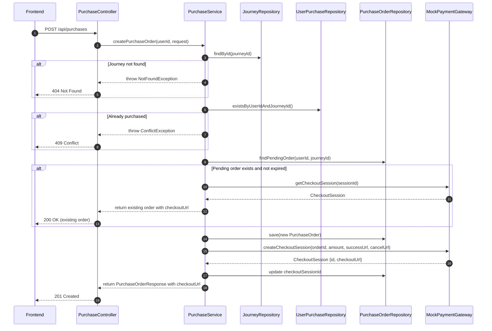
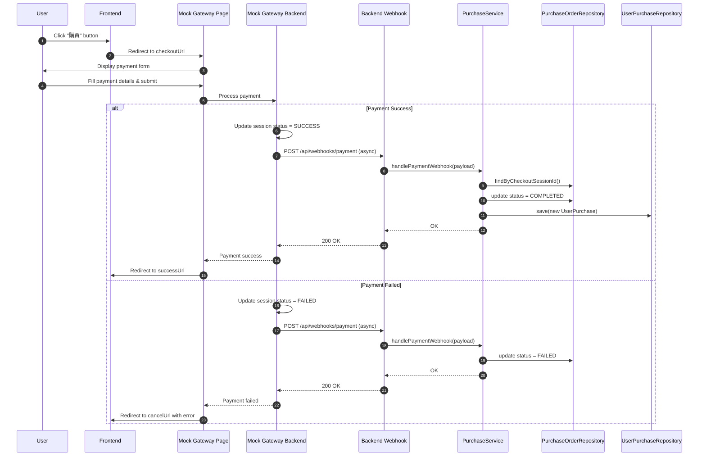
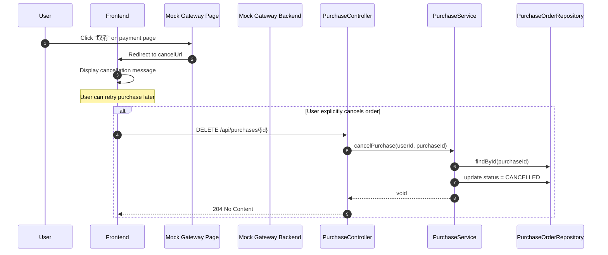
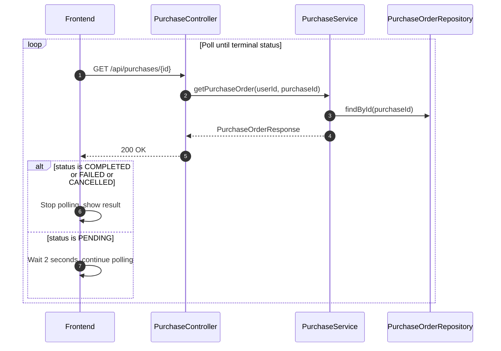

# Backend Specification: Course Purchase Flow

## Overview

實作課程購買流程，允許學生購買課程 (Journey)，支援信用卡、銀行轉帳付款方式（Mock 實作），追蹤訂單狀態，處理未完成購買，成功付款後授權課程存取。

**MVP 範圍**: 使用 Mock Payment Gateway，模擬真實第三方金流的重導向流程。

## Technical Stack

- Spring Boot 3.2
- Spring Security 6
- PostgreSQL + Flyway
- JPA / Hibernate

## Architecture Overview

本系統使用 **Mock Payment Gateway** 模擬真實的第三方支付流程。與一般直接呼叫 API 處理付款不同，這裡模擬的是：

1. **建立結帳 Session** - Backend 向 Mock Gateway 請求建立結帳頁面
2. **重導向至 Gateway** - Frontend 將用戶重導向至 Mock Gateway 的結帳頁面
3. **用戶完成付款** - 用戶在 Mock Gateway 頁面填寫付款資訊並完成付款
4. **Webhook 通知** - Mock Gateway 呼叫 Backend 的 Webhook 通知付款結果
5. **重導向回 Frontend** - Gateway 將用戶重導向回 Frontend 的結果頁面

```
┌──────────────────────────────────────────────────────────────────────────────┐
│                           Purchase Flow Overview                              │
├──────────────────────────────────────────────────────────────────────────────┤
│                                                                              │
│   Frontend              Backend                    Mock Payment Gateway      │
│      │                     │                              │                  │
│      │  1. Create Order    │                              │                  │
│      │────────────────────>│                              │                  │
│      │                     │  2. Create Checkout Session  │                  │
│      │                     │─────────────────────────────>│                  │
│      │                     │<─────────────────────────────│                  │
│      │<────────────────────│  3. Return checkoutUrl       │                  │
│      │                     │                              │                  │
│      │  4. Redirect to checkoutUrl                        │                  │
│      │───────────────────────────────────────────────────>│                  │
│      │                     │                              │                  │
│      │                     │  5. User fills payment form  │                  │
│      │                     │                              │                  │
│      │                     │  6. Webhook notification     │                  │
│      │                     │<─────────────────────────────│                  │
│      │                     │                              │                  │
│      │  7. Redirect back with result                      │                  │
│      │<───────────────────────────────────────────────────│                  │
│      │                     │                              │                  │
│      │  8. Query order status                             │                  │
│      │────────────────────>│                              │                  │
│      │<────────────────────│                              │                  │
│                                                                              │
└──────────────────────────────────────────────────────────────────────────────┘
```

## Database Schema

### purchase_orders table (購買訂單)

```sql
CREATE TABLE purchase_orders (
    id UUID PRIMARY KEY DEFAULT gen_random_uuid(),
    user_id UUID NOT NULL REFERENCES users(id) ON DELETE CASCADE,
    journey_id UUID NOT NULL REFERENCES journeys(id) ON DELETE CASCADE,
    amount DECIMAL(10, 2) NOT NULL,
    payment_method VARCHAR(50) NOT NULL,
    status VARCHAR(50) NOT NULL DEFAULT 'PENDING',
    checkout_session_id VARCHAR(255),
    failure_reason VARCHAR(500),
    created_at TIMESTAMP DEFAULT CURRENT_TIMESTAMP,
    updated_at TIMESTAMP DEFAULT CURRENT_TIMESTAMP,
    expires_at TIMESTAMP,
    completed_at TIMESTAMP
);

CREATE INDEX idx_purchase_orders_user_id ON purchase_orders(user_id);
CREATE INDEX idx_purchase_orders_journey_id ON purchase_orders(journey_id);
CREATE INDEX idx_purchase_orders_status ON purchase_orders(status);
CREATE INDEX idx_purchase_orders_user_status ON purchase_orders(user_id, status);
CREATE INDEX idx_purchase_orders_checkout_session ON purchase_orders(checkout_session_id);
```

### checkout_sessions table (結帳 Session - Mock Gateway 內部用)

```sql
CREATE TABLE checkout_sessions (
    id VARCHAR(255) PRIMARY KEY,
    purchase_order_id UUID NOT NULL REFERENCES purchase_orders(id) ON DELETE CASCADE,
    payment_method VARCHAR(50) NOT NULL,
    amount DECIMAL(10, 2) NOT NULL,
    currency VARCHAR(10) NOT NULL DEFAULT 'TWD',
    status VARCHAR(50) NOT NULL DEFAULT 'PENDING',
    success_url VARCHAR(500) NOT NULL,
    cancel_url VARCHAR(500) NOT NULL,
    created_at TIMESTAMP DEFAULT CURRENT_TIMESTAMP,
    expires_at TIMESTAMP NOT NULL,
    completed_at TIMESTAMP
);

CREATE INDEX idx_checkout_sessions_purchase_order ON checkout_sessions(purchase_order_id);
CREATE INDEX idx_checkout_sessions_status ON checkout_sessions(status);
```

### journeys table extension (課程價格)

```sql
ALTER TABLE journeys ADD COLUMN price DECIMAL(10, 2) NOT NULL DEFAULT 0.00;
```

---

## Sequence Diagrams

### Flow 1: Create Purchase Order and Get Checkout URL



### Flow 2: User Completes Payment on Mock Gateway



### Flow 3: User Cancels Payment



### Flow 4: Query Order Status (Polling)



---

## Common Definitions

### Authentication

需登入的 API 在 Header 帶入 JWT Token：

```
Authorization: Bearer <access_token>
```

### Standard Error Response

```json
{
  "timestamp": "2024-01-01T00:00:00Z",
  "status": 400,
  "error": "Bad Request",
  "message": "Validation failed",
  "path": "/api/purchases"
}
```

### HTTP Status Codes

| Code | Description |
|------|-------------|
| 200 | OK - 請求成功 |
| 201 | Created - 資源建立成功 |
| 204 | No Content - 刪除成功 |
| 400 | Bad Request - 請求參數錯誤或狀態不允許操作 |
| 401 | Unauthorized - 未登入或 Token 過期 |
| 403 | Forbidden - 無權限存取 |
| 404 | Not Found - 資源不存在 |
| 409 | Conflict - 資源衝突（已購買） |

### Common Types

| Field | Format | Example |
|-------|--------|---------|
| id | UUID | `"550e8400-e29b-41d4-a716-446655440000"` |
| timestamp | ISO 8601 | `"2024-01-01T00:00:00Z"` |
| amount | decimal (10, 2) | `1999.00` |

### Enums

**PurchaseStatus:**

- `PENDING` - 待付款（已建立 checkout session）
- `COMPLETED` - 已完成
- `FAILED` - 付款失敗
- `CANCELLED` - 已取消
- `EXPIRED` - 已過期

**PaymentMethod:**

- `CREDIT_CARD` - 信用卡
- `BANK_TRANSFER` - 銀行轉帳

**CheckoutSessionStatus:**

- `PENDING` - 等待付款
- `SUCCESS` - 付款成功
- `FAILED` - 付款失敗
- `EXPIRED` - 已過期

---

## API Endpoints

### Student API (需登入)

---

#### POST /api/purchases

建立購買訂單並取得結帳 URL

**Authentication:** 必要

**Request Body:**

| Field | Type | Required | Validation | Description |
|-------|------|----------|------------|-------------|
| journeyId | UUID | Yes | 必須存在 | 要購買的課程 ID |
| paymentMethod | PaymentMethod | Yes | CREDIT_CARD, BANK_TRANSFER | 付款方式 |

```json
{
  "journeyId": "550e8400-e29b-41d4-a716-446655440000",
  "paymentMethod": "CREDIT_CARD"
}
```

**Response (201 Created):**

| Field | Type | Nullable | Description |
|-------|------|----------|-------------|
| id | UUID | No | 訂單 ID |
| journeyId | UUID | No | 課程 ID |
| journeyTitle | string | No | 課程標題 |
| amount | decimal | No | 金額 |
| currency | string | No | 幣別 |
| paymentMethod | PaymentMethod | No | 付款方式 |
| status | PurchaseStatus | No | 訂單狀態 |
| checkoutUrl | string | No | 結帳頁面 URL (Mock Gateway) |
| expiresAt | timestamp | No | 訂單過期時間 |
| createdAt | timestamp | No | 建立時間 |

```json
{
  "id": "660e8400-e29b-41d4-a716-446655440000",
  "journeyId": "550e8400-e29b-41d4-a716-446655440000",
  "journeyTitle": "軟體設計之旅",
  "amount": 1999.00,
  "currency": "TWD",
  "paymentMethod": "CREDIT_CARD",
  "status": "PENDING",
  "checkoutUrl": "http://localhost:8080/mock-payment/checkout/cs_abc123",
  "expiresAt": "2024-01-01T01:00:00Z",
  "createdAt": "2024-01-01T00:00:00Z"
}
```

**Response (200 OK) - 已有 PENDING 訂單時回傳現有訂單:**

同上格式，回傳現有的 PENDING 訂單與其 checkoutUrl。

**Error Responses:**

| Status | Condition | Message |
|--------|-----------|---------|
| 400 | 無效的付款方式 | Invalid payment method |
| 401 | 未登入 | Unauthorized |
| 404 | 課程不存在或未發布 | Journey not found |
| 409 | 已購買此課程 | You have already purchased this course |

---

#### GET /api/purchases

取得購買歷史

**Authentication:** 必要

**Query Parameters:**

| Parameter | Type | Required | Default | Description |
|-----------|------|----------|---------|-------------|
| status | PurchaseStatus | No | - | 篩選訂單狀態 |
| page | integer | No | 0 | 頁碼 (0-based) |
| size | integer | No | 20 | 每頁筆數 |

**Response (200 OK):**

| Field | Type | Description |
|-------|------|-------------|
| content | PurchaseOrder[] | 訂單列表 |
| totalElements | integer | 總筆數 |
| totalPages | integer | 總頁數 |
| number | integer | 目前頁碼 |
| size | integer | 每頁筆數 |

**PurchaseOrder Object:**

| Field | Type | Nullable | Description |
|-------|------|----------|-------------|
| id | UUID | No | 訂單 ID |
| journeyId | UUID | No | 課程 ID |
| journeyTitle | string | No | 課程標題 |
| journeyThumbnailUrl | string | Yes | 課程縮圖 |
| amount | decimal | No | 金額 |
| currency | string | No | 幣別 |
| paymentMethod | PaymentMethod | No | 付款方式 |
| status | PurchaseStatus | No | 訂單狀態 |
| failureReason | string | Yes | 失敗原因 |
| createdAt | timestamp | No | 建立時間 |
| completedAt | timestamp | Yes | 完成時間 |

```json
{
  "content": [
    {
      "id": "660e8400-e29b-41d4-a716-446655440000",
      "journeyId": "550e8400-e29b-41d4-a716-446655440000",
      "journeyTitle": "軟體設計之旅",
      "journeyThumbnailUrl": "https://example.com/thumbnail.jpg",
      "amount": 1999.00,
      "currency": "TWD",
      "paymentMethod": "CREDIT_CARD",
      "status": "COMPLETED",
      "failureReason": null,
      "createdAt": "2024-01-01T00:00:00Z",
      "completedAt": "2024-01-01T00:05:00Z"
    }
  ],
  "totalElements": 1,
  "totalPages": 1,
  "number": 0,
  "size": 20
}
```

---

#### GET /api/purchases/{purchaseId}

取得訂單詳情

**Authentication:** 必要

**Path Parameters:**

| Parameter | Type | Description |
|-----------|------|-------------|
| purchaseId | UUID | 訂單 ID |

**Response (200 OK):**

| Field | Type | Nullable | Description |
|-------|------|----------|-------------|
| id | UUID | No | 訂單 ID |
| journeyId | UUID | No | 課程 ID |
| journeyTitle | string | No | 課程標題 |
| journeyThumbnailUrl | string | Yes | 課程縮圖 |
| journeyDescription | string | Yes | 課程描述 |
| amount | decimal | No | 金額 |
| currency | string | No | 幣別 |
| paymentMethod | PaymentMethod | No | 付款方式 |
| status | PurchaseStatus | No | 訂單狀態 |
| checkoutUrl | string | Yes | 結帳頁面 URL (僅 PENDING 狀態) |
| failureReason | string | Yes | 失敗原因 |
| createdAt | timestamp | No | 建立時間 |
| updatedAt | timestamp | No | 更新時間 |
| expiresAt | timestamp | Yes | 過期時間 |
| completedAt | timestamp | Yes | 完成時間 |

```json
{
  "id": "660e8400-e29b-41d4-a716-446655440000",
  "journeyId": "550e8400-e29b-41d4-a716-446655440000",
  "journeyTitle": "軟體設計之旅",
  "journeyThumbnailUrl": "https://example.com/thumbnail.jpg",
  "journeyDescription": "從零開始學習軟體設計",
  "amount": 1999.00,
  "currency": "TWD",
  "paymentMethod": "CREDIT_CARD",
  "status": "PENDING",
  "checkoutUrl": "http://localhost:8080/mock-payment/checkout/cs_abc123",
  "failureReason": null,
  "createdAt": "2024-01-01T00:00:00Z",
  "updatedAt": "2024-01-01T00:00:00Z",
  "expiresAt": "2024-01-01T01:00:00Z",
  "completedAt": null
}
```

**Error Responses:**

| Status | Condition |
|--------|-----------|
| 401 | 未登入 |
| 403 | 訂單不屬於此用戶 |
| 404 | 訂單不存在 |

---

#### DELETE /api/purchases/{purchaseId}

取消待付款訂單

**Authentication:** 必要

**Path Parameters:**

| Parameter | Type | Description |
|-----------|------|-------------|
| purchaseId | UUID | 訂單 ID |

**Response (204 No Content):** 無內容

**Error Responses:**

| Status | Condition | Message |
|--------|-----------|---------|
| 400 | 訂單狀態不是 PENDING | Only pending orders can be cancelled |
| 401 | 未登入 | Unauthorized |
| 403 | 訂單不屬於此用戶 | Access denied |
| 404 | 訂單不存在 | Purchase order not found |

---

#### GET /api/purchases/pending

取得用戶的待付款訂單

**Authentication:** 必要

**Response (200 OK):**

```json
[
  {
    "id": "660e8400-e29b-41d4-a716-446655440000",
    "journeyId": "550e8400-e29b-41d4-a716-446655440000",
    "journeyTitle": "軟體設計之旅",
    "journeyThumbnailUrl": "https://example.com/thumbnail.jpg",
    "amount": 1999.00,
    "currency": "TWD",
    "paymentMethod": "CREDIT_CARD",
    "status": "PENDING",
    "checkoutUrl": "http://localhost:8080/mock-payment/checkout/cs_abc123",
    "expiresAt": "2024-01-01T01:00:00Z",
    "createdAt": "2024-01-01T00:00:00Z"
  }
]
```

---

#### GET /api/purchases/pending/journey/{journeyId}

取得用戶對特定課程的待付款訂單

**Authentication:** 必要

**Path Parameters:**

| Parameter | Type | Description |
|-----------|------|-------------|
| journeyId | UUID | 課程 ID |

**Response (200 OK):**

```json
{
  "id": "660e8400-e29b-41d4-a716-446655440000",
  "journeyId": "550e8400-e29b-41d4-a716-446655440000",
  "journeyTitle": "軟體設計之旅",
  "journeyThumbnailUrl": "https://example.com/thumbnail.jpg",
  "amount": 1999.00,
  "currency": "TWD",
  "paymentMethod": "CREDIT_CARD",
  "status": "PENDING",
  "checkoutUrl": "http://localhost:8080/mock-payment/checkout/cs_abc123",
  "expiresAt": "2024-01-01T01:00:00Z",
  "createdAt": "2024-01-01T00:00:00Z"
}
```

**Error Responses:**

| Status | Condition |
|--------|-----------|
| 401 | 未登入 |
| 404 | 該課程無待付款訂單 |

---

### Webhook API (Mock Gateway 呼叫)

---

#### POST /api/webhooks/payment

接收 Mock Payment Gateway 的付款結果通知

**Authentication:** Webhook Secret Header

```
X-Webhook-Secret: <webhook_secret>
```

**Request Body:**

| Field | Type | Description |
|-------|------|-------------|
| sessionId | string | Checkout Session ID |
| status | string | SUCCESS, FAILED |
| failureReason | string | 失敗原因 (僅失敗時) |
| completedAt | timestamp | 完成時間 |

```json
{
  "sessionId": "cs_abc123",
  "status": "SUCCESS",
  "failureReason": null,
  "completedAt": "2024-01-01T00:05:00Z"
}
```

**Response (200 OK):**

```json
{
  "received": true
}
```

**Error Responses:**

| Status | Condition |
|--------|-----------|
| 401 | Webhook Secret 錯誤 |
| 404 | Session 不存在 |

---

## Mock Payment Gateway

Mock Payment Gateway 是一個內建的模擬第三方金流服務，提供完整的重導向付款流程。

### Gateway Endpoints

---

#### GET /mock-payment/checkout/{sessionId}

顯示模擬的結帳頁面

**Response:** HTML 頁面

頁面包含：
- 訂單資訊（金額、課程名稱）
- 付款方式選擇（根據建立時選擇的方式）
- 付款表單（信用卡或銀行轉帳）
- 「確認付款」按鈕
- 「取消」按鈕

---

#### POST /mock-payment/checkout/{sessionId}/submit

處理付款表單提交

**Request Body (CREDIT_CARD):**

```json
{
  "cardNumber": "4111111111111111",
  "expiryMonth": "12",
  "expiryYear": "2025",
  "cvv": "123",
  "cardholderName": "WANG HSIAO MING"
}
```

**Request Body (BANK_TRANSFER):**

```json
{
  "accountNumber": "12345678901234",
  "bankCode": "012"
}
```

**行為:**

1. 驗證付款資訊
2. 根據模擬規則決定成功或失敗
3. 更新 CheckoutSession 狀態
4. 呼叫 Webhook 通知 Backend
5. 重導向至 successUrl 或 cancelUrl

---

### Mock Payment Rules

模擬付款處理邏輯：

**信用卡:**
- 卡號結尾 `0000` → FAILED (Insufficient funds)
- 卡號結尾 `1111` → FAILED (Card declined)
- 其他 → SUCCESS

**銀行轉帳:**
- 銀行代碼 `999` → FAILED (Invalid bank)
- 其他 → SUCCESS

### CheckoutSession Service

```java
@Service
public class MockPaymentGatewayService {
    
    public CheckoutSession createCheckoutSession(CreateCheckoutRequest request) {
        CheckoutSession session = CheckoutSession.builder()
            .id(generateSessionId())
            .purchaseOrderId(request.getPurchaseOrderId())
            .paymentMethod(request.getPaymentMethod())
            .amount(request.getAmount())
            .currency(request.getCurrency())
            .successUrl(request.getSuccessUrl())
            .cancelUrl(request.getCancelUrl())
            .status(CheckoutSessionStatus.PENDING)
            .expiresAt(Instant.now().plus(1, ChronoUnit.HOURS))
            .build();
        
        return checkoutSessionRepository.save(session);
    }
    
    public String getCheckoutUrl(String sessionId) {
        return String.format("/mock-payment/checkout/%s", sessionId);
    }
    
    public PaymentResult processPayment(String sessionId, PaymentDetails details) {
        CheckoutSession session = checkoutSessionRepository.findById(sessionId)
            .orElseThrow(() -> new NotFoundException("Session not found"));
        
        if (session.isExpired()) {
            throw new BadRequestException("Session expired");
        }
        
        PaymentResult result = simulatePayment(session.getPaymentMethod(), details);
        
        session.setStatus(result.isSuccess() ? 
            CheckoutSessionStatus.SUCCESS : CheckoutSessionStatus.FAILED);
        session.setCompletedAt(Instant.now());
        checkoutSessionRepository.save(session);
        
        webhookService.sendPaymentNotification(session, result);
        
        return result;
    }
    
    private PaymentResult simulatePayment(PaymentMethod method, PaymentDetails details) {
        if (details instanceof CreditCardDetails card) {
            if (card.getCardNumber().endsWith("0000")) {
                return PaymentResult.failed("Insufficient funds");
            }
            if (card.getCardNumber().endsWith("1111")) {
                return PaymentResult.failed("Card declined");
            }
        }
        
        if (details instanceof BankTransferDetails bank) {
            if (bank.getBankCode().equals("999")) {
                return PaymentResult.failed("Invalid bank");
            }
        }
        
        return PaymentResult.success();
    }
    
    private String generateSessionId() {
        return "cs_" + UUID.randomUUID().toString().replace("-", "").substring(0, 24);
    }
}
```

---

## Error Handling

### Business Exceptions

| Exception | HTTP Status | Condition |
|-----------|-------------|-----------|
| JourneyNotFoundException | 404 | 課程不存在或未發布 |
| PurchaseOrderNotFoundException | 404 | 訂單不存在 |
| CheckoutSessionNotFoundException | 404 | Checkout Session 不存在 |
| AlreadyPurchasedException | 409 | 已購買此課程 |
| InvalidOrderStatusException | 400 | 訂單狀態不允許此操作 |
| SessionExpiredException | 400 | Checkout Session 已過期 |
| PaymentValidationException | 400 | 付款資訊驗證失敗 |
| AccessDeniedException | 403 | 無權限存取此訂單 |
| InvalidWebhookSecretException | 401 | Webhook Secret 錯誤 |

---

## Components Structure

### Entity Layer

```
entity/
├── PurchaseOrder.java
├── PurchaseStatus.java
├── PaymentMethod.java
├── CheckoutSession.java
└── CheckoutSessionStatus.java
```

### Repository Layer

```
repository/
├── PurchaseOrderRepository.java
└── CheckoutSessionRepository.java
```

### Service Layer

```
service/
├── purchase/
│   ├── PurchaseService.java
│   └── PurchaseWebhookService.java
└── payment/
    ├── MockPaymentGatewayService.java
    ├── PaymentDetails.java
    ├── CreditCardDetails.java
    ├── BankTransferDetails.java
    └── PaymentResult.java
```

### Controller Layer

```
controller/
├── PurchaseController.java
├── PaymentWebhookController.java
└── MockPaymentController.java
```

### DTO

```
dto/
├── request/
│   ├── CreatePurchaseRequest.java
│   ├── CreditCardPaymentRequest.java
│   └── BankTransferPaymentRequest.java
└── response/
    ├── PurchaseOrderResponse.java
    ├── PurchaseOrderDetailResponse.java
    └── PurchaseOrderPageResponse.java
```

---

## Entity Definitions

### PurchaseStatus Enum

```java
public enum PurchaseStatus {
    PENDING,
    COMPLETED,
    FAILED,
    CANCELLED,
    EXPIRED
}
```

### PaymentMethod Enum

```java
public enum PaymentMethod {
    CREDIT_CARD,
    BANK_TRANSFER
}
```

### CheckoutSessionStatus Enum

```java
public enum CheckoutSessionStatus {
    PENDING,
    SUCCESS,
    FAILED,
    EXPIRED
}
```

### PurchaseOrder Entity

```java
@Entity
@Table(name = "purchase_orders")
public class PurchaseOrder {
    @Id
    @GeneratedValue(strategy = GenerationType.UUID)
    private UUID id;
    
    @ManyToOne(fetch = FetchType.LAZY)
    @JoinColumn(name = "user_id", nullable = false)
    private User user;
    
    @ManyToOne(fetch = FetchType.LAZY)
    @JoinColumn(name = "journey_id", nullable = false)
    private Journey journey;
    
    @Column(nullable = false, precision = 10, scale = 2)
    private BigDecimal amount;
    
    @Enumerated(EnumType.STRING)
    @Column(name = "payment_method", nullable = false)
    private PaymentMethod paymentMethod;
    
    @Enumerated(EnumType.STRING)
    @Column(nullable = false)
    private PurchaseStatus status = PurchaseStatus.PENDING;
    
    @Column(name = "checkout_session_id")
    private String checkoutSessionId;
    
    @Column(name = "failure_reason")
    private String failureReason;
    
    @Column(name = "created_at")
    private Instant createdAt;
    
    @Column(name = "updated_at")
    private Instant updatedAt;
    
    @Column(name = "expires_at")
    private Instant expiresAt;
    
    @Column(name = "completed_at")
    private Instant completedAt;
}
```

### CheckoutSession Entity

```java
@Entity
@Table(name = "checkout_sessions")
public class CheckoutSession {
    @Id
    private String id;
    
    @Column(name = "purchase_order_id", nullable = false)
    private UUID purchaseOrderId;
    
    @Enumerated(EnumType.STRING)
    @Column(name = "payment_method", nullable = false)
    private PaymentMethod paymentMethod;
    
    @Column(nullable = false, precision = 10, scale = 2)
    private BigDecimal amount;
    
    @Column(nullable = false)
    private String currency = "TWD";
    
    @Enumerated(EnumType.STRING)
    @Column(nullable = false)
    private CheckoutSessionStatus status = CheckoutSessionStatus.PENDING;
    
    @Column(name = "success_url", nullable = false)
    private String successUrl;
    
    @Column(name = "cancel_url", nullable = false)
    private String cancelUrl;
    
    @Column(name = "created_at")
    private Instant createdAt;
    
    @Column(name = "expires_at", nullable = false)
    private Instant expiresAt;
    
    @Column(name = "completed_at")
    private Instant completedAt;
    
    public boolean isExpired() {
        return Instant.now().isAfter(expiresAt);
    }
}
```

---

## Configuration

### application.yml

```yaml
app:
  payment:
    webhook-secret: ${PAYMENT_WEBHOOK_SECRET:mock-webhook-secret-12345}
    checkout-expiration-minutes: 60
    mock-gateway:
      enabled: true
      base-url: ${MOCK_GATEWAY_BASE_URL:http://localhost:8080}
```

---

## E2E Test Scenarios

### Scenario 1: Complete Purchase Flow (Credit Card Success)

```
Given: 用戶已登入，課程價格為 1999 元
When:
  1. POST /api/purchases { journeyId, paymentMethod: CREDIT_CARD }
  2. Frontend redirects to checkoutUrl
  3. User fills in card: 4111111111112222, submits
  4. Webhook received, order completed
  5. User redirected to successUrl
  6. GET /api/purchases/{id}
Then:
  1. 回傳 201，包含 checkoutUrl
  2. Mock Gateway 顯示結帳頁面
  3. 付款處理中
  4. 訂單狀態更新為 COMPLETED
  5. Frontend 顯示成功頁面
  6. isPurchased = true
```

### Scenario 2: Payment Failure (Insufficient Funds)

```
Given: 用戶已登入，有 PENDING 訂單
When:
  1. User on checkout page fills card: 4111111111110000
  2. Webhook received with FAILED status
  3. User redirected to cancelUrl with error
Then:
  1. 訂單狀態更新為 FAILED
  2. failureReason = "Insufficient funds"
```

### Scenario 3: User Cancels on Gateway

```
Given: 用戶已登入，在結帳頁面
When:
  1. User clicks "取消" on checkout page
  2. Redirected to cancelUrl
Then:
  1. 訂單狀態保持 PENDING（可重新嘗試）
  2. Frontend 顯示取消訊息
```

### Scenario 4: Resume Pending Purchase

```
Given: 用戶已登入，對課程 A 有 PENDING 訂單
When:
  1. POST /api/purchases { journeyId: A, paymentMethod: CREDIT_CARD }
Then:
  1. 回傳 200，回傳現有 PENDING 訂單的 checkoutUrl
```

### Scenario 5: Already Purchased

```
Given: 用戶已登入，已購買課程 A
When:
  1. POST /api/purchases { journeyId: A, paymentMethod: CREDIT_CARD }
Then:
  1. 回傳 409，message = "You have already purchased this course"
```

### Scenario 6: Cancel Pending Order

```
Given: 用戶已登入，有 PENDING 訂單
When:
  1. DELETE /api/purchases/{id}
  2. GET /api/purchases/{id}
Then:
  1. 回傳 204
  2. 回傳 200，狀態 CANCELLED
```

### Scenario 7: Session Expired

```
Given: 用戶有過期的 checkout session
When:
  1. User tries to access checkoutUrl
Then:
  1. 顯示 Session 已過期訊息
  2. 提示用戶重新購買
```

### Scenario 8: Access Control After Purchase

```
Given: 用戶已登入，課程有 PURCHASED 類型的 Lesson
When:
  1. GET /api/lessons/{lessonId} (購買前)
  2. Complete purchase flow via Mock Gateway
  3. GET /api/lessons/{lessonId} (購買後)
Then:
  1. 回傳 403
  2. 成功完成購買
  3. 回傳 200，可存取課程內容
```

---

## Success Criteria

### 功能驗收

- [ ] 可建立購買訂單並取得 checkoutUrl
- [ ] Mock Gateway 可顯示結帳頁面
- [ ] 可處理信用卡付款 (Mock)
- [ ] 可處理銀行轉帳付款 (Mock)
- [ ] Webhook 正確接收並處理付款通知
- [ ] 付款成功後自動授權課程存取
- [ ] 可取消待付款訂單
- [ ] 可查詢購買歷史
- [ ] 可取得待付款訂單列表
- [ ] 已購買課程不可重複購買
- [ ] 待付款訂單可續購
- [ ] Session 過期正確處理

### 測試驗收

- [ ] 所有 Integration Tests 通過
- [ ] 所有 E2E Tests 通過
- [ ] 測試覆蓋率達到 80% 以上
- [ ] E2E 測試涵蓋所有購買流程場景
