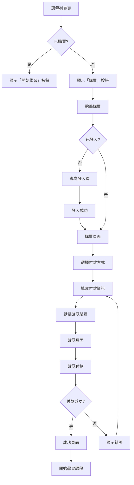
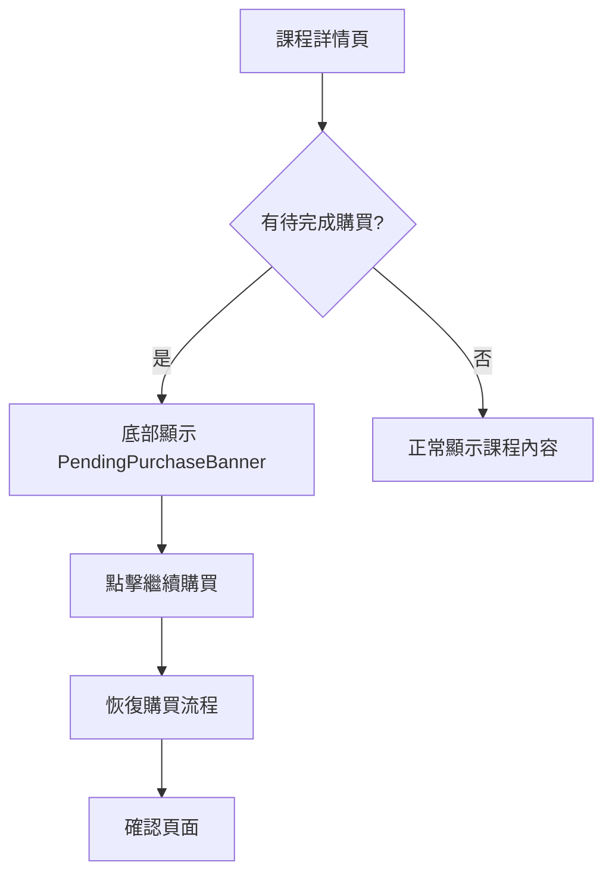

# Frontend Specification: Course Purchase Flow

## Overview

實作課程購買流程介面，支援選擇付款方式、確認訂單、完成購買，並顯示待完成購買提示讓用戶可繼續未完成的購買流程。

## Technical Stack

- Next.js 15 (App Router)
- React 19
- TypeScript
- Tailwind CSS
- shadcn/ui

## Architecture

```
┌─────────────────────────────────────────────────────────────┐
│                      Components                              │
│  PurchaseButton, PaymentMethodSelector, PurchaseSummary      │
│  PendingPurchaseBanner, PaymentForm, PurchaseSuccess         │
├─────────────────────────────────────────────────────────────┤
│                        Hooks                                 │
│  usePurchase, usePendingPurchases, usePayment                │
├─────────────────────────────────────────────────────────────┤
│                       Services                               │
│  purchase.service.ts                                         │
├─────────────────────────────────────────────────────────────┤
│                        Types                                 │
│  purchase.ts                                                 │
└─────────────────────────────────────────────────────────────┘
```

## Directory Structure

```
src/
├── app/
│   └── courses/
│       └── [courseId]/
│           ├── page.tsx                      # 更新：顯示 PendingPurchaseBanner
│           └── purchase/
│               ├── page.tsx                  # 購買頁面
│               ├── confirm/
│               │   └── page.tsx              # 確認付款頁面
│               └── success/
│                   └── page.tsx              # 購買成功頁面
├── components/
│   ├── course/
│   │   ├── JourneyCard.tsx                   # 更新：顯示 PurchaseButton
│   │   └── index.ts
│   └── purchase/
│       ├── PurchaseButton.tsx                # 購買按鈕
│       ├── PaymentMethodSelector.tsx         # 付款方式選擇
│       ├── PurchaseSummary.tsx               # 訂單摘要
│       ├── PendingPurchaseBanner.tsx         # 待完成購買提示
│       ├── PaymentForm.tsx                   # 付款表單
│       ├── PurchaseSuccess.tsx               # 購買成功畫面
│       └── index.ts
├── hooks/
│   ├── usePurchase.ts                        # 購買流程 hook
│   ├── usePendingPurchases.ts                # 待完成購買 hook
│   └── usePayment.ts                         # 付款處理 hook
├── services/
│   └── purchase.service.ts                   # 購買 API
└── types/
    └── purchase.ts                           # 購買相關型別
```

## User Journey Flowchart





## Types

### types/purchase.ts

```typescript
export type PaymentMethod = 'CREDIT_CARD' | 'BANK_TRANSFER';

export type PurchaseStatus = 'PENDING' | 'COMPLETED' | 'FAILED' | 'CANCELLED';

export interface Purchase {
  id: string;
  journeyId: string;
  journeyTitle: string;
  journeyThumbnailUrl: string | null;
  amount: number;
  currency: string;
  paymentMethod: PaymentMethod;
  status: PurchaseStatus;
  createdAt: string;
  completedAt: string | null;
}

export interface PendingPurchase {
  id: string;
  journeyId: string;
  journeyTitle: string;
  journeyThumbnailUrl: string | null;
  amount: number;
  currency: string;
  paymentMethod: PaymentMethod;
  createdAt: string;
  expiresAt: string;
}

export interface CreatePurchaseRequest {
  journeyId: string;
  paymentMethod: PaymentMethod;
}

export interface CreatePurchaseResponse {
  purchaseId: string;
  amount: number;
  currency: string;
}

export interface ConfirmPurchaseRequest {
  purchaseId: string;
  paymentDetails: CreditCardPaymentDetails | BankTransferPaymentDetails;
}

export interface CreditCardPaymentDetails {
  type: 'CREDIT_CARD';
  cardNumber: string;
  expiryDate: string;
  cvv: string;
  cardholderName: string;
}

export interface BankTransferPaymentDetails {
  type: 'BANK_TRANSFER';
  accountNumber: string;
  accountName: string;
  bankCode: string;
}

export interface PaymentMethodOption {
  value: PaymentMethod;
  label: string;
  description: string;
  icon: string;
}

export interface JourneyPricing {
  journeyId: string;
  price: number;
  currency: string;
  originalPrice?: number;
  discountPercentage?: number;
}
```

## Components

### PurchaseButton

購買按鈕，顯示於未購買的課程卡片上

```typescript
interface PurchaseButtonProps {
  journeyId: string;
  price: number;
  currency?: string;
  size?: 'sm' | 'md' | 'lg';
  variant?: 'default' | 'outline';
  className?: string;
}
```

**行為:**

- 顯示價格與購買按鈕
- 點擊後檢查登入狀態
- 未登入導向登入頁，並記錄 redirect URL
- 已登入導向購買頁面

### PaymentMethodSelector

付款方式選擇器

```typescript
interface PaymentMethodSelectorProps {
  selectedMethod: PaymentMethod | null;
  onSelect: (method: PaymentMethod) => void;
  disabled?: boolean;
}
```

**顯示選項:**

- 信用卡付款 (CREDIT_CARD)
  - 圖示：信用卡圖示
  - 說明：支援 Visa、MasterCard、JCB
- 銀行轉帳 (BANK_TRANSFER)
  - 圖示：銀行圖示
  - 說明：ATM 轉帳或網路銀行

### PurchaseSummary

訂單摘要，顯示購買資訊

```typescript
interface PurchaseSummaryProps {
  journey: {
    id: string;
    title: string;
    thumbnailUrl: string | null;
    chapterCount: number;
    lessonCount: number;
  };
  pricing: JourneyPricing;
  paymentMethod?: PaymentMethod;
}
```

**顯示內容:**

- 課程縮圖
- 課程標題
- 章節數、課程數
- 原價（如有折扣）
- 折扣金額（如有）
- 最終價格
- 選擇的付款方式

### PendingPurchaseBanner

待完成購買提示，顯示於課程詳情頁底部

```typescript
interface PendingPurchaseBannerProps {
  purchase: PendingPurchase;
  onContinue: () => void;
  onCancel: () => void;
}
```

**顯示內容:**

- 提示文字：「您有一筆未完成的購買」
- 購買金額
- 到期時間倒數
- 「繼續購買」按鈕
- 「取消」按鈕

**行為:**

- 固定於頁面底部
- 點擊繼續導向確認頁面
- 點擊取消呼叫取消 API

### PaymentForm

付款表單（模擬付款）

```typescript
interface PaymentFormProps {
  paymentMethod: PaymentMethod;
  onSubmit: (details: CreditCardPaymentDetails | BankTransferPaymentDetails) => void;
  isSubmitting?: boolean;
  error?: string | null;
}
```

**信用卡表單欄位:**

- 卡號 (cardNumber) - 16 位數字
- 到期日 (expiryDate) - MM/YY 格式
- CVV (cvv) - 3 位數字
- 持卡人姓名 (cardholderName)

**銀行轉帳表單欄位:**

- 銀行代碼 (bankCode) - 下拉選擇
- 帳戶號碼 (accountNumber)
- 戶名 (accountName)

**驗證規則:**

- 信用卡號：16 位數字，Luhn 演算法驗證（模擬）
- 到期日：格式 MM/YY，不可過期
- CVV：3 位數字
- 銀行帳號：至少 10 位數字

### PurchaseSuccess

購買成功畫面

```typescript
interface PurchaseSuccessProps {
  purchase: Purchase;
  journey: {
    id: string;
    title: string;
    thumbnailUrl: string | null;
  };
}
```

**顯示內容:**

- 成功圖示與動畫
- 恭喜訊息
- 購買明細
- 「開始學習」按鈕
- 「返回課程列表」按鈕

## Hooks

### usePurchase

購買流程 hook

```typescript
function usePurchase(journeyId: string): {
  pricing: JourneyPricing | null;
  isLoadingPricing: boolean;
  createPurchase: (paymentMethod: PaymentMethod) => Promise<CreatePurchaseResponse>;
  confirmPurchase: (purchaseId: string, paymentDetails: CreditCardPaymentDetails | BankTransferPaymentDetails) => Promise<Purchase>;
  cancelPurchase: (purchaseId: string) => Promise<void>;
  isCreating: boolean;
  isConfirming: boolean;
  error: Error | null;
};
```

### usePendingPurchases

取得待完成購買

```typescript
function usePendingPurchases(journeyId?: string): {
  pendingPurchases: PendingPurchase[];
  isLoading: boolean;
  error: Error | null;
  refetch: () => void;
};
```

### usePayment

付款處理 hook

```typescript
function usePayment(): {
  validateCreditCard: (cardNumber: string) => boolean;
  formatCardNumber: (value: string) => string;
  formatExpiryDate: (value: string) => string;
  isExpired: (expiryDate: string) => boolean;
};
```

## Services

### purchase.service.ts

```typescript
export const purchaseService = {
  async getJourneyPricing(journeyId: string): Promise<JourneyPricing>;
  async createPurchase(data: CreatePurchaseRequest): Promise<CreatePurchaseResponse>;
  async confirmPurchase(purchaseId: string, paymentDetails: CreditCardPaymentDetails | BankTransferPaymentDetails): Promise<Purchase>;
  async cancelPurchase(purchaseId: string): Promise<void>;
  async getPurchase(purchaseId: string): Promise<Purchase>;
  async getPendingPurchases(): Promise<PendingPurchase[]>;
  async getPendingPurchaseByJourney(journeyId: string): Promise<PendingPurchase | null>;
  async getUserPurchases(): Promise<Purchase[]>;
};
```

## Page Implementation

### /courses/[courseId]/purchase (購買頁面)

```typescript
interface PurchasePageState {
  step: 'select-method' | 'payment-form';
  selectedMethod: PaymentMethod | null;
  purchaseId: string | null;
}
```

**步驟 1：選擇付款方式**

- 顯示課程資訊 (PurchaseSummary)
- 顯示付款方式選項 (PaymentMethodSelector)
- 「下一步」按鈕

**步驟 2：填寫付款資訊**

- 顯示訂單摘要
- 顯示付款表單 (PaymentForm)
- 「返回」按鈕
- 「確認購買」按鈕

### /courses/[courseId]/purchase/confirm (確認付款頁面)

```typescript
// URL: /courses/[courseId]/purchase/confirm?purchaseId=xxx
```

**顯示內容:**

- 訂單摘要
- 付款方式
- 付款金額
- 確認條款 checkbox
- 「確認付款」按鈕
- 「返回修改」按鈕

**行為:**

- 點擊確認付款後呼叫 confirmPurchase API
- 成功導向成功頁面
- 失敗顯示錯誤訊息

### /courses/[courseId]/purchase/success (購買成功頁面)

```typescript
// URL: /courses/[courseId]/purchase/success?purchaseId=xxx
```

**顯示內容:**

- PurchaseSuccess 元件
- 成功動畫
- 購買詳情
- 導航按鈕

## State Management

### Purchase Flow State

```typescript
interface PurchaseFlowState {
  currentStep: 'method' | 'payment' | 'confirm' | 'success';
  journeyId: string;
  selectedMethod: PaymentMethod | null;
  purchaseId: string | null;
  paymentDetails: CreditCardPaymentDetails | BankTransferPaymentDetails | null;
  error: string | null;
}
```

### State Persistence

- 使用 URL query parameters 保存購買狀態
- purchaseId 用於恢復未完成的購買
- 頁面刷新後可從 URL 恢復狀態

## Page Updates

### /courses/[courseId]/page.tsx

新增待完成購買提示：

```typescript
// 在頁面底部顯示 PendingPurchaseBanner
// 檢查是否有該課程的待完成購買
// 若有，顯示 banner 讓用戶繼續購買
```

### JourneyCard 更新

```typescript
interface JourneyCardProps {
  journey: Journey;
  progress?: JourneyProgress;
  isPurchased?: boolean;
  pricing?: JourneyPricing;
}
```

**更新內容:**

- 未購買時顯示 PurchaseButton
- 已購買時顯示「繼續學習」或「開始學習」

## Error Handling

### 錯誤類型

```typescript
type PurchaseError =
  | 'ALREADY_PURCHASED'      // 已購買過
  | 'PURCHASE_EXPIRED'       // 購買已過期
  | 'PAYMENT_FAILED'         // 付款失敗
  | 'INVALID_PAYMENT_DETAILS'// 付款資訊錯誤
  | 'JOURNEY_NOT_FOUND'      // 課程不存在
  | 'UNAUTHORIZED';          // 未登入
```

### 錯誤處理 UI

- 已購買：顯示提示並導向課程頁面
- 購買過期：提示重新購買
- 付款失敗：顯示錯誤並允許重試
- 未登入：導向登入頁面

## UI States

### Loading States

- 價格載入中
- 建立購買中
- 確認付款中
- 取消購買中

### Empty States

- 無待完成購買

### Success States

- 購買成功動畫
- 成功頁面顯示

## Responsive Design

### Desktop (≥1024px)

- 左側：訂單摘要
- 右側：付款表單/方式選擇

### Tablet (768px-1023px)

- 單欄式佈局
- 訂單摘要在上
- 付款表單在下

### Mobile (<768px)

- 單欄式佈局
- 訂單摘要可收合
- 付款表單全寬
- PendingPurchaseBanner 固定底部

## E2E Test Scenarios

### 測試案例 1：完整購買流程（信用卡）

```gherkin
Feature: 信用卡購買課程
  Scenario: 已登入用戶使用信用卡購買課程
    Given 用戶已登入
    And 用戶在課程列表頁
    When 用戶點擊未購買課程的「購買」按鈕
    Then 導向購買頁面
    When 用戶選擇「信用卡付款」
    And 填寫信用卡資訊
    And 點擊「確認購買」
    Then 導向確認頁面
    When 用戶勾選同意條款
    And 點擊「確認付款」
    Then 顯示購買成功頁面
    And 用戶可以開始學習課程
```

### 測試案例 2：完整購買流程（銀行轉帳）

```gherkin
Feature: 銀行轉帳購買課程
  Scenario: 已登入用戶使用銀行轉帳購買課程
    Given 用戶已登入
    When 用戶進入購買頁面
    And 選擇「銀行轉帳」
    And 填寫銀行帳戶資訊
    And 完成購買流程
    Then 顯示購買成功頁面
```

### 測試案例 3：未登入用戶購買

```gherkin
Feature: 未登入購買
  Scenario: 未登入用戶點擊購買
    Given 用戶未登入
    When 用戶點擊「購買」按鈕
    Then 導向登入頁面
    When 用戶完成登入
    Then 導向購買頁面（原本要購買的課程）
```

### 測試案例 4：繼續未完成購買

```gherkin
Feature: 繼續未完成購買
  Scenario: 用戶繼續之前未完成的購買
    Given 用戶有一筆待完成的購買
    When 用戶進入該課程詳情頁
    Then 底部顯示 PendingPurchaseBanner
    When 用戶點擊「繼續購買」
    Then 導向確認頁面
    And 顯示之前選擇的付款方式
```

### 測試案例 5：取消待完成購買

```gherkin
Feature: 取消待完成購買
  Scenario: 用戶取消待完成的購買
    Given 用戶有一筆待完成的購買
    When 用戶進入課程詳情頁
    And 點擊 PendingPurchaseBanner 的「取消」按鈕
    Then 顯示確認對話框
    When 用戶確認取消
    Then PendingPurchaseBanner 消失
    And 用戶可以重新購買
```

### 測試案例 6：已購買課程無法重複購買

```gherkin
Feature: 防止重複購買
  Scenario: 已購買課程不顯示購買按鈕
    Given 用戶已購買某課程
    When 用戶在課程列表頁查看該課程
    Then 顯示「開始學習」而非「購買」按鈕
    When 用戶直接訪問購買頁面 URL
    Then 顯示「您已購買此課程」提示
    And 導向課程詳情頁
```

### 測試案例 7：付款驗證

```gherkin
Feature: 付款表單驗證
  Scenario: 信用卡資訊驗證
    Given 用戶在付款表單頁面
    When 用戶輸入無效的信用卡號
    Then 顯示「信用卡號格式錯誤」
    When 用戶輸入過期的到期日
    Then 顯示「信用卡已過期」
    When 用戶輸入錯誤的 CVV 格式
    Then 顯示「CVV 格式錯誤」
```

### 測試案例 8：購買過期處理

```gherkin
Feature: 購買過期處理
  Scenario: 待完成購買過期
    Given 用戶有一筆已過期的待完成購買
    When 用戶嘗試繼續購買
    Then 顯示「購買已過期，請重新購買」
    And 導向購買頁面重新開始
```

## Implementation Tasks

### Phase 1: Types & Services

1. [ ] 建立 `types/purchase.ts`
2. [ ] 建立 `services/purchase.service.ts`

### Phase 2: Hooks

3. [ ] 建立 `hooks/usePurchase.ts`
4. [ ] 建立 `hooks/usePendingPurchases.ts`
5. [ ] 建立 `hooks/usePayment.ts`

### Phase 3: Components

6. [ ] 建立 `components/purchase/PurchaseButton.tsx`
7. [ ] 建立 `components/purchase/PaymentMethodSelector.tsx`
8. [ ] 建立 `components/purchase/PurchaseSummary.tsx`
9. [ ] 建立 `components/purchase/PendingPurchaseBanner.tsx`
10. [ ] 建立 `components/purchase/PaymentForm.tsx`
11. [ ] 建立 `components/purchase/PurchaseSuccess.tsx`
12. [ ] 建立 `components/purchase/index.ts`

### Phase 4: Pages

13. [ ] 建立 `courses/[courseId]/purchase/page.tsx`
14. [ ] 建立 `courses/[courseId]/purchase/confirm/page.tsx`
15. [ ] 建立 `courses/[courseId]/purchase/success/page.tsx`

### Phase 5: Integration

16. [ ] 更新 `courses/[courseId]/page.tsx` - 加入 PendingPurchaseBanner
17. [ ] 更新 `components/course/JourneyCard.tsx` - 加入 PurchaseButton

### Phase 6: Testing

18. [ ] E2E 測試：完整購買流程（信用卡）
19. [ ] E2E 測試：完整購買流程（銀行轉帳）
20. [ ] E2E 測試：未登入用戶購買
21. [ ] E2E 測試：繼續未完成購買
22. [ ] E2E 測試：取消待完成購買
23. [ ] E2E 測試：已購買課程無法重複購買
24. [ ] E2E 測試：付款驗證
25. [ ] E2E 測試：購買過期處理

## Success Criteria

- [ ] 未購買課程顯示購買按鈕與價格
- [ ] 可選擇信用卡或銀行轉帳付款
- [ ] 付款表單驗證正確運作
- [ ] 購買成功後可立即存取課程
- [ ] 待完成購買可繼續或取消
- [ ] 已購買課程無法重複購買
- [ ] 響應式設計正常運作
- [ ] E2E 測試覆蓋所有核心購買流程
