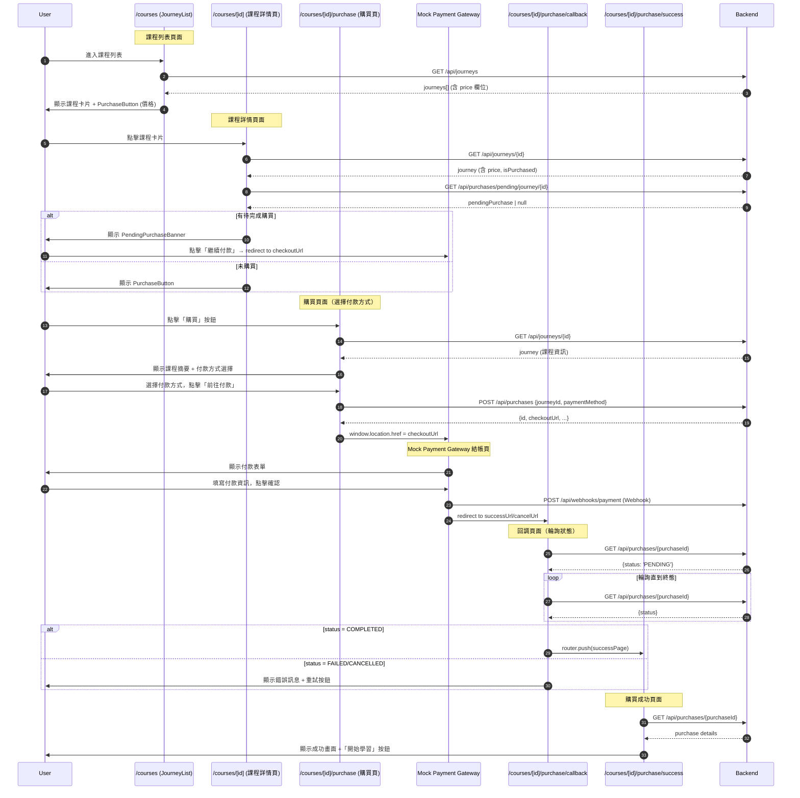
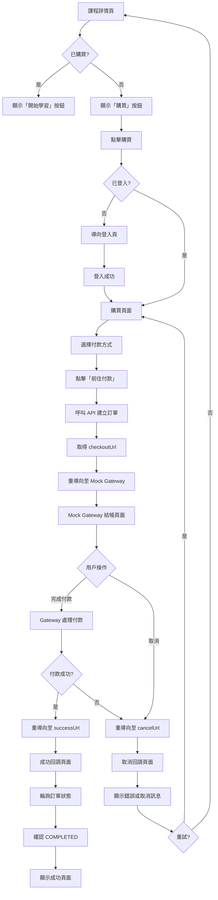
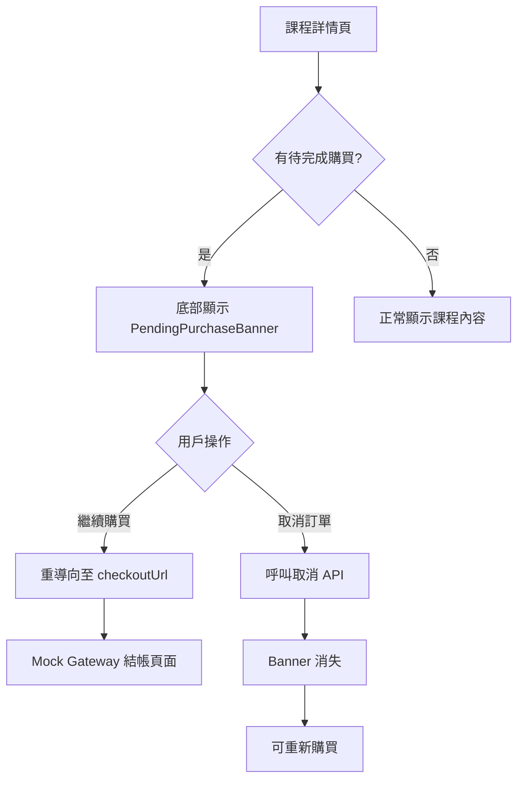
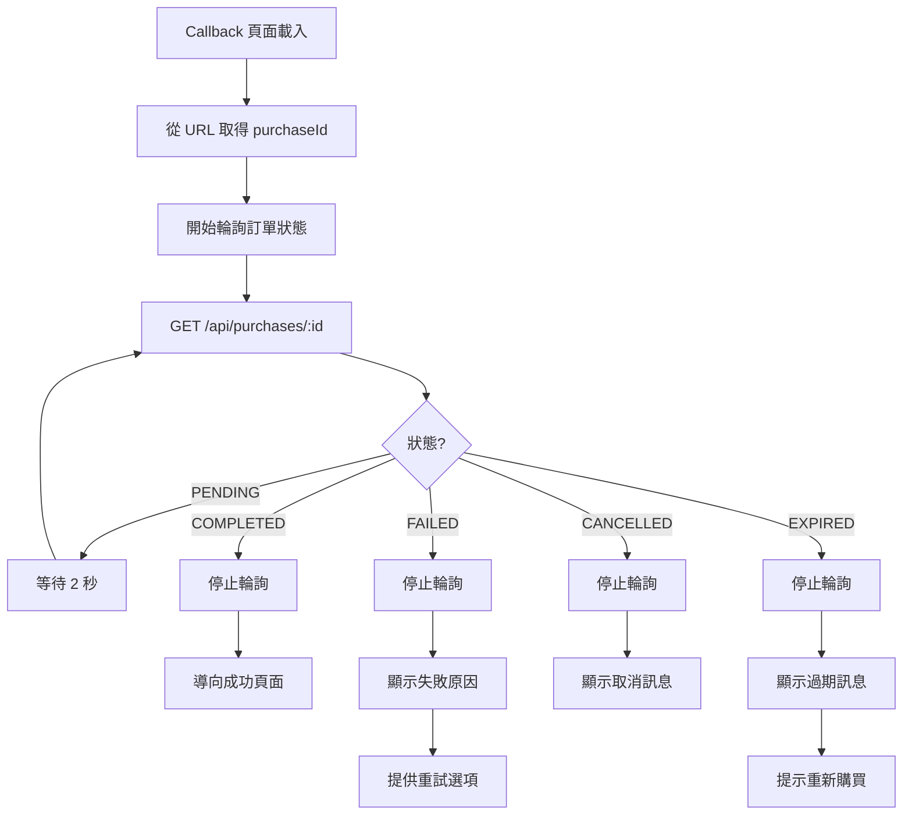

# Frontend Specification: Course Purchase Flow

## Overview

實作課程購買流程介面，採用**重導向式付款流程**，模擬真實第三方金流整合。用戶選擇付款方式後，將被重導向至 Mock Payment Gateway 完成付款，付款完成後再重導回前端顯示結果。

## Technical Stack

- Next.js 15 (App Router)
- React 19
- TypeScript
- Tailwind CSS
- shadcn/ui

## Page-API Sequence Diagram

### Complete Purchase Flow



### Page-API Summary Table

| 頁面 | 時機 | API | 說明 |
|------|------|-----|------|
| `/courses` (JourneyList) | 頁面載入 | `GET /api/journeys` | 取得課程列表（含 price） |
| `/courses/[id]` (課程詳情) | 頁面載入 | `GET /api/journeys/{id}` | 取得課程詳情（含 price, isPurchased） |
| `/courses/[id]` (課程詳情) | 頁面載入 | `GET /api/purchases/pending/journey/{id}` | 檢查是否有待完成購買 |
| `/courses/[id]` (課程詳情) | 點擊取消 | `DELETE /api/purchases/{id}` | 取消待完成購買 |
| `/courses/[id]/purchase` | 頁面載入 | `GET /api/journeys/{id}` | 取得課程資訊顯示摘要 |
| `/courses/[id]/purchase` | 點擊付款 | `POST /api/purchases` | 建立訂單，取得 checkoutUrl |
| `/courses/[id]/purchase/callback` | 頁面載入 | `GET /api/purchases/{id}` | 輪詢訂單狀態 |
| `/courses/[id]/purchase/success` | 頁面載入 | `GET /api/purchases/{id}` | 取得購買詳情顯示成功畫面 |

### API 權限說明

| API | 需登入 | 說明 |
|-----|--------|------|
| `GET /api/journeys` | ❌ | 公開課程列表 |
| `GET /api/journeys/{id}` | ❌ | 公開課程詳情 |
| `GET /api/purchases/pending/journey/{id}` | ✅ | 查詢自己的待完成購買 |
| `POST /api/purchases` | ✅ | 建立購買訂單 |
| `GET /api/purchases/{id}` | ✅ | 查詢自己的訂單 |
| `DELETE /api/purchases/{id}` | ✅ | 取消自己的訂單 |

## Architecture

```
┌─────────────────────────────────────────────────────────────┐
│                      Components                              │
│  PurchaseButton, PaymentMethodSelector, PurchaseSummary      │
│  PendingPurchaseBanner, PurchaseSuccess, PurchaseStatus      │
├─────────────────────────────────────────────────────────────┤
│                        Hooks                                 │
│  usePurchase, usePendingPurchases, usePurchaseStatus         │
├─────────────────────────────────────────────────────────────┤
│                       Services                               │
│  purchase.service.ts                                         │
├─────────────────────────────────────────────────────────────┤
│                        Types                                 │
│  purchase.ts                                                 │
└─────────────────────────────────────────────────────────────┘
```

## Directory Structure

```
src/
├── app/
│   └── courses/
│       └── [courseId]/
│           ├── page.tsx                      # 更新：顯示 PendingPurchaseBanner
│           └── purchase/
│               ├── page.tsx                  # 選擇付款方式頁面
│               ├── callback/
│               │   └── page.tsx              # Gateway 回調頁面（處理 success/cancel）
│               └── success/
│                   └── page.tsx              # 購買成功頁面
├── components/
│   ├── course/
│   │   ├── JourneyCard.tsx                   # 更新：顯示 PurchaseButton
│   │   └── index.ts
│   └── purchase/
│       ├── PurchaseButton.tsx                # 購買按鈕
│       ├── PaymentMethodSelector.tsx         # 付款方式選擇
│       ├── PurchaseSummary.tsx               # 訂單摘要
│       ├── PendingPurchaseBanner.tsx         # 待完成購買提示
│       ├── PurchaseSuccess.tsx               # 購買成功畫面
│       ├── PurchaseStatus.tsx                # 訂單狀態顯示
│       └── index.ts
├── hooks/
│   ├── usePurchase.ts                        # 購買流程 hook
│   ├── usePendingPurchases.ts                # 待完成購買 hook
│   └── usePurchaseStatus.ts                  # 訂單狀態輪詢 hook
├── services/
│   └── purchase.service.ts                   # 購買 API
└── types/
    └── purchase.ts                           # 購買相關型別
```

## User Journey Flowchart

### Main Purchase Flow (Redirect-based)



### Pending Purchase Resume Flow



### Status Polling Flow



## Types

### types/purchase.ts

```typescript
export type PaymentMethod = 'CREDIT_CARD' | 'BANK_TRANSFER';

export type PurchaseStatus = 'PENDING' | 'COMPLETED' | 'FAILED' | 'CANCELLED' | 'EXPIRED';

export interface Purchase {
  id: string;
  journeyId: string;
  journeyTitle: string;
  journeyThumbnailUrl: string | null;
  journeyDescription?: string | null;
  amount: number;
  currency: string;
  paymentMethod: PaymentMethod;
  status: PurchaseStatus;
  checkoutUrl?: string | null;
  failureReason?: string | null;
  createdAt: string;
  updatedAt?: string;
  expiresAt?: string | null;
  completedAt: string | null;
}

export interface PendingPurchase {
  id: string;
  journeyId: string;
  journeyTitle: string;
  journeyThumbnailUrl: string | null;
  amount: number;
  currency: string;
  paymentMethod: PaymentMethod;
  status: 'PENDING';
  checkoutUrl: string;
  expiresAt: string;
  createdAt: string;
}

export interface CreatePurchaseRequest {
  journeyId: string;
  paymentMethod: PaymentMethod;
}

export interface CreatePurchaseResponse {
  id: string;
  journeyId: string;
  journeyTitle: string;
  amount: number;
  currency: string;
  paymentMethod: PaymentMethod;
  status: PurchaseStatus;
  checkoutUrl: string;
  expiresAt: string;
  createdAt: string;
}

export interface PaymentMethodOption {
  value: PaymentMethod;
  label: string;
  description: string;
  icon: React.ComponentType;
}

export interface JourneyPricing {
  journeyId: string;
  price: number;
  currency: string;
  originalPrice?: number;
  discountPercentage?: number;
}

export interface PurchaseCallbackParams {
  purchaseId: string;
  status: 'success' | 'cancel';
  error?: string;
}
```

## Components

### PurchaseButton

購買按鈕，顯示於未購買的課程卡片上

```typescript
interface PurchaseButtonProps {
  journeyId: string;
  price: number;
  currency?: string;
  size?: 'sm' | 'md' | 'lg';
  variant?: 'default' | 'outline';
  className?: string;
}
```

**行為:**

- 顯示價格與購買按鈕
- 點擊後檢查登入狀態
- 未登入導向登入頁，並記錄 redirect URL
- 已登入導向購買頁面 `/courses/[courseId]/purchase`

### PaymentMethodSelector

付款方式選擇器

```typescript
interface PaymentMethodSelectorProps {
  selectedMethod: PaymentMethod | null;
  onSelect: (method: PaymentMethod) => void;
  disabled?: boolean;
}
```

**顯示選項:**

- 信用卡付款 (CREDIT_CARD)
  - 圖示：信用卡圖示
  - 說明：支援 Visa、MasterCard、JCB
- 銀行轉帳 (BANK_TRANSFER)
  - 圖示：銀行圖示
  - 說明：ATM 轉帳或網路銀行

### PurchaseSummary

訂單摘要，顯示購買資訊

```typescript
interface PurchaseSummaryProps {
  journey: {
    id: string;
    title: string;
    thumbnailUrl: string | null;
    chapterCount: number;
    lessonCount: number;
  };
  pricing: JourneyPricing;
  paymentMethod?: PaymentMethod;
}
```

**顯示內容:**

- 課程縮圖
- 課程標題
- 章節數、課程數
- 原價（如有折扣）
- 折扣金額（如有）
- 最終價格
- 選擇的付款方式

### PendingPurchaseBanner

待完成購買提示，顯示於課程詳情頁底部

```typescript
interface PendingPurchaseBannerProps {
  purchase: PendingPurchase;
  onContinue: () => void;
  onCancel: () => void;
  isCancelling?: boolean;
}
```

**顯示內容:**

- 提示文字：「您有一筆未完成的購買」
- 購買金額
- 到期時間倒數
- 「繼續付款」按鈕 → 重導向至 checkoutUrl
- 「取消」按鈕 → 呼叫取消 API

**行為:**

- 固定於頁面底部
- 點擊繼續直接重導向至 Mock Gateway
- 點擊取消呼叫取消 API，成功後 Banner 消失

### PurchaseSuccess

購買成功畫面

```typescript
interface PurchaseSuccessProps {
  purchase: Purchase;
  journey: {
    id: string;
    title: string;
    thumbnailUrl: string | null;
  };
}
```

**顯示內容:**

- 成功圖示與動畫
- 恭喜訊息
- 購買明細（金額、付款方式、完成時間）
- 「開始學習」按鈕
- 「返回課程列表」按鈕

### PurchaseStatus

訂單狀態顯示元件

```typescript
interface PurchaseStatusProps {
  status: PurchaseStatus;
  failureReason?: string | null;
  onRetry?: () => void;
  onBackToCourse?: () => void;
}
```

**根據狀態顯示:**

- `PENDING` - 處理中動畫
- `COMPLETED` - 成功圖示
- `FAILED` - 失敗訊息 + 重試按鈕
- `CANCELLED` - 取消訊息
- `EXPIRED` - 過期訊息 + 重新購買按鈕

## Hooks

### usePurchase

購買流程 hook

```typescript
function usePurchase(journeyId: string): {
  pricing: JourneyPricing | null;
  isLoadingPricing: boolean;
  createPurchase: (paymentMethod: PaymentMethod) => Promise<CreatePurchaseResponse>;
  cancelPurchase: (purchaseId: string) => Promise<void>;
  isCreating: boolean;
  isCancelling: boolean;
  error: Error | null;
};
```

**使用方式:**

```typescript
const { createPurchase, isCreating } = usePurchase(journeyId);

const handlePurchase = async (method: PaymentMethod) => {
  const result = await createPurchase(method);
  window.location.href = result.checkoutUrl;
};
```

### usePendingPurchases

取得待完成購買

```typescript
function usePendingPurchases(journeyId?: string): {
  pendingPurchases: PendingPurchase[];
  pendingPurchaseForJourney: PendingPurchase | null;
  isLoading: boolean;
  error: Error | null;
  refetch: () => void;
};
```

### usePurchaseStatus

訂單狀態輪詢 hook

```typescript
interface UsePurchaseStatusOptions {
  purchaseId: string;
  enabled?: boolean;
  pollingInterval?: number;
  onStatusChange?: (status: PurchaseStatus) => void;
}

function usePurchaseStatus(options: UsePurchaseStatusOptions): {
  purchase: Purchase | null;
  status: PurchaseStatus | null;
  isLoading: boolean;
  isPolling: boolean;
  error: Error | null;
  stopPolling: () => void;
};
```

**行為:**

- 自動輪詢直到狀態變為終態 (COMPLETED, FAILED, CANCELLED, EXPIRED)
- 預設輪詢間隔 2 秒
- 最大輪詢次數 30 次（1 分鐘）
- 支援手動停止輪詢

**使用方式:**

```typescript
const { purchase, status, isPolling } = usePurchaseStatus({
  purchaseId,
  enabled: true,
  onStatusChange: (status) => {
    if (status === 'COMPLETED') {
      router.push(`/courses/${courseId}/purchase/success?purchaseId=${purchaseId}`);
    }
  },
});
```

## Services

### purchase.service.ts

```typescript
export const purchaseService = {
  async createPurchase(data: CreatePurchaseRequest): Promise<CreatePurchaseResponse>;
  
  async cancelPurchase(purchaseId: string): Promise<void>;
  
  async getPurchase(purchaseId: string): Promise<Purchase>;
  
  async getPendingPurchases(): Promise<PendingPurchase[]>;
  
  async getPendingPurchaseByJourney(journeyId: string): Promise<PendingPurchase | null>;
  
  async getUserPurchases(params?: { status?: PurchaseStatus; page?: number; size?: number }): Promise<{
    content: Purchase[];
    totalElements: number;
    totalPages: number;
    number: number;
    size: number;
  }>;
};
```

## Page Implementation

### /courses/[courseId]/purchase (選擇付款方式頁面)

**URL:** `/courses/[courseId]/purchase`

**功能:**

1. 顯示課程資訊與價格
2. 選擇付款方式
3. 建立訂單並重導向至 Gateway

**狀態:**

```typescript
interface PurchasePageState {
  selectedMethod: PaymentMethod | null;
  isCreating: boolean;
  error: string | null;
}
```

**流程:**

1. 載入課程資訊與價格
2. 檢查是否有待完成購買
   - 有：顯示 Banner，點擊可直接前往 Gateway
   - 無：顯示付款方式選擇
3. 用戶選擇付款方式
4. 點擊「前往付款」
5. 呼叫 `createPurchase` API
6. 取得 `checkoutUrl`
7. `window.location.href = checkoutUrl` 重導向

**UI:**

```
┌────────────────────────────────────────┐
│  ← 返回課程                            │
├────────────────────────────────────────┤
│                                        │
│  ┌──────────────────────────────────┐  │
│  │  課程縮圖                         │  │
│  │  課程標題                         │  │
│  │  5 章節 · 20 課程                 │  │
│  └──────────────────────────────────┘  │
│                                        │
│  選擇付款方式                          │
│                                        │
│  ┌──────────────────────────────────┐  │
│  │ ○ 💳 信用卡付款                   │  │
│  │   支援 Visa、MasterCard、JCB     │  │
│  └──────────────────────────────────┘  │
│                                        │
│  ┌──────────────────────────────────┐  │
│  │ ○ 🏦 銀行轉帳                     │  │
│  │   ATM 轉帳或網路銀行              │  │
│  └──────────────────────────────────┘  │
│                                        │
│  ────────────────────────────────────  │
│                                        │
│  小計                      NT$ 1,999   │
│                                        │
│  ┌──────────────────────────────────┐  │
│  │         前往付款                  │  │
│  └──────────────────────────────────┘  │
│                                        │
└────────────────────────────────────────┘
```

### /courses/[courseId]/purchase/callback (Gateway 回調頁面)

**URL:** `/courses/[courseId]/purchase/callback?purchaseId=xxx&status=success|cancel&error=xxx`

**功能:**

1. 接收 Gateway 回調
2. 輪詢訂單狀態
3. 根據結果導向或顯示訊息

**Query Parameters:**

| Parameter | Type | Description |
|-----------|------|-------------|
| purchaseId | string | 訂單 ID |
| status | 'success' \| 'cancel' | Gateway 回調狀態 |
| error | string? | 錯誤訊息（cancel 時） |

**流程:**

```typescript
// 成功回調
if (status === 'success') {
  // 開始輪詢訂單狀態
  // 等待 Webhook 處理完成
  // 確認 COMPLETED 後導向成功頁
}

// 取消回調
if (status === 'cancel') {
  // 顯示取消/錯誤訊息
  // 提供重試選項
}
```

**UI (處理中):**

```
┌────────────────────────────────────────┐
│                                        │
│           ⏳                           │
│                                        │
│       正在確認付款結果...               │
│                                        │
│       請稍候，不要關閉此頁面             │
│                                        │
└────────────────────────────────────────┘
```

**UI (失敗):**

```
┌────────────────────────────────────────┐
│                                        │
│           ❌                           │
│                                        │
│         付款失敗                        │
│                                        │
│    錯誤原因：餘額不足                   │
│                                        │
│  ┌──────────────────────────────────┐  │
│  │         重新嘗試                  │  │
│  └──────────────────────────────────┘  │
│                                        │
│  ┌──────────────────────────────────┐  │
│  │         返回課程                  │  │
│  └──────────────────────────────────┘  │
│                                        │
└────────────────────────────────────────┘
```

### /courses/[courseId]/purchase/success (購買成功頁面)

**URL:** `/courses/[courseId]/purchase/success?purchaseId=xxx`

**功能:**

1. 顯示購買成功資訊
2. 提供開始學習入口

**UI:**

```
┌────────────────────────────────────────┐
│                                        │
│           ✅                           │
│                                        │
│       恭喜！購買成功                    │
│                                        │
│  ┌──────────────────────────────────┐  │
│  │  課程縮圖                         │  │
│  │  軟體設計之旅                     │  │
│  └──────────────────────────────────┘  │
│                                        │
│  訂單編號：660e8400-...                │
│  付款金額：NT$ 1,999                   │
│  付款方式：信用卡                      │
│  完成時間：2024/01/01 12:00            │
│                                        │
│  ┌──────────────────────────────────┐  │
│  │         開始學習                  │  │
│  └──────────────────────────────────┘  │
│                                        │
│        返回課程列表                     │
│                                        │
└────────────────────────────────────────┘
```

## State Management

### URL-based State

購買流程使用 URL 參數保存狀態：

```
/courses/[courseId]/purchase
  → 選擇付款方式

/courses/[courseId]/purchase/callback?purchaseId=xxx&status=success
  → 成功回調，等待確認

/courses/[courseId]/purchase/callback?purchaseId=xxx&status=cancel&error=xxx
  → 取消/失敗回調

/courses/[courseId]/purchase/success?purchaseId=xxx
  → 購買成功頁面
```

### Redirect URLs

建立訂單時設定的回調 URL：

```typescript
const successUrl = `${window.location.origin}/courses/${courseId}/purchase/callback?purchaseId=${purchaseId}&status=success`;
const cancelUrl = `${window.location.origin}/courses/${courseId}/purchase/callback?purchaseId=${purchaseId}&status=cancel`;
```

## Page Updates

### /courses/[courseId]/page.tsx

新增待完成購買提示：

```typescript
export default function CoursePage({ params }: { params: { courseId: string } }) {
  const { pendingPurchaseForJourney, isLoading } = usePendingPurchases(params.courseId);
  
  return (
    <div>
      {/* 課程內容 */}
      
      {/* 待完成購買 Banner */}
      {pendingPurchaseForJourney && (
        <PendingPurchaseBanner
          purchase={pendingPurchaseForJourney}
          onContinue={() => {
            window.location.href = pendingPurchaseForJourney.checkoutUrl;
          }}
          onCancel={handleCancel}
        />
      )}
    </div>
  );
}
```

### JourneyCard 更新

```typescript
interface JourneyCardProps {
  journey: Journey;
  progress?: JourneyProgress;
  isPurchased?: boolean;
  pricing?: JourneyPricing;
}
```

**更新內容:**

- 未購買時顯示 PurchaseButton
- 已購買時顯示「繼續學習」或「開始學習」

## Error Handling

### 錯誤類型

```typescript
type PurchaseError =
  | 'ALREADY_PURCHASED'       // 已購買過
  | 'PURCHASE_EXPIRED'        // 購買已過期
  | 'PAYMENT_FAILED'          // 付款失敗
  | 'SESSION_EXPIRED'         // Checkout Session 過期
  | 'JOURNEY_NOT_FOUND'       // 課程不存在
  | 'UNAUTHORIZED'            // 未登入
  | 'NETWORK_ERROR';          // 網路錯誤
```

### 錯誤處理 UI

| 錯誤類型 | 處理方式 |
|----------|----------|
| ALREADY_PURCHASED | 顯示提示並導向課程頁面 |
| PURCHASE_EXPIRED | 提示重新購買 |
| PAYMENT_FAILED | 顯示錯誤原因，提供重試選項 |
| SESSION_EXPIRED | 提示重新建立訂單 |
| UNAUTHORIZED | 導向登入頁面 |
| NETWORK_ERROR | 顯示重試按鈕 |

## UI States

### Loading States

- 課程資訊載入中
- 建立訂單中（顯示 loading，防止重複點擊）
- 重導向中
- 輪詢狀態中

### Error States

- API 錯誤
- 付款失敗（顯示原因）
- Session 過期

### Success States

- 購買成功動畫
- Confetti 效果（可選）

## Responsive Design

### Desktop (≥1024px)

- 左側：課程資訊
- 右側：付款選項與摘要

### Tablet (768px-1023px)

- 單欄式佈局
- 課程資訊在上
- 付款選項在下

### Mobile (<768px)

- 單欄式佈局
- 緊湊的付款選項
- PendingPurchaseBanner 固定底部

## E2E Test Scenarios

### 測試案例 1：完整購買流程（信用卡成功）

```gherkin
Feature: 信用卡購買課程
  Scenario: 已登入用戶使用信用卡購買課程
    Given 用戶已登入
    And 用戶在課程詳情頁
    When 用戶點擊「購買」按鈕
    Then 導向購買頁面
    When 用戶選擇「信用卡付款」
    And 點擊「前往付款」
    Then 重導向至 Mock Gateway 結帳頁面
    When 用戶填寫有效信用卡資訊
    And 點擊「確認付款」
    Then 重導向回成功回調頁面
    And 顯示「正在確認付款結果」
    When 訂單狀態變為 COMPLETED
    Then 導向購買成功頁面
    And 用戶可以點擊「開始學習」
```

### 測試案例 2：完整購買流程（銀行轉帳成功）

```gherkin
Feature: 銀行轉帳購買課程
  Scenario: 已登入用戶使用銀行轉帳購買課程
    Given 用戶已登入
    When 用戶進入購買頁面
    And 選擇「銀行轉帳」
    And 點擊「前往付款」
    Then 重導向至 Mock Gateway
    When 用戶填寫銀行帳戶資訊並確認
    Then 重導向回成功回調頁面
    And 顯示購買成功頁面
```

### 測試案例 3：未登入用戶購買

```gherkin
Feature: 未登入購買
  Scenario: 未登入用戶點擊購買
    Given 用戶未登入
    When 用戶點擊「購買」按鈕
    Then 導向登入頁面
    And URL 包含 redirect 參數
    When 用戶完成登入
    Then 導向購買頁面（原本要購買的課程）
```

### 測試案例 4：付款失敗重試

```gherkin
Feature: 付款失敗重試
  Scenario: 用戶付款失敗後重試
    Given 用戶已登入
    And 用戶在 Mock Gateway 結帳頁面
    When 用戶輸入會失敗的卡號（結尾 0000）
    And 點擊確認付款
    Then 重導向回取消回調頁面
    And 顯示「付款失敗：餘額不足」
    When 用戶點擊「重新嘗試」
    Then 導向購買頁面重新開始
```

### 測試案例 5：繼續未完成購買

```gherkin
Feature: 繼續未完成購買
  Scenario: 用戶繼續之前未完成的購買
    Given 用戶有一筆待完成的購買
    When 用戶進入該課程詳情頁
    Then 底部顯示 PendingPurchaseBanner
    And 顯示到期時間倒數
    When 用戶點擊「繼續付款」
    Then 直接重導向至 Mock Gateway checkoutUrl
```

### 測試案例 6：取消待完成購買

```gherkin
Feature: 取消待完成購買
  Scenario: 用戶取消待完成的購買
    Given 用戶有一筆待完成的購買
    When 用戶進入課程詳情頁
    And 點擊 PendingPurchaseBanner 的「取消」按鈕
    Then 顯示確認對話框
    When 用戶確認取消
    Then PendingPurchaseBanner 消失
    And 用戶可以重新購買
```

### 測試案例 7：已購買課程無法重複購買

```gherkin
Feature: 防止重複購買
  Scenario: 已購買課程不顯示購買按鈕
    Given 用戶已購買某課程
    When 用戶在課程詳情頁查看該課程
    Then 顯示「開始學習」而非「購買」按鈕
    When 用戶直接訪問購買頁面 URL
    Then 顯示「您已購買此課程」提示
    And 自動導向課程詳情頁
```

### 測試案例 8：Gateway 取消返回

```gherkin
Feature: Gateway 取消返回
  Scenario: 用戶在 Gateway 頁面點擊取消
    Given 用戶在 Mock Gateway 結帳頁面
    When 用戶點擊「取消」
    Then 重導向回取消回調頁面
    And 顯示「購買已取消」訊息
    And 訂單狀態保持 PENDING（可稍後繼續）
```

### 測試案例 9：Session 過期處理

```gherkin
Feature: Session 過期處理
  Scenario: Checkout Session 過期
    Given 用戶有一筆過期的待完成購買
    When 用戶嘗試存取過期的 checkoutUrl
    Then 顯示「Session 已過期」訊息
    And 提示用戶重新購買
```

## Success Criteria

- [ ] 未購買課程顯示購買按鈕與價格
- [ ] 可選擇信用卡或銀行轉帳付款
- [ ] 點擊「前往付款」後正確重導向至 Mock Gateway
- [ ] Gateway 付款成功後正確重導回 Frontend
- [ ] 訂單狀態輪詢正常運作
- [ ] 購買成功後可立即存取課程
- [ ] 待完成購買可繼續或取消
- [ ] 已購買課程無法重複購買
- [ ] 響應式設計正常運作
- [ ] E2E 測試覆蓋所有核心購買流程
