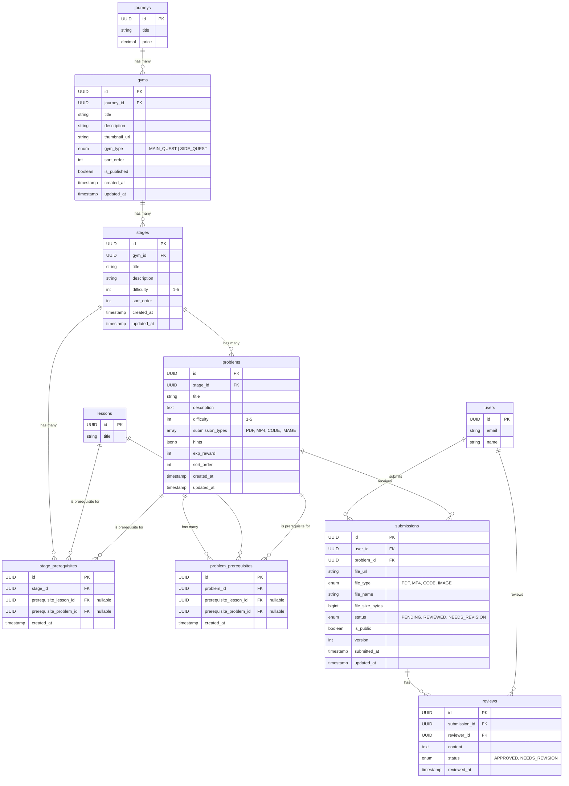

# Backend Specification: Gym Homework System

## Overview

實作道館作業系統後端，支援 Gym -> Stage -> Problem 三層架構，包含權限控制、前置條件檢查、作業提交與批改流程。

**MVP 範圍**: 學生端 API + 基本批改 API（透過 SQL Script 模擬老師批改），Admin 後台暫不實作。

## Technical Stack

- Spring Boot 3.2
- Spring Security 6
- PostgreSQL + Flyway
- JPA / Hibernate
- File Storage (支援多 Provider: Local / Supabase / S3)

## Entity Relationship Diagram



## Database Schema

### gyms table (道館)

```sql
CREATE TABLE gyms (
    id UUID PRIMARY KEY DEFAULT gen_random_uuid(),
    journey_id UUID NOT NULL REFERENCES journeys(id) ON DELETE CASCADE,
    title VARCHAR(255) NOT NULL,
    description TEXT,
    thumbnail_url VARCHAR(500),
    gym_type VARCHAR(50) NOT NULL DEFAULT 'MAIN_QUEST',
    sort_order INT NOT NULL DEFAULT 0,
    is_published BOOLEAN DEFAULT FALSE,
    created_at TIMESTAMP DEFAULT CURRENT_TIMESTAMP,
    updated_at TIMESTAMP DEFAULT CURRENT_TIMESTAMP
);

CREATE INDEX idx_gyms_journey_id ON gyms(journey_id);
CREATE INDEX idx_gyms_type ON gyms(gym_type);
CREATE INDEX idx_gyms_published ON gyms(is_published);
```

### stages table (關卡)

```sql
CREATE TABLE stages (
    id UUID PRIMARY KEY DEFAULT gen_random_uuid(),
    gym_id UUID NOT NULL REFERENCES gyms(id) ON DELETE CASCADE,
    title VARCHAR(255) NOT NULL,
    description TEXT,
    difficulty INT NOT NULL DEFAULT 1 CHECK (difficulty >= 1 AND difficulty <= 5),
    sort_order INT NOT NULL DEFAULT 0,
    created_at TIMESTAMP DEFAULT CURRENT_TIMESTAMP,
    updated_at TIMESTAMP DEFAULT CURRENT_TIMESTAMP
);

CREATE INDEX idx_stages_gym_id ON stages(gym_id);
CREATE INDEX idx_stages_sort_order ON stages(gym_id, sort_order);
```

### problems table (題目)

```sql
CREATE TABLE problems (
    id UUID PRIMARY KEY DEFAULT gen_random_uuid(),
    stage_id UUID NOT NULL REFERENCES stages(id) ON DELETE CASCADE,
    title VARCHAR(255) NOT NULL,
    description TEXT NOT NULL,
    difficulty INT NOT NULL DEFAULT 1 CHECK (difficulty >= 1 AND difficulty <= 5),
    submission_types VARCHAR(255)[] NOT NULL DEFAULT ARRAY['PDF'],
    hints JSONB DEFAULT '[]',
    exp_reward INT NOT NULL DEFAULT 10,
    sort_order INT NOT NULL DEFAULT 0,
    created_at TIMESTAMP DEFAULT CURRENT_TIMESTAMP,
    updated_at TIMESTAMP DEFAULT CURRENT_TIMESTAMP
);

CREATE INDEX idx_problems_stage_id ON problems(stage_id);
CREATE INDEX idx_problems_sort_order ON problems(stage_id, sort_order);
```

### stage_prerequisites table (關卡前置條件)

```sql
CREATE TABLE stage_prerequisites (
    id UUID PRIMARY KEY DEFAULT gen_random_uuid(),
    stage_id UUID NOT NULL REFERENCES stages(id) ON DELETE CASCADE,
    prerequisite_lesson_id UUID REFERENCES lessons(id) ON DELETE CASCADE,
    prerequisite_problem_id UUID REFERENCES problems(id) ON DELETE CASCADE,
    created_at TIMESTAMP DEFAULT CURRENT_TIMESTAMP,
    CONSTRAINT chk_stage_prereq_one_type CHECK (
        (prerequisite_lesson_id IS NOT NULL AND prerequisite_problem_id IS NULL) OR
        (prerequisite_lesson_id IS NULL AND prerequisite_problem_id IS NOT NULL)
    ),
    UNIQUE(stage_id, prerequisite_lesson_id),
    UNIQUE(stage_id, prerequisite_problem_id)
);

CREATE INDEX idx_stage_prereq_stage ON stage_prerequisites(stage_id);
CREATE INDEX idx_stage_prereq_lesson ON stage_prerequisites(prerequisite_lesson_id) WHERE prerequisite_lesson_id IS NOT NULL;
CREATE INDEX idx_stage_prereq_problem ON stage_prerequisites(prerequisite_problem_id) WHERE prerequisite_problem_id IS NOT NULL;
```

### problem_prerequisites table (題目前置條件)

```sql
CREATE TABLE problem_prerequisites (
    id UUID PRIMARY KEY DEFAULT gen_random_uuid(),
    problem_id UUID NOT NULL REFERENCES problems(id) ON DELETE CASCADE,
    prerequisite_lesson_id UUID REFERENCES lessons(id) ON DELETE CASCADE,
    prerequisite_problem_id UUID REFERENCES problems(id) ON DELETE CASCADE,
    created_at TIMESTAMP DEFAULT CURRENT_TIMESTAMP,
    CONSTRAINT chk_problem_prereq_one_type CHECK (
        (prerequisite_lesson_id IS NOT NULL AND prerequisite_problem_id IS NULL) OR
        (prerequisite_lesson_id IS NULL AND prerequisite_problem_id IS NOT NULL)
    ),
    CONSTRAINT chk_problem_prereq_not_self CHECK (problem_id != prerequisite_problem_id),
    UNIQUE(problem_id, prerequisite_lesson_id),
    UNIQUE(problem_id, prerequisite_problem_id)
);

CREATE INDEX idx_problem_prereq_problem ON problem_prerequisites(problem_id);
CREATE INDEX idx_problem_prereq_lesson ON problem_prerequisites(prerequisite_lesson_id) WHERE prerequisite_lesson_id IS NOT NULL;
CREATE INDEX idx_problem_prereq_prereq_problem ON problem_prerequisites(prerequisite_problem_id) WHERE prerequisite_problem_id IS NOT NULL;
```

### submissions table (提交記錄)

```sql
CREATE TABLE submissions (
    id UUID PRIMARY KEY DEFAULT gen_random_uuid(),
    user_id UUID NOT NULL REFERENCES users(id) ON DELETE CASCADE,
    problem_id UUID NOT NULL REFERENCES problems(id) ON DELETE CASCADE,
    file_url VARCHAR(500) NOT NULL,
    file_type VARCHAR(50) NOT NULL,
    file_name VARCHAR(255) NOT NULL,
    file_size_bytes BIGINT NOT NULL,
    status VARCHAR(50) NOT NULL DEFAULT 'PENDING',
    is_public BOOLEAN DEFAULT FALSE,
    version INT NOT NULL DEFAULT 1,
    submitted_at TIMESTAMP DEFAULT CURRENT_TIMESTAMP,
    updated_at TIMESTAMP DEFAULT CURRENT_TIMESTAMP
);

CREATE INDEX idx_submissions_user_id ON submissions(user_id);
CREATE INDEX idx_submissions_problem_id ON submissions(problem_id);
CREATE INDEX idx_submissions_user_problem ON submissions(user_id, problem_id);
CREATE INDEX idx_submissions_status ON submissions(status);
CREATE INDEX idx_submissions_public ON submissions(is_public) WHERE is_public = TRUE;
```

### reviews table (批改記錄)

```sql
CREATE TABLE reviews (
    id UUID PRIMARY KEY DEFAULT gen_random_uuid(),
    submission_id UUID NOT NULL REFERENCES submissions(id) ON DELETE CASCADE,
    reviewer_id UUID NOT NULL REFERENCES users(id) ON DELETE CASCADE,
    content TEXT NOT NULL,
    status VARCHAR(50) NOT NULL,
    reviewed_at TIMESTAMP DEFAULT CURRENT_TIMESTAMP
);

CREATE INDEX idx_reviews_submission_id ON reviews(submission_id);
CREATE INDEX idx_reviews_reviewer_id ON reviews(reviewer_id);
```

---

## Common Definitions

### Authentication

需登入的 API 在 Header 帶入 JWT Token：

```
Authorization: Bearer <access_token>
```

### Standard Error Response

```json
{
  "timestamp": "2024-01-01T00:00:00Z",
  "status": 400,
  "error": "Bad Request",
  "message": "Validation failed",
  "path": "/api/gyms"
}
```

### HTTP Status Codes

| Code | Description |
|------|-------------|
| 200 | OK - 請求成功 |
| 201 | Created - 資源建立成功 |
| 400 | Bad Request - 請求參數錯誤 |
| 401 | Unauthorized - 未登入或 Token 過期 |
| 403 | Forbidden - 無權限存取 |
| 404 | Not Found - 資源不存在 |
| 409 | Conflict - 資源衝突 |

### Enums

**GymType:**

- `MAIN_QUEST` - 主線任務
- `SIDE_QUEST` - 支線任務

**SubmissionType:**

- `PDF` - PDF 文件
- `MP4` - 影片檔案
- `CODE` - 程式碼 (zip/txt)
- `IMAGE` - 圖片

**SubmissionStatus:**

- `PENDING` - 待批改
- `REVIEWED` - 已批改
- `NEEDS_REVISION` - 需修改

**ReviewStatus:**

- `APPROVED` - 通過
- `NEEDS_REVISION` - 需修改

**PrerequisiteType:**

- `LESSON` - 課程
- `PROBLEM` - 題目

---

## API Endpoints

### Public API (未登入可存取)

---

#### GET /api/gyms

取得道館列表 (依 Journey 分組)

**Authentication:** 選填 (登入時回傳個人進度)

**Query Parameters:**

| Parameter | Type | Required | Default | Description |
|-----------|------|----------|---------|-------------|
| journeyId | UUID | No | - | 篩選特定課程的道館 |
| type | GymType | No | - | 篩選道館類型 |

**Response (200 OK):**

| Field | Type | Nullable | Description |
|-------|------|----------|-------------|
| id | UUID | No | 道館 ID |
| journeyId | UUID | No | 所屬課程 ID |
| journeyTitle | string | No | 課程標題 |
| title | string | No | 道館標題 |
| description | string | Yes | 道館描述 |
| thumbnailUrl | string | Yes | 縮圖網址 |
| type | GymType | No | 道館類型 |
| stageCount | integer | No | 關卡數量 |
| problemCount | integer | No | 題目數量 |
| completedCount | integer | No | 已完成題目數 (需登入) |
| isPurchased | boolean | No | 是否已購買課程 |

```json
[
  {
    "id": "550e8400-e29b-41d4-a716-446655440000",
    "journeyId": "660e8400-e29b-41d4-a716-446655440000",
    "journeyTitle": "軟體設計之旅",
    "title": "設計模式道館",
    "description": "挑戰經典的設計模式題目",
    "thumbnailUrl": "https://example.com/gym-thumb.jpg",
    "type": "MAIN_QUEST",
    "stageCount": 5,
    "problemCount": 20,
    "completedCount": 8,
    "isPurchased": true
  }
]
```

---

#### GET /api/gyms/{gymId}

取得道館詳情 (含關卡列表)

**Authentication:** 選填 (登入時回傳個人進度與購買狀態)

**Path Parameters:**

| Parameter | Type | Description |
|-----------|------|-------------|
| gymId | UUID | 道館 ID |

**Response (200 OK):**

| Field | Type | Nullable | Description |
|-------|------|----------|-------------|
| id | UUID | No | 道館 ID |
| journeyId | UUID | No | 所屬課程 ID |
| journeyTitle | string | No | 課程標題 |
| title | string | No | 道館標題 |
| description | string | Yes | 道館描述 |
| thumbnailUrl | string | Yes | 縮圖網址 |
| type | GymType | No | 道館類型 |
| stages | StageSummary[] | No | 關卡列表 |
| isPurchased | boolean | No | 是否已購買課程 |
| relatedGyms | GymSummary[] | No | 同課程的其他道館 |

**StageSummary Object:**

| Field | Type | Nullable | Description |
|-------|------|----------|-------------|
| id | UUID | No | 關卡 ID |
| title | string | No | 關卡標題 |
| description | string | Yes | 關卡描述 |
| difficulty | integer | No | 難度 (1-5) |
| problemCount | integer | No | 題目數量 |
| completedCount | integer | No | 已完成數量 |
| isUnlocked | boolean | No | 是否已解鎖 |
| prerequisites | PrerequisiteInfo[] | No | 前置條件 |

**PrerequisiteInfo Object:**

| Field | Type | Nullable | Description |
|-------|------|----------|-------------|
| type | PrerequisiteType | No | 條件類型 |
| id | UUID | No | 條件 ID |
| title | string | No | 條件標題 |
| isCompleted | boolean | No | 是否已完成 |

```json
{
  "id": "550e8400-e29b-41d4-a716-446655440000",
  "journeyId": "660e8400-e29b-41d4-a716-446655440000",
  "journeyTitle": "軟體設計之旅",
  "title": "設計模式道館",
  "description": "挑戰經典的設計模式題目",
  "thumbnailUrl": "https://example.com/gym-thumb.jpg",
  "type": "MAIN_QUEST",
  "stages": [
    {
      "id": "770e8400-e29b-41d4-a716-446655440000",
      "title": "第一關：策略模式",
      "description": "學習策略模式的應用",
      "difficulty": 2,
      "problemCount": 4,
      "completedCount": 2,
      "isUnlocked": true,
      "prerequisites": []
    },
    {
      "id": "770e8400-e29b-41d4-a716-446655440001",
      "title": "第二關：觀察者模式",
      "description": "實作觀察者模式",
      "difficulty": 3,
      "problemCount": 3,
      "completedCount": 0,
      "isUnlocked": false,
      "prerequisites": [
        {
          "type": "PROBLEM",
          "id": "880e8400-e29b-41d4-a716-446655440000",
          "title": "策略模式實戰題",
          "isCompleted": false
        }
      ]
    }
  ],
  "isPurchased": true,
  "relatedGyms": [
    {
      "id": "550e8400-e29b-41d4-a716-446655440001",
      "title": "SOLID 道館",
      "type": "SIDE_QUEST"
    }
  ]
}
```

**Error Responses:**

| Status | Condition |
|--------|-----------|
| 404 | 道館不存在或未發布 |

---

#### GET /api/gyms/{gymId}/stages/{stageId}

取得關卡詳情 (含題目列表)

**Authentication:** 選填

**Path Parameters:**

| Parameter | Type | Description |
|-----------|------|-------------|
| gymId | UUID | 道館 ID |
| stageId | UUID | 關卡 ID |

**Response (200 OK):**

| Field | Type | Nullable | Description |
|-------|------|----------|-------------|
| id | UUID | No | 關卡 ID |
| gymId | UUID | No | 道館 ID |
| gymTitle | string | No | 道館標題 |
| title | string | No | 關卡標題 |
| description | string | Yes | 關卡描述 |
| difficulty | integer | No | 難度 (1-5) |
| problems | ProblemSummary[] | No | 題目列表 (未購買時為空或僅顯示基本資訊) |
| isUnlocked | boolean | No | 是否已解鎖 |
| isPurchased | boolean | No | 是否已購買課程 |
| prerequisites | PrerequisiteInfo[] | No | 前置條件 |

**ProblemSummary Object:**

| Field | Type | Nullable | Description |
|-------|------|----------|-------------|
| id | UUID | No | 題目 ID |
| title | string | No | 題目標題 |
| difficulty | integer | No | 難度 (1-5) |
| submissionTypes | SubmissionType[] | No | 允許的提交類型 |
| isCompleted | boolean | No | 是否已完成 |
| isUnlocked | boolean | No | 是否已解鎖 |
| submissionStatus | SubmissionStatus | Yes | 最新提交狀態 |

```json
{
  "id": "770e8400-e29b-41d4-a716-446655440000",
  "gymId": "550e8400-e29b-41d4-a716-446655440000",
  "gymTitle": "設計模式道館",
  "title": "第一關：策略模式",
  "description": "學習策略模式的應用，完成以下挑戰",
  "difficulty": 2,
  "problems": [
    {
      "id": "880e8400-e29b-41d4-a716-446655440000",
      "title": "策略模式概念題",
      "difficulty": 1,
      "submissionTypes": ["PDF"],
      "isCompleted": true,
      "isUnlocked": true,
      "submissionStatus": "REVIEWED"
    },
    {
      "id": "880e8400-e29b-41d4-a716-446655440001",
      "title": "策略模式實戰題",
      "difficulty": 3,
      "submissionTypes": ["CODE", "PDF"],
      "isCompleted": false,
      "isUnlocked": true,
      "submissionStatus": null
    }
  ],
  "isUnlocked": true,
  "isPurchased": true,
  "prerequisites": []
}
```

**Error Responses:**

| Status | Condition |
|--------|-----------|
| 403 | 未購買課程，無法查看題目詳情 |
| 404 | 關卡不存在 |

---

### Student API (需登入)

---

#### GET /api/problems/{problemId}

取得題目詳情

**Authentication:** 必要

**Path Parameters:**

| Parameter | Type | Description |
|-----------|------|-------------|
| problemId | UUID | 題目 ID |

**Response (200 OK):**

| Field | Type | Nullable | Description |
|-------|------|----------|-------------|
| id | UUID | No | 題目 ID |
| stageId | UUID | No | 關卡 ID |
| stageTitle | string | No | 關卡標題 |
| gymId | UUID | No | 道館 ID |
| gymTitle | string | No | 道館標題 |
| title | string | No | 題目標題 |
| description | string | No | 題目描述 (Markdown) |
| difficulty | integer | No | 難度 (1-5) |
| submissionTypes | SubmissionType[] | No | 允許的提交類型 |
| hints | Hint[] | No | 提示列表 |
| expReward | integer | No | 經驗值獎勵 |
| isUnlocked | boolean | No | 是否已解鎖 |
| prerequisites | PrerequisiteInfo[] | No | 前置條件 |
| latestSubmission | SubmissionInfo | Yes | 最新提交資訊 |
| previousProblem | ProblemNav | Yes | 上一題 |
| nextProblem | ProblemNav | Yes | 下一題 |

**Hint Object:**

| Field | Type | Nullable | Description |
|-------|------|----------|-------------|
| order | integer | No | 順序 |
| content | string | No | 提示內容 |

**SubmissionInfo Object:**

| Field | Type | Nullable | Description |
|-------|------|----------|-------------|
| id | UUID | No | 提交 ID |
| status | SubmissionStatus | No | 狀態 |
| fileUrl | string | No | 檔案網址 |
| fileName | string | No | 檔案名稱 |
| submittedAt | timestamp | No | 提交時間 |
| version | integer | No | 版本號 |
| review | ReviewInfo | Yes | 批改結果 |

**ReviewInfo Object:**

| Field | Type | Nullable | Description |
|-------|------|----------|-------------|
| id | UUID | No | 批改 ID |
| content | string | No | 批改內容 (Markdown) |
| status | ReviewStatus | No | 批改狀態 |
| reviewedAt | timestamp | No | 批改時間 |
| reviewerName | string | No | 批改者名稱 |

```json
{
  "id": "880e8400-e29b-41d4-a716-446655440000",
  "stageId": "770e8400-e29b-41d4-a716-446655440000",
  "stageTitle": "第一關：策略模式",
  "gymId": "550e8400-e29b-41d4-a716-446655440000",
  "gymTitle": "設計模式道館",
  "title": "策略模式實戰題",
  "description": "## 題目說明\n\n請實作一個...",
  "difficulty": 3,
  "submissionTypes": ["CODE", "PDF"],
  "hints": [
    { "order": 1, "content": "可以先思考哪些行為是可以抽換的" },
    { "order": 2, "content": "試著畫出 UML 圖" }
  ],
  "expReward": 20,
  "isUnlocked": true,
  "prerequisites": [],
  "latestSubmission": {
    "id": "990e8400-e29b-41d4-a716-446655440000",
    "status": "REVIEWED",
    "fileUrl": "https://storage.example.com/submissions/xxx.pdf",
    "fileName": "my-solution.pdf",
    "submittedAt": "2024-01-15T10:30:00Z",
    "version": 2,
    "review": {
      "id": "aa0e8400-e29b-41d4-a716-446655440000",
      "content": "## 批改結果\n\n做得很好！建議可以...",
      "status": "APPROVED",
      "reviewedAt": "2024-01-16T14:00:00Z",
      "reviewerName": "水球老師"
    }
  },
  "previousProblem": {
    "id": "880e8400-e29b-41d4-a716-446655440001",
    "title": "策略模式概念題"
  },
  "nextProblem": null
}
```

**Error Responses:**

| Status | Condition |
|--------|-----------|
| 401 | 未登入 |
| 403 | 未購買課程 / 未解鎖題目 |
| 404 | 題目不存在 |

---

#### POST /api/problems/{problemId}/submissions

提交作答

**Authentication:** 必要

**Path Parameters:**

| Parameter | Type | Description |
|-----------|------|-------------|
| problemId | UUID | 題目 ID |

**Request Body (multipart/form-data):**

| Field | Type | Required | Validation | Description |
|-------|------|----------|------------|-------------|
| file | File | Yes | 符合題目允許類型, 大小限制 | 上傳檔案 |
| isPublic | boolean | No | - | 是否公開批改結果 (預設 false) |

**Response (201 Created):**

| Field | Type | Description |
|-------|------|-------------|
| id | UUID | 提交 ID |
| problemId | UUID | 題目 ID |
| fileUrl | string | 檔案網址 |
| fileName | string | 檔案名稱 |
| fileType | string | 檔案類型 |
| status | SubmissionStatus | 狀態 |
| isPublic | boolean | 是否公開 |
| version | integer | 版本號 |
| submittedAt | timestamp | 提交時間 |

```json
{
  "id": "990e8400-e29b-41d4-a716-446655440000",
  "problemId": "880e8400-e29b-41d4-a716-446655440000",
  "fileUrl": "https://storage.example.com/submissions/xxx.pdf",
  "fileName": "my-solution.pdf",
  "fileType": "PDF",
  "status": "PENDING",
  "isPublic": false,
  "version": 1,
  "submittedAt": "2024-01-15T10:30:00Z"
}
```

**Error Responses:**

| Status | Condition | Message |
|--------|-----------|---------|
| 400 | 檔案類型不符 | File type not allowed for this problem |
| 400 | 檔案過大 | File size exceeds limit |
| 401 | 未登入 | Unauthorized |
| 403 | 未購買課程 | Course not purchased |
| 403 | 未解鎖題目 | Problem is locked. Complete prerequisites first |
| 404 | 題目不存在 | Problem not found |

---

#### GET /api/problems/{problemId}/submissions

取得題目的提交歷史

**Authentication:** 必要

**Path Parameters:**

| Parameter | Type | Description |
|-----------|------|-------------|
| problemId | UUID | 題目 ID |

**Response (200 OK):**

```json
[
  {
    "id": "990e8400-e29b-41d4-a716-446655440000",
    "fileUrl": "https://storage.example.com/submissions/xxx.pdf",
    "fileName": "my-solution-v2.pdf",
    "fileType": "PDF",
    "status": "REVIEWED",
    "isPublic": true,
    "version": 2,
    "submittedAt": "2024-01-15T10:30:00Z",
    "review": {
      "id": "aa0e8400-e29b-41d4-a716-446655440000",
      "content": "做得很好！",
      "status": "APPROVED",
      "reviewedAt": "2024-01-16T14:00:00Z",
      "reviewerName": "水球老師"
    }
  },
  {
    "id": "990e8400-e29b-41d4-a716-446655440001",
    "fileUrl": "https://storage.example.com/submissions/yyy.pdf",
    "fileName": "my-solution.pdf",
    "fileType": "PDF",
    "status": "REVIEWED",
    "isPublic": false,
    "version": 1,
    "submittedAt": "2024-01-14T09:00:00Z",
    "review": {
      "id": "aa0e8400-e29b-41d4-a716-446655440001",
      "content": "需要修改這部分...",
      "status": "NEEDS_REVISION",
      "reviewedAt": "2024-01-14T18:00:00Z",
      "reviewerName": "水球老師"
    }
  }
]
```

---

#### GET /api/submissions/{submissionId}

取得提交詳情

**Authentication:** 必要

**Path Parameters:**

| Parameter | Type | Description |
|-----------|------|-------------|
| submissionId | UUID | 提交 ID |

**Response (200 OK):**

```json
{
  "id": "990e8400-e29b-41d4-a716-446655440000",
  "problemId": "880e8400-e29b-41d4-a716-446655440000",
  "problemTitle": "策略模式實戰題",
  "stageTitle": "第一關：策略模式",
  "gymTitle": "設計模式道館",
  "fileUrl": "https://storage.example.com/submissions/xxx.pdf",
  "fileName": "my-solution.pdf",
  "fileType": "PDF",
  "fileSizeBytes": 1024000,
  "status": "REVIEWED",
  "isPublic": true,
  "version": 2,
  "submittedAt": "2024-01-15T10:30:00Z",
  "review": {
    "id": "aa0e8400-e29b-41d4-a716-446655440000",
    "content": "## 批改結果\n\n做得很好！",
    "status": "APPROVED",
    "reviewedAt": "2024-01-16T14:00:00Z",
    "reviewerName": "水球老師"
  }
}
```

**Error Responses:**

| Status | Condition |
|--------|-----------|
| 401 | 未登入 |
| 403 | 非自己的提交且非公開 |
| 404 | 提交不存在 |

---

#### PATCH /api/submissions/{submissionId}/visibility

更新提交的公開設定

**Authentication:** 必要

**Path Parameters:**

| Parameter | Type | Description |
|-----------|------|-------------|
| submissionId | UUID | 提交 ID |

**Request Body:**

```json
{
  "isPublic": true
}
```

**Response (200 OK):**

```json
{
  "id": "990e8400-e29b-41d4-a716-446655440000",
  "isPublic": true,
  "updatedAt": "2024-01-17T10:00:00Z"
}
```

---

#### GET /api/submissions/public

取得公開的批改結果列表

**Authentication:** 選填

**Query Parameters:**

| Parameter | Type | Required | Default | Description |
|-----------|------|----------|---------|-------------|
| problemId | UUID | No | - | 篩選特定題目 |
| gymId | UUID | No | - | 篩選特定道館 |
| page | integer | No | 0 | 頁碼 |
| size | integer | No | 20 | 每頁筆數 |

**Response (200 OK):**

```json
{
  "content": [
    {
      "id": "990e8400-e29b-41d4-a716-446655440000",
      "userName": "學生 A",
      "userAvatarUrl": "https://example.com/avatar.jpg",
      "problemId": "880e8400-e29b-41d4-a716-446655440000",
      "problemTitle": "策略模式實戰題",
      "gymTitle": "設計模式道館",
      "fileUrl": "https://storage.example.com/submissions/xxx.pdf",
      "fileName": "my-solution.pdf",
      "status": "REVIEWED",
      "submittedAt": "2024-01-15T10:30:00Z",
      "review": {
        "content": "做得很好！",
        "status": "APPROVED",
        "reviewedAt": "2024-01-16T14:00:00Z",
        "reviewerName": "水球老師"
      }
    }
  ],
  "totalElements": 50,
  "totalPages": 3,
  "number": 0,
  "size": 20
}
```

---

#### GET /api/my/gym-progress

取得個人道館進度總覽

**Authentication:** 必要

**Response (200 OK):**

```json
{
  "totalGyms": 5,
  "completedGyms": 2,
  "totalProblems": 50,
  "completedProblems": 25,
  "pendingReviews": 3,
  "gyms": [
    {
      "gymId": "550e8400-e29b-41d4-a716-446655440000",
      "gymTitle": "設計模式道館",
      "type": "MAIN_QUEST",
      "problemCount": 20,
      "completedCount": 15,
      "pendingCount": 2,
      "progressPercentage": 75
    }
  ]
}
```

---

### File Upload API (Future - Not Implemented)

> **Note**: This section describes a planned feature for Signed URL uploads. Currently, file uploads are handled directly via `POST /api/problems/{problemId}/submissions` using `multipart/form-data`.

---

#### POST /api/upload/submission

取得檔案上傳的 Signed URL (Not yet implemented)

**Authentication:** 必要

**Request Body:**

```json
{
  "problemId": "880e8400-e29b-41d4-a716-446655440000",
  "fileName": "my-solution.pdf",
  "fileType": "application/pdf",
  "fileSizeBytes": 1024000
}
```

**Response (200 OK):**

```json
{
  "uploadUrl": "https://xxx.supabase.co/storage/v1/object/upload/submissions/...",
  "fileKey": "submissions/user-id/problem-id/timestamp-filename.pdf",
  "expiresAt": "2024-01-15T11:00:00Z"
}
```

**Error Responses:**

| Status | Condition |
|--------|-----------|
| 400 | 檔案類型不允許 |
| 400 | 檔案大小超過限制 |
| 401 | 未登入 |
| 403 | 未購買課程 |

---

## Access Control Logic

### isUnlocked 判斷邏輯

```
Stage/Problem 解鎖判斷:

1. 檢查 Journey 購買狀態
   - 未購買 → locked (無法看到題目詳情)

2. 檢查 Prerequisites
   - 無前置條件 → unlocked
   - 有前置條件:
     - LESSON type: 檢查 lesson_progress.is_completed
     - PROBLEM type: 檢查是否有該題目的 submission 記錄
   - 所有條件都滿足 → unlocked
   - 任一條件未滿足 → locked
```

### isCompleted 判斷邏輯

```
Problem 完成判斷:

1. 檢查是否有 submission 記錄
   - 無記錄 → not completed
   - 有記錄 → completed (不論批改狀態)
```

---

## Entity Definitions

### GymType Enum

```java
public enum GymType {
    MAIN_QUEST,
    SIDE_QUEST
}
```

### SubmissionType Enum

```java
public enum SubmissionType {
    PDF,
    MP4,
    CODE,
    IMAGE
}
```

### SubmissionStatus Enum

```java
public enum SubmissionStatus {
    PENDING,
    REVIEWED,
    NEEDS_REVISION
}
```

### ReviewStatus Enum

```java
public enum ReviewStatus {
    APPROVED,
    NEEDS_REVISION
}
```

### PrerequisiteType Enum

```java
public enum PrerequisiteType {
    LESSON,
    PROBLEM
}
```

---

## File Storage Architecture

### Current Implementation

檔案儲存透過 `StorageService` 介面實作，位於 `service/` 層：

```java
public interface StorageService {
    String uploadFile(String path, MultipartFile file);
    InputStream downloadFile(String path);
    void deleteFile(String path);
    String getFileUrl(String path);
    String generateSignedUrl(String path, int expirationSeconds);
}
```

### Implementations

```
service/
├── StorageService.java           # Interface
├── MockStorageService.java       # Development: Mock implementation
└── SupabaseStorageService.java   # Production: Supabase Storage
```

### Current Flow

目前檔案上傳透過 `POST /api/problems/{problemId}/submissions` 使用 `multipart/form-data` 直接上傳，由 `SubmissionController` 處理。

### Future Enhancement (Not Implemented)

未來可新增 Signed URL 上傳機制：

```
infrastructure/
└── storage/
    ├── FileStorageService.java    # Interface (Port)
    ├── StorageConfig.java
    ├── LocalFileStorage.java      # Adapter
    ├── SupabaseStorage.java       # Adapter
    └── S3Storage.java             # Adapter
```

---

## Components Structure

維持現有 3-Layer 架構，Gym 相關代碼照現有慣例放置。唯一新增 `infrastructure/` 層放置技術基礎設施。

### Package Overview

```
com.waterball.course/
├── controller/
│   ├── ... (現有)
│   ├── GymController.java
│   ├── ProblemController.java
│   └── SubmissionController.java
│
├── service/
│   ├── ... (現有)
│   ├── StorageService.java          # Interface for file storage
│   ├── MockStorageService.java      # Mock implementation for dev/test
│   ├── SupabaseStorageService.java  # Production implementation
│   └── gym/
│       ├── GymService.java
│       ├── StageService.java
│       ├── ProblemService.java
│       ├── SubmissionService.java
│       ├── PrerequisiteService.java
│       └── GymAccessControlService.java
│
├── repository/
│   ├── ... (現有)
│   ├── GymRepository.java
│   ├── StageRepository.java
│   ├── StagePrerequisiteRepository.java
│   ├── ProblemRepository.java
│   ├── ProblemPrerequisiteRepository.java
│   ├── SubmissionRepository.java
│   └── ReviewRepository.java
│
├── entity/
│   ├── ... (現有)
│   ├── Gym.java
│   ├── GymType.java
│   ├── Stage.java
│   ├── StagePrerequisite.java
│   ├── Problem.java
│   ├── ProblemPrerequisite.java
│   ├── PrerequisiteType.java
│   ├── Submission.java
│   ├── SubmissionStatus.java
│   ├── SubmissionType.java
│   ├── Review.java
│   └── ReviewStatus.java
│
├── dto/
│   ├── request/
│   │   ├── ... (現有)
│   │   ├── SubmissionRequest.java
│   │   └── VisibilityUpdateRequest.java
│   └── response/
│       ├── ... (現有)
│       ├── GymListResponse.java
│       ├── GymDetailResponse.java
│       ├── StageSummaryResponse.java
│       ├── StageDetailResponse.java
│       ├── ProblemSummaryResponse.java
│       ├── ProblemDetailResponse.java
│       ├── SubmissionResponse.java
│       ├── ReviewResponse.java
│       ├── PrerequisiteInfoResponse.java
│       └── GymProgressResponse.java
```

### Architecture Evolution Path

未來可重構為 Clean/Hexagonal Architecture：

```
現在 (3-Layer)                         未來 (Clean Architecture)
──────────────────────────────────────────────────────────────────
Controller ────────────────────────► Controller (不變，API 契約不變)
    │                                     │
    ▼                                     ▼
Service ───────────────────────────► Application Layer (Use Cases)
    │                                     │
    ▼                                     ▼
Repository + Entity ───────────────► Domain Layer + Infrastructure
```

**重構安全網**：E2E Tests 測試 API 層級，內部重構只要 E2E 全過就是安全的。

---

## File Upload Configuration

### Storage Provider Configuration

See **File Storage Architecture** section for provider configuration.

### File Path Structure

```
submissions/{userId}/{problemId}/{timestamp}-{filename}
```

Example: `submissions/550e8400-.../880e8400-.../1704067200-solution.pdf`

### Supabase Storage Buckets (when using Supabase provider)

```yaml
buckets:
  - name: submissions
    public: false
    file_size_limit: 524288000  # 500MB
    allowed_mime_types:
      - application/pdf
      - video/mp4
      - text/plain
      - application/zip
      - image/png
      - image/jpeg
```

### File Size Limits

| Type | Max Size |
|------|----------|
| PDF | 50MB |
| MP4 | 500MB |
| CODE (zip/txt) | 10MB |
| IMAGE | 10MB |

---

## Admin Data Management (Script)

MVP 階段使用 SQL Script 管理資料：

```sql
-- 建立道館
INSERT INTO gyms (id, journey_id, title, description, gym_type, sort_order, is_published)
VALUES ('uuid', 'journey-uuid', '設計模式道館', '描述', 'MAIN_QUEST', 1, true);

-- 建立關卡
INSERT INTO stages (id, gym_id, title, description, difficulty, sort_order)
VALUES ('uuid', 'gym-uuid', '第一關：策略模式', '描述', 2, 1);

-- 建立題目
INSERT INTO problems (id, stage_id, title, description, difficulty, submission_types, hints, sort_order)
VALUES (
  'uuid', 
  'stage-uuid', 
  '策略模式實戰題', 
  '## 題目\n請實作...', 
  3, 
  ARRAY['CODE', 'PDF'],
  '[{"order": 1, "content": "提示1"}, {"order": 2, "content": "提示2"}]',
  1
);

-- 設定關卡前置條件 (需完成某 Lesson)
INSERT INTO stage_prerequisites (stage_id, prerequisite_lesson_id)
VALUES ('stage-uuid', 'lesson-uuid');

-- 設定題目前置條件 (需完成某 Problem)
INSERT INTO problem_prerequisites (problem_id, prerequisite_problem_id)
VALUES ('problem-uuid', 'other-problem-uuid');

-- 設定題目前置條件 (需完成某 Lesson)
INSERT INTO problem_prerequisites (problem_id, prerequisite_lesson_id)
VALUES ('problem-uuid', 'lesson-uuid');

-- 模擬老師批改
INSERT INTO reviews (submission_id, reviewer_id, content, status)
VALUES ('submission-uuid', 'teacher-uuid', '## 批改結果\n做得很好！', 'APPROVED');

UPDATE submissions SET status = 'REVIEWED' WHERE id = 'submission-uuid';
```

---

## E2E Test Scenarios

### Scenario 1: View Gym List (Purchased)

```
Given: 用戶已登入，已購買 Journey
When:
  1. GET /api/gyms?journeyId={journeyId}
Then:
  1. 回傳該 Journey 的道館列表
  2. 包含進度資訊 (completedCount)
  3. isPurchased = true
```

### Scenario 2: View Gym List (Not Purchased)

```
Given: 用戶已登入，未購買 Journey
When:
  1. GET /api/gyms?journeyId={journeyId}
Then:
  1. 回傳該 Journey 的道館列表
  2. completedCount = 0
  3. isPurchased = false
```

### Scenario 3: View Problem Detail (Unlocked)

```
Given: 用戶已登入，已購買課程，題目已解鎖
When:
  1. GET /api/problems/{problemId}
Then:
  1. 回傳題目詳情，包含 description, hints
  2. isUnlocked = true
```

### Scenario 4: View Problem Detail (Locked)

```
Given: 用戶已登入，已購買課程，但未完成前置條件
When:
  1. GET /api/problems/{problemId}
Then:
  1. 回傳 403
  2. message = "Problem is locked. Complete prerequisites first"
```

### Scenario 5: Submit Answer

```
Given: 用戶已登入，已購買課程，題目已解鎖
When:
  1. POST /api/problems/{problemId}/submissions (上傳 PDF)
Then:
  1. 回傳 201
  2. 建立 submission 記錄，status = PENDING
  3. 該題目 isCompleted = true
```

### Scenario 6: Resubmit Answer

```
Given: 用戶已登入，該題目已有提交記錄且被標記為 NEEDS_REVISION
When:
  1. POST /api/problems/{problemId}/submissions (上傳新版本)
Then:
  1. 回傳 201
  2. 建立新 submission 記錄，version = 2
  3. 保留舊版本記錄
```

### Scenario 7: View Public Submissions

```
Given: 用戶已登入
When:
  1. GET /api/submissions/public?gymId={gymId}
Then:
  1. 回傳該道館所有 isPublic = true 的提交
  2. 包含批改內容
```

### Scenario 8: Prerequisite Check - Lesson

```
Given: 題目 A 的前置條件是完成 Lesson B
When:
  1. 用戶未完成 Lesson B
  2. GET /api/problems/{problemAId}
Then:
  1. 回傳 403
  2. prerequisites 顯示 Lesson B, isCompleted = false
```

### Scenario 9: Prerequisite Check - Problem

```
Given: 關卡 B 的前置條件是完成題目 A
When:
  1. 用戶已提交題目 A (不論批改狀態)
  2. GET /api/gyms/{gymId}/stages/{stageBId}
Then:
  1. 關卡 B isUnlocked = true
```

### Scenario 10: Check My Progress

```
Given: 用戶已登入，有多個道館進度
When:
  1. GET /api/my/gym-progress
Then:
  1. 回傳所有道館的進度統計
  2. 包含待批改數量
```

---

## Success Criteria

### 功能驗收

- [ ] 可瀏覽道館列表
- [ ] 可瀏覽關卡與題目列表
- [ ] 未購買課程時看不到題目詳情
- [ ] 前置條件正確檢查 (Lesson/Problem)
- [ ] 可上傳作業 (PDF/MP4/CODE/IMAGE)
- [ ] 可查看提交歷史
- [ ] 可查看批改結果
- [ ] 可設定提交是否公開
- [ ] 可瀏覽公開的批改結果
- [ ] 可查看個人進度總覽
- [ ] 提示功能正常顯示

### 測試驗收

- [ ] 所有 Integration Tests 通過
- [ ] 所有 E2E Tests 通過
- [ ] 測試覆蓋率達到 80% 以上
