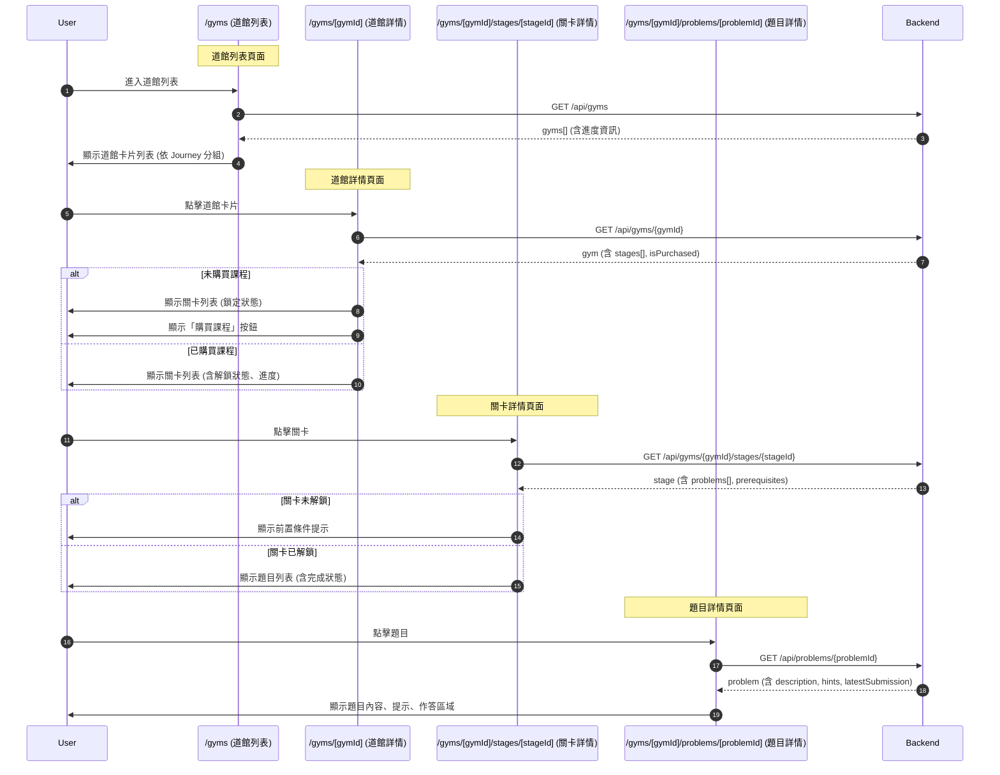
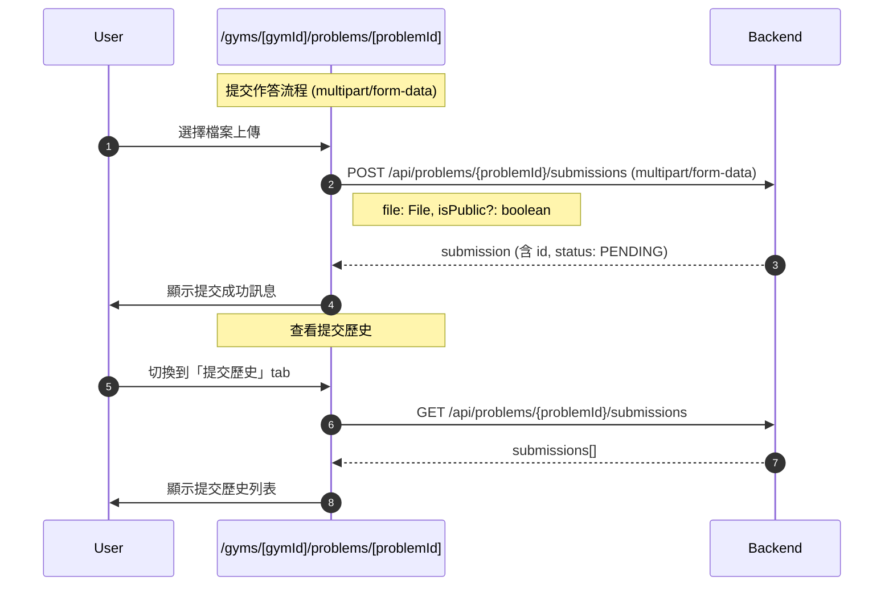

# Frontend Specification: Gym Homework System

## Overview

實作道館作業系統前端介面，包含道館列表、關卡題目瀏覽、作業提交、批改結果查看等功能。

## Technical Stack

- Next.js 15 (App Router)
- React 19
- TypeScript
- Tailwind CSS
- shadcn/ui

## Page-API Sequence Diagram

### Gym Browsing Flow



### Submission Flow



### Page-API Summary Table

| 頁面 | 時機 | API | 說明 |
|------|------|-----|------|
| `/gyms` | 頁面載入 | `GET /api/gyms` | 取得道館列表 |
| `/gyms/[gymId]` | 頁面載入 | `GET /api/gyms/{gymId}` | 取得道館詳情 (含關卡) |
| `/gyms/[gymId]/stages/[stageId]` | 頁面載入 | `GET /api/gyms/{gymId}/stages/{stageId}` | 取得關卡詳情 (含題目) |
| `/gyms/[gymId]/problems/[problemId]` | 頁面載入 | `GET /api/problems/{problemId}` | 取得題目詳情 |
| `/gyms/[gymId]/problems/[problemId]` | 提交 | `POST /api/problems/{problemId}/submissions` | 提交作答 (multipart/form-data) |
| `/gyms/[gymId]/problems/[problemId]` | 查看歷史 | `GET /api/problems/{problemId}/submissions` | 取得提交歷史 |
| `/gyms/[gymId]/problems/[problemId]` | 更新公開 | `PATCH /api/submissions/{id}/visibility` | 更新公開設定 |
| `/submissions/public` | 頁面載入 | `GET /api/submissions/public` | 取得公開提交列表 |
| `/my/gym-progress` | 頁面載入 | `GET /api/my/gym-progress` | 取得個人進度 |

### API 權限說明

| API | 需登入 | 說明 |
|-----|--------|------|
| `GET /api/gyms` | 選填 | 公開道館列表，登入時含進度 |
| `GET /api/gyms/{gymId}` | 選填 | 公開道館詳情 |
| `GET /api/gyms/{gymId}/stages/{stageId}` | 選填 | 關卡詳情，未購買時題目列表為空 |
| `GET /api/problems/{problemId}` | ✅ | 需購買課程且題目已解鎖 |
| `POST /api/problems/{problemId}/submissions` | ✅ | 提交作答 (multipart/form-data) |
| `GET /api/problems/{problemId}/submissions` | ✅ | 查看自己的提交歷史 |
| `PATCH /api/submissions/{id}/visibility` | ✅ | 更新自己的提交公開設定 |
| `GET /api/submissions/public` | 選填 | 公開提交列表 |
| `GET /api/my/gym-progress` | ✅ | 個人進度總覽 |

## Architecture

```
┌─────────────────────────────────────────────────────────────┐
│                      Components                              │
│  GymCard, GymList, StageCard, StageList, ProblemCard        │
│  ProblemDetail, SubmissionForm, SubmissionHistory           │
│  ReviewDisplay, HintAccordion, DifficultyStars              │
│  PrerequisiteStatus, LockedContent, GymProgress             │
├─────────────────────────────────────────────────────────────┤
│                        Hooks                                 │
│  useGymList, useGym, useStage, useProblem, useSubmission    │
│  useSubmissionHistory, useGymProgress, useFileUpload        │
├─────────────────────────────────────────────────────────────┤
│                       Services                               │
│  gym.service.ts, problem.service.ts, submission.service.ts  │
├─────────────────────────────────────────────────────────────┤
│                        Types                                 │
│  gym.ts                                                      │
└─────────────────────────────────────────────────────────────┘
```

## Directory Structure

```
src/
├── app/
│   ├── (main)/
│   │   ├── gyms/
│   │   │   └── page.tsx                      # 道館列表頁面
│   │   └── my/
│   │       └── gym-progress/
│   │           └── page.tsx                  # 個人道館進度頁面
│   └── gyms/
│       └── [gymId]/
│           ├── page.tsx                      # 道館詳情頁面
│           ├── stages/
│           │   └── [stageId]/
│           │       └── page.tsx              # 關卡詳情頁面
│           └── problems/
│               └── [problemId]/
│                   └── page.tsx              # 題目詳情頁面
├── components/
│   └── gym/
│       ├── GymCard.tsx                       # 道館卡片
│       ├── GymList.tsx                       # 道館列表
│       ├── GymTypeFilter.tsx                 # 道館類型篩選
│       ├── StageCard.tsx                     # 關卡卡片
│       ├── StageList.tsx                     # 關卡列表
│       ├── ProblemCard.tsx                   # 題目卡片
│       ├── ProblemList.tsx                   # 題目列表
│       ├── ProblemDetail.tsx                 # 題目詳情
│       ├── ProblemDescription.tsx            # 題目描述 (Markdown)
│       ├── SubmissionForm.tsx                # 作答提交表單
│       ├── SubmissionHistory.tsx             # 提交歷史列表
│       ├── SubmissionCard.tsx                # 提交記錄卡片
│       ├── ReviewDisplay.tsx                 # 批改結果顯示
│       ├── HintAccordion.tsx                 # 提示摺疊面板
│       ├── DifficultyStars.tsx               # 難度星星顯示
│       ├── PrerequisiteStatus.tsx            # 前置條件狀態
│       ├── LockedContent.tsx                 # 鎖定內容提示
│       ├── GymProgress.tsx                   # 道館進度統計
│       ├── GymProgressCard.tsx               # 進度卡片
│       ├── PublicSubmissionList.tsx          # 公開提交列表
│       ├── PublicSubmissionCard.tsx          # 公開提交卡片
│       ├── FileUploader.tsx                  # 檔案上傳元件
│       ├── SubmissionTypeIcon.tsx            # 提交類型圖示
│       └── index.ts
├── hooks/
│   ├── useGymList.ts                         # 道館列表 hook
│   ├── useGym.ts                             # 道館詳情 hook
│   ├── useStage.ts                           # 關卡詳情 hook
│   ├── useProblem.ts                         # 題目詳情 hook
│   ├── useSubmission.ts                      # 提交作答 hook
│   ├── useSubmissionHistory.ts               # 提交歷史 hook
│   ├── usePublicSubmissions.ts               # 公開提交 hook
│   ├── useGymProgress.ts                     # 道館進度 hook
│   └── useFileUpload.ts                      # 檔案上傳 hook
├── services/
│   ├── gym.service.ts                        # 道館相關 API
│   ├── problem.service.ts                    # 題目相關 API
│   └── submission.service.ts                 # 提交相關 API
└── types/
    └── gym.ts                                # 道館相關型別
```

## Types

### types/gym.ts

```typescript
export type GymType = 'MAIN_QUEST' | 'SIDE_QUEST';

export type SubmissionType = 'PDF' | 'MP4' | 'CODE' | 'IMAGE';

export type SubmissionStatus = 'PENDING' | 'REVIEWED' | 'NEEDS_REVISION';

export type ReviewStatus = 'APPROVED' | 'NEEDS_REVISION';

export type PrerequisiteType = 'LESSON' | 'PROBLEM';

export interface Gym {
  id: string;
  journeyId: string;
  journeyTitle: string;
  title: string;
  description: string | null;
  thumbnailUrl: string | null;
  type: GymType;
  stageCount: number;
  problemCount: number;
  completedCount: number;
  isPurchased: boolean;
}

export interface GymDetail extends Gym {
  stages: StageSummary[];
  relatedGyms: GymSummary[];
}

export interface GymSummary {
  id: string;
  title: string;
  type: GymType;
}

export interface StageSummary {
  id: string;
  title: string;
  description: string | null;
  difficulty: number;
  problemCount: number;
  completedCount: number;
  isUnlocked: boolean;
  prerequisites: PrerequisiteInfo[];
}

export interface StageDetail {
  id: string;
  gymId: string;
  gymTitle: string;
  title: string;
  description: string | null;
  difficulty: number;
  problems: ProblemSummary[];
  isUnlocked: boolean;
  isPurchased: boolean;
  prerequisites: PrerequisiteInfo[];
}

export interface ProblemSummary {
  id: string;
  title: string;
  difficulty: number;
  submissionTypes: SubmissionType[];
  isCompleted: boolean;
  isUnlocked: boolean;
  submissionStatus: SubmissionStatus | null;
}

export interface ProblemDetail {
  id: string;
  stageId: string;
  stageTitle: string;
  gymId: string;
  gymTitle: string;
  title: string;
  description: string;
  difficulty: number;
  submissionTypes: SubmissionType[];
  hints: Hint[];
  expReward: number;
  isUnlocked: boolean;
  prerequisites: PrerequisiteInfo[];
  latestSubmission: SubmissionInfo | null;
  previousProblem: ProblemNav | null;
  nextProblem: ProblemNav | null;
}

export interface Hint {
  order: number;
  content: string;
}

export interface PrerequisiteInfo {
  type: PrerequisiteType;
  id: string;
  title: string;
  isCompleted: boolean;
}

export interface ProblemNav {
  id: string;
  title: string;
}

export interface SubmissionInfo {
  id: string;
  status: SubmissionStatus;
  fileUrl: string;
  fileName: string;
  fileType: string;
  submittedAt: string;
  version: number;
  review: ReviewInfo | null;
}

export interface Submission extends SubmissionInfo {
  problemId: string;
  isPublic: boolean;
  fileSizeBytes: number;
}

export interface SubmissionDetail extends Submission {
  problemTitle: string;
  stageTitle: string;
  gymTitle: string;
}

export interface ReviewInfo {
  id: string;
  content: string;
  status: ReviewStatus;
  reviewedAt: string;
  reviewerName: string;
}

export interface PublicSubmission {
  id: string;
  userName: string;
  userAvatarUrl: string | null;
  problemId: string;
  problemTitle: string;
  gymTitle: string;
  fileUrl: string;
  fileName: string;
  status: SubmissionStatus;
  submittedAt: string;
  review: {
    content: string;
    status: ReviewStatus;
    reviewedAt: string;
    reviewerName: string;
  } | null;
}

export interface GymProgressSummary {
  totalGyms: number;
  completedGyms: number;
  totalProblems: number;
  completedProblems: number;
  pendingReviews: number;
  gyms: GymProgressItem[];
}

export interface GymProgressItem {
  gymId: string;
  gymTitle: string;
  type: GymType;
  problemCount: number;
  completedCount: number;
  pendingCount: number;
  progressPercentage: number;
}

export interface CreateSubmissionRequest {
  fileKey: string;
  fileName: string;
  fileType: string;
  fileSizeBytes: number;
  isPublic?: boolean;
}

export interface UploadUrlRequest {
  problemId: string;
  fileName: string;
  fileType: string;
  fileSizeBytes: number;
}

export interface UploadUrlResponse {
  uploadUrl: string;
  fileKey: string;
  expiresAt: string;
}

export interface VisibilityUpdateRequest {
  isPublic: boolean;
}

export interface PaginatedResponse<T> {
  content: T[];
  totalElements: number;
  totalPages: number;
  number: number;
  size: number;
}

export const SUBMISSION_TYPE_CONFIG: Record<SubmissionType, {
  label: string;
  accept: string[];
  maxSizeMB: number;
  icon: string;
}> = {
  PDF: {
    label: 'PDF 文件',
    accept: ['application/pdf'],
    maxSizeMB: 50,
    icon: 'FileText',
  },
  MP4: {
    label: '影片',
    accept: ['video/mp4'],
    maxSizeMB: 500,
    icon: 'Video',
  },
  CODE: {
    label: '程式碼',
    accept: ['text/plain', 'application/zip'],
    maxSizeMB: 10,
    icon: 'Code',
  },
  IMAGE: {
    label: '圖片',
    accept: ['image/png', 'image/jpeg'],
    maxSizeMB: 10,
    icon: 'Image',
  },
};
```

## Components

### GymCard

道館卡片，顯示道館基本資訊與進度

```typescript
interface GymCardProps {
  gym: Gym;
  onClick?: () => void;
}
```

**顯示內容:**

- 縮圖
- 標題
- 類型標籤 (主線/支線)
- 所屬課程
- 進度 (x/y 題完成)
- 進度條
- 鎖定狀態 (未購買時)

### StageCard

關卡卡片

```typescript
interface StageCardProps {
  stage: StageSummary;
  gymId: string;
  isPurchased: boolean;
  onClick?: () => void;
}
```

**顯示內容:**

- 標題
- 難度 (星星)
- 進度 (x/y 題完成)
- 解鎖狀態
- 前置條件 (未解鎖時)

### ProblemCard

題目卡片

```typescript
interface ProblemCardProps {
  problem: ProblemSummary;
  gymId: string;
  onClick?: () => void;
}
```

**顯示內容:**

- 標題
- 難度 (星星)
- 提交類型圖示
- 完成狀態
- 最新提交狀態 (PENDING/REVIEWED/NEEDS_REVISION)

### DifficultyStars

難度星星顯示

```typescript
interface DifficultyStarsProps {
  difficulty: number;
  maxStars?: number;
  size?: 'sm' | 'md' | 'lg';
}
```

### HintAccordion

提示摺疊面板

```typescript
interface HintAccordionProps {
  hints: Hint[];
}
```

**行為:**

- 初始狀態全部收合
- 點擊展開單個提示
- 顯示「提示 1」「提示 2」...

### PrerequisiteStatus

前置條件狀態顯示

```typescript
interface PrerequisiteStatusProps {
  prerequisites: PrerequisiteInfo[];
  showLinks?: boolean;
}
```

**顯示內容:**

- 條件列表
- 每個條件的完成狀態 (✓/✗)
- 可選：點擊跳轉至對應 Lesson/Problem

### LockedContent

鎖定內容提示

```typescript
interface LockedContentProps {
  type: 'purchase' | 'prerequisite';
  prerequisites?: PrerequisiteInfo[];
  journeyId?: string;
  message?: string;
}
```

**根據類型顯示:**

- `purchase`: 顯示「購買課程以解鎖」+ 購買按鈕
- `prerequisite`: 顯示前置條件列表

### SubmissionForm

作答提交表單

```typescript
interface SubmissionFormProps {
  problemId: string;
  allowedTypes: SubmissionType[];
  onSubmitSuccess?: (submission: Submission) => void;
}
```

**功能:**

- 檔案選擇/拖放上傳
- 檔案類型驗證
- 檔案大小驗證
- 上傳進度顯示
- 公開設定選項
- 提交按鈕

### FileUploader

檔案上傳元件

```typescript
interface FileUploaderProps {
  allowedTypes: SubmissionType[];
  onFileSelect: (file: File) => void;
  isUploading?: boolean;
  uploadProgress?: number;
  error?: string;
}
```

**功能:**

- 拖放區域
- 點擊選擇檔案
- 顯示允許的檔案類型
- 顯示檔案大小限制
- 上傳進度條
- 錯誤訊息

### SubmissionHistory

提交歷史列表

```typescript
interface SubmissionHistoryProps {
  submissions: Submission[];
  onVisibilityChange?: (id: string, isPublic: boolean) => void;
}
```

**顯示內容:**

- 版本號
- 提交時間
- 檔案名稱
- 狀態
- 批改結果 (如有)
- 公開設定開關

### ReviewDisplay

批改結果顯示

```typescript
interface ReviewDisplayProps {
  review: ReviewInfo;
  showReviewer?: boolean;
}
```

**顯示內容:**

- 狀態標籤 (通過/需修改)
- 批改內容 (Markdown 渲染)
- 批改者名稱
- 批改時間

### GymProgress

道館進度統計

```typescript
interface GymProgressProps {
  progress: GymProgressSummary;
}
```

**顯示內容:**

- 總覽統計 (完成道館數、完成題目數、待批改數)
- 各道館進度列表

### PublicSubmissionList

公開提交列表

```typescript
interface PublicSubmissionListProps {
  gymId?: string;
  problemId?: string;
}
```

**功能:**

- 篩選功能 (道館/題目)
- 分頁
- 查看公開的提交與批改

## Hooks

### useGymList

```typescript
function useGymList(options?: {
  journeyId?: string;
  type?: GymType;
}): {
  gyms: Gym[];
  isLoading: boolean;
  error: Error | null;
  refetch: () => void;
};
```

### useGym

```typescript
function useGym(gymId: string): {
  gym: GymDetail | null;
  isLoading: boolean;
  error: Error | null;
  refetch: () => void;
};
```

### useStage

```typescript
function useStage(gymId: string, stageId: string): {
  stage: StageDetail | null;
  isLoading: boolean;
  error: Error | null;
  refetch: () => void;
};
```

### useProblem

```typescript
function useProblem(problemId: string): {
  problem: ProblemDetail | null;
  isLoading: boolean;
  error: Error | null;
  refetch: () => void;
};
```

### useSubmission

```typescript
function useSubmission(problemId: string): {
  submit: (data: CreateSubmissionRequest) => Promise<Submission>;
  isSubmitting: boolean;
  error: Error | null;
};
```

### useSubmissionHistory

```typescript
function useSubmissionHistory(problemId: string): {
  submissions: Submission[];
  isLoading: boolean;
  error: Error | null;
  updateVisibility: (submissionId: string, isPublic: boolean) => Promise<void>;
  refetch: () => void;
};
```

### useFileUpload

```typescript
function useFileUpload(): {
  getUploadUrl: (data: UploadUrlRequest) => Promise<UploadUrlResponse>;
  uploadFile: (uploadUrl: string, file: File) => Promise<void>;
  isUploading: boolean;
  progress: number;
  error: Error | null;
};
```

### useGymProgress

```typescript
function useGymProgress(): {
  progress: GymProgressSummary | null;
  isLoading: boolean;
  error: Error | null;
  refetch: () => void;
};
```

### usePublicSubmissions

```typescript
function usePublicSubmissions(options?: {
  gymId?: string;
  problemId?: string;
  page?: number;
  size?: number;
}): {
  submissions: PublicSubmission[];
  pagination: {
    totalElements: number;
    totalPages: number;
    currentPage: number;
    pageSize: number;
  };
  isLoading: boolean;
  error: Error | null;
  refetch: () => void;
};
```

## Services

### gym.service.ts

```typescript
export const gymService = {
  async getGyms(params?: {
    journeyId?: string;
    type?: GymType;
  }): Promise<Gym[]>;

  async getGym(gymId: string): Promise<GymDetail>;

  async getStage(gymId: string, stageId: string): Promise<StageDetail>;
};
```

### problem.service.ts

```typescript
export const problemService = {
  async getProblem(problemId: string): Promise<ProblemDetail>;

  async getUploadUrl(data: UploadUrlRequest): Promise<UploadUrlResponse>;
};
```

### submission.service.ts

```typescript
export const submissionService = {
  async createSubmission(
    problemId: string,
    data: CreateSubmissionRequest
  ): Promise<Submission>;

  async getSubmissionHistory(problemId: string): Promise<Submission[]>;

  async getSubmission(submissionId: string): Promise<SubmissionDetail>;

  async updateVisibility(
    submissionId: string,
    isPublic: boolean
  ): Promise<void>;

  async getPublicSubmissions(params?: {
    gymId?: string;
    problemId?: string;
    page?: number;
    size?: number;
  }): Promise<PaginatedResponse<PublicSubmission>>;

  async getGymProgress(): Promise<GymProgressSummary>;
};
```

## Page Implementation

### /gyms (道館列表頁面)

**URL:** `/gyms`

**功能:**

1. 顯示所有道館列表 (依 Journey 分組)
2. 篩選道館類型 (全部/主線/支線)
3. 顯示進度 (已登入時)

**UI:**

```
┌────────────────────────────────────────┐
│  道館挑戰                               │
│                                        │
│  [全部] [主線任務] [支線任務]            │
│                                        │
│  軟體設計之旅                           │
│  ┌──────────┐  ┌──────────┐            │
│  │ 🏛️ 設計   │  │ 🏛️ SOLID │            │
│  │ 模式道館  │  │   道館    │            │
│  │ ★★★☆☆    │  │ ★★☆☆☆    │            │
│  │ 8/20 完成 │  │ 0/15 完成 │            │
│  │ ████░░   │  │ ░░░░░░   │            │
│  │ 主線任務  │  │ 支線任務  │            │
│  └──────────┘  └──────────┘            │
│                                        │
│  Clean Code 之旅                       │
│  ┌──────────┐                          │
│  │ 🔒 重構   │  (未購買課程)             │
│  │   道館    │                          │
│  │ ★★★★☆    │                          │
│  │ 購買解鎖  │                          │
│  └──────────┘                          │
└────────────────────────────────────────┘
```

### /gyms/[gymId] (道館詳情頁面)

**URL:** `/gyms/[gymId]`

**功能:**

1. 顯示道館資訊
2. 顯示關卡列表
3. 顯示解鎖狀態與前置條件

**UI:**

```
┌────────────────────────────────────────┐
│  ← 返回道館列表                         │
├────────────────────────────────────────┤
│  🏛️ 設計模式道館                        │
│  軟體設計之旅 · 主線任務                 │
│                                        │
│  挑戰經典的設計模式題目，透過實作深入    │
│  理解各種設計模式的應用場景              │
│                                        │
│  進度：8/20 題完成                      │
│  ████████░░░░░░░░░░░░                  │
│                                        │
├────────────────────────────────────────┤
│  關卡列表                               │
│                                        │
│  ┌──────────────────────────────────┐  │
│  │ ✓ 第一關：策略模式                 │  │
│  │   ★★☆☆☆ · 4 題 · 4/4 完成        │  │
│  └──────────────────────────────────┘  │
│                                        │
│  ┌──────────────────────────────────┐  │
│  │ 🔓 第二關：觀察者模式              │  │
│  │   ★★★☆☆ · 3 題 · 2/3 完成        │  │
│  └──────────────────────────────────┘  │
│                                        │
│  ┌──────────────────────────────────┐  │
│  │ 🔒 第三關：裝飾者模式              │  │
│  │   ★★★★☆ · 5 題                   │  │
│  │   需完成：策略模式實戰題           │  │
│  └──────────────────────────────────┘  │
│                                        │
├────────────────────────────────────────┤
│  同課程其他道館                         │
│  ┌─────────┐  ┌─────────┐              │
│  │ SOLID   │  │ 重構    │              │
│  │ 道館    │  │ 道館    │              │
│  └─────────┘  └─────────┘              │
└────────────────────────────────────────┘
```

### /gyms/[gymId]/stages/[stageId] (關卡詳情頁面)

**URL:** `/gyms/[gymId]/stages/[stageId]`

**功能:**

1. 顯示關卡資訊
2. 顯示題目列表
3. 前置條件檢查

**UI:**

```
┌────────────────────────────────────────┐
│  ← 設計模式道館                         │
├────────────────────────────────────────┤
│  第一關：策略模式                       │
│  ★★☆☆☆                                │
│                                        │
│  學習策略模式的應用，完成以下挑戰        │
│                                        │
│  進度：2/4 題完成                       │
│                                        │
├────────────────────────────────────────┤
│  題目列表                               │
│                                        │
│  ┌──────────────────────────────────┐  │
│  │ ✓ 策略模式概念題                   │  │
│  │   ★☆☆☆☆ · PDF                    │  │
│  │   狀態：已批改 (通過)              │  │
│  └──────────────────────────────────┘  │
│                                        │
│  ┌──────────────────────────────────┐  │
│  │ ✓ 策略模式 UML 繪製                │  │
│  │   ★★☆☆☆ · IMAGE                  │  │
│  │   狀態：待批改                     │  │
│  └──────────────────────────────────┘  │
│                                        │
│  ┌──────────────────────────────────┐  │
│  │ ○ 策略模式實戰題                   │  │
│  │   ★★★☆☆ · CODE, PDF              │  │
│  │   尚未提交                         │  │
│  └──────────────────────────────────┘  │
│                                        │
│  ┌──────────────────────────────────┐  │
│  │ 🔒 策略模式進階題                  │  │
│  │   ★★★★☆ · CODE                   │  │
│  │   需完成：策略模式實戰題           │  │
│  └──────────────────────────────────┘  │
└────────────────────────────────────────┘
```

### /gyms/[gymId]/problems/[problemId] (題目詳情頁面)

**URL:** `/gyms/[gymId]/problems/[problemId]`

**功能:**

1. 顯示題目內容 (Markdown)
2. 顯示提示 (摺疊)
3. 檔案上傳與提交
4. 提交歷史與批改結果

**UI:**

```
┌────────────────────────────────────────┐
│  ← 第一關：策略模式                     │
│                                        │
│  [題目描述] [提交歷史]                  │
├────────────────────────────────────────┤
│  策略模式實戰題                         │
│  ★★★☆☆ · 經驗值 +20                   │
│                                        │
│  ## 題目說明                           │
│                                        │
│  請實作一個付款系統，支援多種付款方式    │
│  ...                                   │
│                                        │
│  ## 需求                               │
│  1. 使用策略模式設計                    │
│  2. 支援信用卡、銀行轉帳、電子錢包       │
│  ...                                   │
│                                        │
├────────────────────────────────────────┤
│  💡 提示                                │
│  ┌──────────────────────────────────┐  │
│  │ ▶ 提示 1                          │  │
│  └──────────────────────────────────┘  │
│  ┌──────────────────────────────────┐  │
│  │ ▶ 提示 2                          │  │
│  └──────────────────────────────────┘  │
│                                        │
├────────────────────────────────────────┤
│  📤 提交作答                            │
│                                        │
│  支援格式：CODE, PDF                    │
│  ┌──────────────────────────────────┐  │
│  │                                    │  │
│  │   拖放檔案到此處                    │  │
│  │   或 點擊選擇檔案                  │  │
│  │                                    │  │
│  │   CODE: .zip, .txt (最大 10MB)    │  │
│  │   PDF: .pdf (最大 50MB)           │  │
│  │                                    │  │
│  └──────────────────────────────────┘  │
│                                        │
│  ☐ 公開我的批改結果給其他學員參考        │
│                                        │
│  ┌──────────────────────────────────┐  │
│  │            提交作答                 │  │
│  └──────────────────────────────────┘  │
│                                        │
├────────────────────────────────────────┤
│  ← 上一題：策略模式 UML    下一題：→    │
└────────────────────────────────────────┘
```

**提交歷史 Tab:**

```
┌────────────────────────────────────────┐
│  [題目描述] [提交歷史]                  │
├────────────────────────────────────────┤
│  提交記錄                               │
│                                        │
│  ┌──────────────────────────────────┐  │
│  │ 版本 2 · 2024/01/15 10:30        │  │
│  │ my-solution-v2.zip                │  │
│  │ 狀態：已批改 (通過)               │  │
│  │                                    │  │
│  │ 📝 批改結果                        │  │
│  │ ┌────────────────────────────────┐│  │
│  │ │ ## 評語                         ││  │
│  │ │ 做得很好！程式碼結構清晰...     ││  │
│  │ │                                 ││  │
│  │ │ — 水球老師 · 2024/01/16 14:00  ││  │
│  │ └────────────────────────────────┘│  │
│  │                                    │  │
│  │ 公開批改結果 [開]                  │  │
│  └──────────────────────────────────┘  │
│                                        │
│  ┌──────────────────────────────────┐  │
│  │ 版本 1 · 2024/01/14 09:00        │  │
│  │ my-solution.zip                   │  │
│  │ 狀態：需修改                       │  │
│  │                                    │  │
│  │ 📝 批改結果                        │  │
│  │ 需要修改這部分的實作...            │  │
│  └──────────────────────────────────┘  │
└────────────────────────────────────────┘
```

### /my/gym-progress (個人道館進度頁面)

**URL:** `/my/gym-progress`

**功能:**

1. 顯示總覽統計
2. 各道館進度列表

**UI:**

```
┌────────────────────────────────────────┐
│  我的道館進度                           │
├────────────────────────────────────────┤
│                                        │
│  ┌──────────┐ ┌──────────┐ ┌──────────┐│
│  │    2/5   │ │   25/50  │ │    3     ││
│  │ 道館完成  │ │ 題目完成  │ │ 待批改   ││
│  └──────────┘ └──────────┘ └──────────┘│
│                                        │
├────────────────────────────────────────┤
│  道館列表                               │
│                                        │
│  ┌──────────────────────────────────┐  │
│  │ 🏛️ 設計模式道館                    │  │
│  │ 主線任務 · 15/20 完成 · 2 待批改   │  │
│  │ ███████████████░░░░░░ 75%         │  │
│  └──────────────────────────────────┘  │
│                                        │
│  ┌──────────────────────────────────┐  │
│  │ 🏛️ SOLID 道館                      │  │
│  │ 支線任務 · 10/15 完成 · 1 待批改   │  │
│  │ ██████████████░░░░░░░ 67%         │  │
│  └──────────────────────────────────┘  │
│                                        │
└────────────────────────────────────────┘
```

## Error Handling

### 錯誤類型

```typescript
type GymError =
  | 'NOT_PURCHASED'           // 未購買課程
  | 'PROBLEM_LOCKED'          // 題目未解鎖
  | 'STAGE_LOCKED'            // 關卡未解鎖
  | 'GYM_NOT_FOUND'           // 道館不存在
  | 'PROBLEM_NOT_FOUND'       // 題目不存在
  | 'FILE_TYPE_NOT_ALLOWED'   // 檔案類型不允許
  | 'FILE_TOO_LARGE'          // 檔案過大
  | 'UPLOAD_FAILED'           // 上傳失敗
  | 'UNAUTHORIZED'            // 未登入
  | 'NETWORK_ERROR';          // 網路錯誤
```

### 錯誤處理 UI

| 錯誤類型 | 處理方式 |
|----------|----------|
| NOT_PURCHASED | 顯示購買課程提示，提供購買按鈕 |
| PROBLEM_LOCKED | 顯示前置條件，引導完成 |
| STAGE_LOCKED | 顯示前置條件 |
| GYM_NOT_FOUND | 顯示 404 頁面 |
| FILE_TYPE_NOT_ALLOWED | 表單驗證錯誤訊息 |
| FILE_TOO_LARGE | 表單驗證錯誤訊息 |
| UPLOAD_FAILED | 重試按鈕 |
| UNAUTHORIZED | 導向登入頁 |
| NETWORK_ERROR | 重試按鈕 |

## UI States

### Loading States

- 道館列表載入中
- 道館詳情載入中
- 題目詳情載入中
- 檔案上傳中 (含進度)
- 提交中

### Empty States

- 無道館 (課程未設定道館)
- 無提交歷史

### Success States

- 提交成功 (Toast)
- 公開設定更新成功 (Toast)

## Responsive Design

### Desktop (≥1024px)

- 道館列表：4 欄網格
- 題目頁面：雙欄 (左側題目內容，右側提交區)

### Tablet (768px-1023px)

- 道館列表：2-3 欄網格
- 題目頁面：單欄

### Mobile (<768px)

- 道館列表：單欄
- 題目頁面：單欄，Tab 切換內容

## E2E Test Scenarios

### 測試案例 1：瀏覽道館列表

```gherkin
Feature: 瀏覽道館列表
  Scenario: 已登入用戶瀏覽道館列表
    Given 用戶已登入
    And 已購買「軟體設計之旅」課程
    When 用戶進入道館列表頁面
    Then 看到「設計模式道館」
    And 顯示進度「8/20 完成」
    And 可篩選「主線任務」或「支線任務」
```

### 測試案例 2：查看關卡與題目

```gherkin
Feature: 查看關卡與題目
  Scenario: 用戶查看關卡題目列表
    Given 用戶已登入並購買課程
    When 用戶點擊「設計模式道館」
    Then 看到關卡列表
    When 用戶點擊「第一關：策略模式」
    Then 看到題目列表
    And 顯示各題目的完成狀態
```

### 測試案例 3：提交作答

```gherkin
Feature: 提交作答
  Scenario: 用戶提交 PDF 作答
    Given 用戶已登入並購買課程
    And 題目允許 PDF 格式
    When 用戶進入題目詳情頁
    And 上傳 solution.pdf 檔案
    And 點擊「提交作答」
    Then 顯示提交成功訊息
    And 題目狀態變為「待批改」
```

### 測試案例 4：查看批改結果

```gherkin
Feature: 查看批改結果
  Scenario: 用戶查看已批改的提交
    Given 用戶有一筆已批改的提交
    When 用戶進入題目詳情頁
    And 切換到「提交歷史」tab
    Then 看到批改結果
    And 顯示批改者名稱與時間
```

### 測試案例 5：前置條件鎖定

```gherkin
Feature: 前置條件鎖定
  Scenario: 題目因前置條件未完成而鎖定
    Given 題目 B 的前置條件是完成題目 A
    And 用戶尚未完成題目 A
    When 用戶嘗試進入題目 B
    Then 顯示「題目鎖定」提示
    And 顯示需完成的前置條件
    And 提供跳轉至前置題目的連結
```

### 測試案例 6：未購買課程

```gherkin
Feature: 未購買課程無法作答
  Scenario: 未購買用戶嘗試查看題目
    Given 用戶未購買「軟體設計之旅」課程
    When 用戶嘗試進入題目詳情頁
    Then 顯示「購買課程以解鎖」提示
    And 提供購買按鈕
```

### 測試案例 7：重新提交作答

```gherkin
Feature: 重新提交作答
  Scenario: 用戶重新提交需修改的作答
    Given 用戶的前次提交被標記為「需修改」
    When 用戶上傳新版本檔案
    And 點擊「提交作答」
    Then 建立版本 2 的提交
    And 保留版本 1 的記錄
```

### 測試案例 8：設定提交公開

```gherkin
Feature: 設定提交公開
  Scenario: 用戶公開自己的批改結果
    Given 用戶有一筆已批改的提交
    When 用戶在提交歷史中打開「公開」開關
    Then 該提交可被其他學員在公開列表中看到
```

### 測試案例 9：查看公開提交

```gherkin
Feature: 查看公開提交
  Scenario: 用戶查看其他學員的公開提交
    Given 有其他學員公開了提交
    When 用戶進入公開提交列表
    Then 看到其他學員的提交與批改結果
```

### 測試案例 10：檔案類型驗證

```gherkin
Feature: 檔案類型驗證
  Scenario: 用戶上傳不允許的檔案類型
    Given 題目只允許 PDF 格式
    When 用戶嘗試上傳 .docx 檔案
    Then 顯示「檔案類型不允許」錯誤訊息
    And 無法提交
```

## Success Criteria

- [ ] 可瀏覽道館列表 (依 Journey 分組)
- [ ] 可篩選主線/支線任務
- [ ] 可查看道館詳情與關卡列表
- [ ] 可查看關卡詳情與題目列表
- [ ] 未購買課程時顯示購買提示
- [ ] 前置條件正確顯示與鎖定
- [ ] 可查看題目詳情 (Markdown 渲染)
- [ ] 提示功能正常 (摺疊顯示)
- [ ] 可上傳檔案 (拖放/點擊)
- [ ] 檔案類型與大小驗證正常
- [ ] 可提交作答
- [ ] 可查看提交歷史
- [ ] 可查看批改結果 (Markdown 渲染)
- [ ] 可設定提交公開/私有
- [ ] 可查看公開提交列表
- [ ] 可查看個人道館進度總覽
- [ ] 響應式設計正常運作
- [ ] E2E 測試覆蓋所有核心流程
